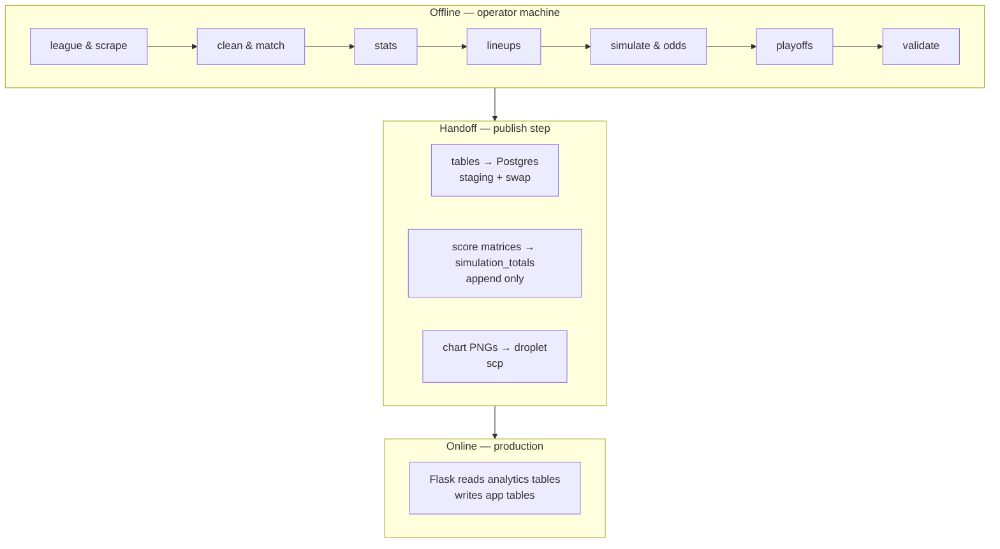

# 01 – Overview

## Components

| Component | Location | Runs where | Responsibility |
|---|---|---|---|
| Pipeline CLI and runner | `pipeline/__main__.py`, `pipeline/runner.py`, `pipeline/settings.py` | Operator machine | `python -m pipeline run / status / review / backfill / fit-model`; runs steps in order and records every run and step in `pipeline.db` |
| Pipeline steps | `pipeline/steps/*.py` | Operator machine | Thirteen steps, from mirroring the Sleeper league to pricing the week's markets and the season's futures ([02](02-data-pipeline.md)) |
| Projection sources | `pipeline/sources/*.py` | Operator machine | Fetch one week from each of eight sources and verify it against Sleeper before it is stored |
| Model | `pipeline/model/` | Operator machine | Versioned parameters (`params/`), the sampler, and the fit and evaluation behind `fit-model` |
| Publish step | `pipeline/steps/publish.py` | Operator machine → prod DB and droplet | Upload the chart PNGs, append new score matrices to `simulation_totals`, stage and swap the analytics tables and run records into Postgres |
| Web app | `app/` + `frontend/` | Production droplet | Serve odds/analytics, handle auth, bets, settlement, admin |
| PostgreSQL | Production droplet | Production droplet | App tables + published analytics tables in one database |

There is **no scheduler, queue, or background worker**. Every pipeline run is started by hand on the operator's machine. The web app does no simulation: it reads published tables, and prices parlays, cash-outs and settlements from the published score matrices.

## Offline vs. online boundary



The contract between the two halves is the **set of Postgres table names and columns** in `TABLES` in `pipeline/steps/publish.py` (25 tables), the append-only `simulation_totals`, and the PNG filenames. Before a publish, the `validate` step checks the week's lineups, simulation and odds, and that the tables the app reads have rows for the week; during one, each replaced table is staged and row-counted before all of them are swapped in together. The app's tests build the same tables by hand (`create_analytics_tables` in `tests/conftest.py`).

## Weekly operating cycle

```mermaid
sequenceDiagram
    actor Op as Operator (admin)
    participant Local as Local pipeline
    participant PG as Postgres
    participant App as Flask app
    actor User as Users

    Note over Op,App: Wednesday — open the week
    Op->>App: /admin → set betting period (week, lock_time at Sunday's first kickoff)
    Op->>Local: python -m pipeline run --week N
    Op->>Local: pipeline status, then review --verdict ok|reject per source
    Op->>PG: pipeline run --week N --steps publish (--dry-run first)
    Note over App: Window 1 open until the run's window_closes_at (Thursday kickoff)

    User->>App: View odds, analytics
    User->>App: Place / remove bets, parlays
    App->>PG: bets, bet_legs, weekly_stats, users.balance

    Note over App: Paused from Thursday kickoff until the next publish

    Note over Op,App: Friday — after Thursday's game
    Op->>Local: run --steps league,lineups,simulate,odds,playoffs,validate
    Op->>PG: publish
    Note over App: Window 2 open until the next kickoff; older bets can cash out

    Note over Op,App: Saturday — late inactives
    Op->>Local: python -m pipeline run --week N
    Op->>PG: publish

    Note over Op,App: After the week's games are final
    Op->>PG: a publish that carries the final scores (sleeper_matchups)
    Op->>App: /admin → settlement preview → settle outcomes → settle week
    Note over App: get_current_week() now returns the next unsettled period
```

Timing notes:

- **The run opens the window.** `app/windows.py` accepts bets while the latest published run's `window_closes_at` (the next NFL kickoff after the run) is in the future, and pauses them after; the next publish reopens betting on its own. With no Friday publish, betting stays paused, which is the safe default.
- **Friday's rerun skips the scrape**: Wednesday's projections still hold for players who have not played, and the league step brings the injury news. The playoffs step is optional there, since it re-projects ten future weeks and is slow; left out, publish keeps Wednesday's futures. Saturday is the full default run, for late inactives.
- **The lock is lazy and is the kill switch.** Nothing flips `is_locked` at `lock_time`; the first `place_bet` / `remove_bet` call after that time does it (`check_betting_period_lock`), and for good, so `lock_time` is set at Sunday's first kickoff, never Thursday's.
- **Settlement reads the published scores.** The settlement preview judges each pending keyed bet, single or parlay, from `sleeper_matchups` through `pipeline/markets.py`; the admin confirms the outcomes, then settles the week. In the regular season's last week the preview also judges the first-place, make-playoffs and last-place futures from the final standings; the champion is settled by hand after the final.
- The step-by-step routine, with the checks to make before each publish, is the runbook skill `.claude/skills/run-pipeline/SKILL.md`.

## Technology

| Layer | Stack |
|---|---|
| Language | Python 3.13 |
| Web | Flask, Flask-Login, Flask-Dance (Google OAuth), Flask-WTF (CSRF), Flask-SQLAlchemy |
| Frontend | Jinja2 templates, vanilla JS, Chart.js 4.4.1 (CDN, analytics page only) |
| Data | pandas, NumPy, SciPy, pyarrow (Parquet draws), matplotlib/seaborn (chart PNGs) |
| Sources | requests, BeautifulSoup + lxml, Playwright (Chromium, FanDuel only) |
| Storage | SQLite + Parquet (pipeline), PostgreSQL (production) |
| Serving | gunicorn behind nginx, Cloudflare DNS/SSL, DigitalOcean droplet |
| Quality | ruff (lint + format), pytest (1241 tests), GitHub Actions |
