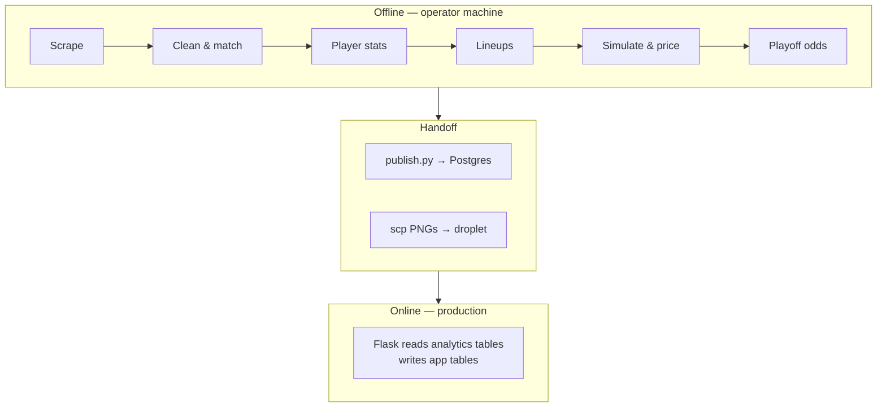
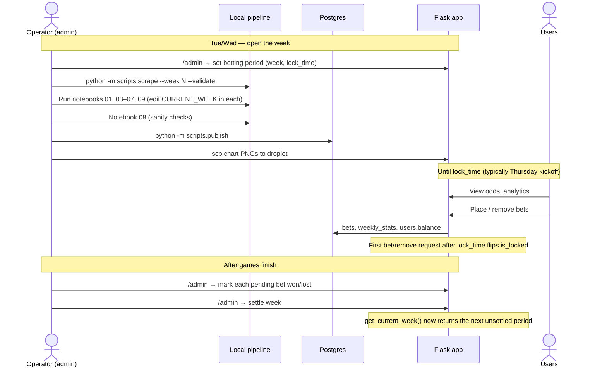

# 01 – Overview

## Components

| Component | Location | Runs where | Responsibility |
|---|---|---|---|
| Projection scrapers | `backend/scrapers/scraper_*.py` | Operator machine | Pull weekly player projections from 5 sources into `projections.db` |
| League scraper | `backend/scrapers/scraper_sleeper_league.py` | Operator machine | Pull league, rosters, matchups, players, stats from the Sleeper API into `league.db` |
| SQLite access classes | `backend/scrapers/database.py`, `database_league.py` | Operator machine | Schema creation and upserts for `projections.db` and `league.db` |
| Scrape CLI | `scripts/scrape.py`, `scripts/validate_scraping.py` | Operator machine | Run scrapers with per-source isolation and check data quality |
| Notebooks | `backend/notebooks/01–10_*.ipynb` | Operator machine (Jupyter) | Cleaning, matching, stats, lineups, simulation, odds, validation, accuracy analysis |
| Publisher | `scripts/publish.py` | Operator machine → prod DB | Copy analytics tables from SQLite into Postgres atomically |
| Web app | `app/` + `frontend/` | Production droplet | Serve odds/analytics, handle auth, bets, admin |
| PostgreSQL | Production droplet | Production droplet | App tables + published analytics tables in one database |

There is **no scheduler, queue, or background worker**. Every pipeline step is triggered by hand. The web app does no computation beyond SQL reads and small aggregations.

## Offline vs. online boundary

The only contract between the two halves is the **set of Postgres table names and columns** listed in `scripts/publish.py` (`TABLE_MAP`) plus the PNG filenames. Nothing validates that contract except the row-count check in `publish.py` and the hand-written SQLite DDL in `tests/conftest.py`.

## Weekly operating cycle

Timing notes:

- The lock is **lazy**: nothing flips `is_locked` at `lock_time`; the first `place_bet` / `remove_bet` call after that time does it (`check_betting_period_lock`).
- Settlement is **manual per bet**. The app has no knowledge of real game results; the admin decides won/lost for each bet.
- Notebook 10 (prediction accuracy) is run occasionally, not weekly, and produces no outputs.

## Technology

| Layer | Stack |
|---|---|
| Language | Python 3.13 |
| Web | Flask, Flask-Login, Flask-Dance (Google OAuth), Flask-WTF (CSRF), Flask-SQLAlchemy |
| Frontend | Jinja2 templates, vanilla JS, Chart.js 4.4.1 (CDN, analytics page only) |
| Data | pandas, NumPy, SciPy (`gaussian_kde`), matplotlib/seaborn |
| Scraping | requests, Selenium (Chrome), Playwright (Chromium) |
| Storage | SQLite (pipeline), PostgreSQL (production) |
| Serving | gunicorn behind nginx, Cloudflare DNS/SSL, DigitalOcean droplet |
| Quality | ruff (lint + format), pytest (88 tests), GitHub Actions |
