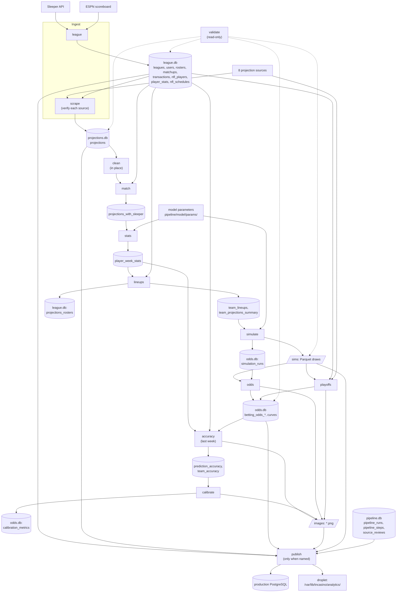

# 02 – Data Pipeline

Everything here runs on the operator's machine, as the `pipeline` package (`python -m pipeline`). Paths are relative to `backend/data/` unless noted: SQLite databases in `databases/`, simulation draws in `sims/`, chart PNGs in `images/`. All of it is gitignored.

## Flow



`python -m pipeline run --week N` runs the first twelve steps in this order (`STEP_ORDER` in `pipeline/steps/__init__.py`); publish runs only when named in `--steps`. The runner (`pipeline/runner.py`) records the run and each step, with its status (`ok`, `warn`, `failed`), duration, warnings, error and summary, in `pipeline.db`, and stops at the first failed step. Every row a step writes carries an integer `season` and `week`.

## Projection sources

Each source in `pipeline/sources/` is a `ProjectionSource` with a `fetch(season, week)` that returns `Projection` rows (name, position, team, PPR points, the source's own id where it has one) and a pure `parse` that the tests run on saved fixtures under `tests/pipeline/fixtures/`. Every HTTP request goes through `base.get`, which sends `USER_AGENT` (`TNCasino-pipeline/2026 (+https://tncasino.win)`) and spaces requests to one host by at least two seconds, longer where a site's `robots.txt` asks.

| `source_website` | Transport | Future weeks | Notes |
|---|---|---|---|
| `sleeper.com` | Sleeper's public projections JSON | yes | The reference: every other source is checked against it, and it supplies the Sleeper ids. A full run fails without it. |
| `espn.com` | ESPN's fantasy API | yes | Position and team from ESPN's numeric ids. |
| `fantasysharks.com` | Server-rendered table, one page per position | yes | QB is not read: its quarterback numbers disagree with every other source. |
| `firstdown.studio` | The rankings snapshot behind each rankings page | no | PPR read from the snapshot (the table shows half PPR). No DEF. |
| `fanduel.com` | Headless Chromium through Playwright, capturing the research pages' GraphQL responses | no | The only source that does not go through `base.get`. Needs `playwright install chromium`. |
| `fftoday.com` | Server-rendered table, one or two pages per position | no | QB, RB, WR, TE. Points rescored from the stat line with league scoring. Posts on Wednesday. |
| `rotoballer.com` | The news sitemap, then the week's projections article | no | Read under RotoBaller's permission letter (non-commercial, attribution on the about page). QB, RB, WR, TE, rescored from the stat line. Only aggregates are shown. |
| `fleaflicker.com` | Fleaflicker's documented API on the owner's own league (`FLEAFLICKER_LEAGUE_ID`) | no | Read under Fleaflicker's permission letter. Points are in the league's own scoring, so the league's rules are compared with a pinned copy every run and a difference drops the source. Unset league id: the fetch fails and the run goes on. Only aggregates are shown. |

"Future weeks" marks the sources the playoffs step scrapes for the weeks after the current one.

### Verification

`pipeline/sources/verify.py` checks a source's week before its rows are stored, against Sleeper's player database, Sleeper's projections for the week, and the source's own previous week. A source's status is its worst check.

| Check | Fails when |
|---|---|
| `position_agreement` | more than 2% of the rows matched to a Sleeper player carry another position (warns above 0.5%) |
| `duplicate_positions` | more than 2 players appear under two positions (warns above 0) |
| `position_counts` | a position's row count is outside its range (QB 20–80, RB 40–150, WR 50–200, TE 20–130, K 15–40, DEF 20–36) |
| `value_agreement` | at QB, RB, WR or TE, the correlation with Sleeper is below 0.85 or the median gap above 4 points (K and DEF only warn; for a future week a low QB correlation only warns) |
| `team_codes` | more than 5% of rows have a team code that normalisation does not recognise (warns above 0) |
| `week_stamp` | the payload names another week than the one requested (`n/a` for sources that name none) |
| `freshness` | more than 90% of the players have the same points as the source's previous week |
| `top_players` | one of the top three at a position is not in Sleeper's player database at that position |

A failing source has its rows for the week deleted and is listed in the scrape step's summary, and the step warns. The step fails when fewer than three sources are usable or Sleeper is not among them (unless `--sources` narrowed the run).

The checks catch shifted positions, stale copies and truncated lists; they cannot tell whether the numbers are sensible. The scrape step prints each source's top 15 per position, and the operator records a verdict:

```bash
python -m pipeline review --week N --source espn.com --verdict ok --note "top players look right"
python -m pipeline review --week N --source espn.com --verdict reject --note "last week's numbers"
```

A `reject` deletes that source's rows for the week; the operator then reruns with `--from clean`. Verdicts go to `pipeline.db.source_reviews` and show on the admin dashboard beside the checks.

## Steps

One or two lines each; the module docstrings in `pipeline/steps/` have the detail.

### Ingest

| Step | Reads | Does | Writes |
|---|---|---|---|
| `league` | Sleeper API, ESPN scoreboard | Mirrors the league, users, rosters, matchups (weeks 1 to N), transactions, all NFL players and last weeks' actual points; builds the season's schedule, byes included. | `league.db` |
| `scrape` | The sources, `nfl_players`, Sleeper's rows | Fetches each source, verifies it, stores the rows that pass; a failed source's rows for the week are deleted, so a stale copy never outlives a bad fetch. | `projections` |

### Projections to players

| Step | Reads | Does | Writes |
|---|---|---|---|
| `clean` | `projections` | Strips injury tags and suffixes from names (keeping case and punctuation for display), makes positions and team codes canonical, gives every defense Sleeper's (city, nickname) form, and drops duplicates it creates. | `projections`, in place |
| `match` | `projections`, `nfl_players` | Links each row to a Sleeper player id, first rule wins: Sleeper's own ids, defenses by team, a few hand-checked names, then name rules that loosen one step at a time and link only when one player fits. Records the rule used. Unmatched rows stay with a NULL id. | `projections_with_sleeper` |
| `stats` | `projections_with_sleeper`, `nfl_players`, model parameters | Per player: μ = weighted mean of the sources' bias-corrected points; σ from the parameters' sigma formula ([03](03-modeling-and-odds.md)). | `player_week_stats` |

### Grading

| Step | Reads | Does | Writes |
|---|---|---|---|
| `accuracy` | Last week's projections, player stats, lineups, curves and moneylines; `player_stats`, `matchups` | Scores every source and the consensus by position, and each team's projected total, [p10, p90] range and moneyline, against what happened. Grades the week's latest run with `n_locked = 0` (Wednesday's), its curves and moneylines, and takes each team's projected total from that run's curve mean, so a rerun's real points never flatter the model; a week with only locked runs grades players, not teams, and warns. Skips with a warning until last week's games are final. | `prediction_accuracy`, `team_accuracy`; two bar charts |
| `calibrate` | `player_week_stats`, `team_lineups`, `team_accuracy`, actual points | Season-to-date calibration of the model as it ran: interval coverage for players and starters, team coverage, moneyline Brier. Nothing is refitted. | `odds.db.calibration_metrics`; one chart |

### Lineups, simulation and odds

| Step | Reads | Does | Writes |
|---|---|---|---|
| `lineups` | `rosters`, `matchups`, `nfl_players`, `nfl_schedules`, `player_week_stats` | Pins the owner's actual starters whose NFL game is final (`STATUS_FINAL`) in their slots at their real league points (`is_locked` 1, `locked_points`, σ 0), projected or not, and labels his other players from that game `played`; starts the best available players by μ in the other slots; slots left empty by injuries and byes are filled from the waiver wire in FAAB order, each pickup capped at the league's median starter at that position. Its summary counts `n_locked`. | `team_lineups`, `team_projections_summary`; `league.db.projections_rosters` |
| `simulate` | `team_lineups` starters, model parameters, `nfl_schedules` | 50,000 draws of every starter (lognormal above a floor, a dud chance, same-team correlation), seed 1738. Locked starters are fixed at their points in every simulation and counted in `n_locked`; every other starter's draws are bit-identical to an unlocked run. A game in progress does not stop the run: its players are simulated as unplayed and the step warns, naming the game. `window_closes_at` is the week's next kickoff after the run. | `sims/{season}/wkNN/{run_id}.parquet`; `simulation_runs` |
| `odds` | The latest run's draws, `team_lineups`, `matchups` | Prices team and matchup over/unders, moneylines, highest and lowest scorer through `pipeline/markets.py`, and the distribution and margin curves; a chance of exactly 0 or 1 gets no price. | `betting_odds_team_ou`, `_matchup_ou`, `_matchup_ml`, `_highest_scorer`, `_lowest_scorer`, `team_distribution_curves`, `team_matchup_margin_curves`; two charts |
| `playoffs` | The latest run's draws (first 20,000), future-week projections, `rosters`, `matchups` | Scrapes, matches and simulates each later week from the rosters as they stand, ranks every simulated season on top of the record to date, and plays the bracket on the playoff weeks' scores. The slow step: it re-projects about ten weeks over the network. | `betting_odds_first_place`, `_make_playoffs`, `_last_place`, `_champion`, `standings_probability_matrix`; two charts |
| `validate` | The week's lineups, draws and odds | Cross-table checks (slots filled, no missing μ, probabilities and moneyline sums, curves, one odds run, owners, tables the app reads have rows). Any failure stops the run before publish. | Nothing |

### Publish

`python -m pipeline run --week N --steps publish` (see [04](04-data-model.md) and [07](07-deployment-and-ops.md)):

1. Uploads `images/*.png` by `scp` to `PUBLISH_CHARTS_TARGET` (default the droplet's `/var/lib/tncasino/analytics/`); a failed upload stops the step before any table. `--no-charts` skips it.
2. Appends the score matrix of each run production does not hold yet to `simulation_totals` (append-only: bets are re-priced and settled at the run they were placed on).
3. Reads this season's rows (this league's, for a table without a season) of the 25 tables in `TABLES`, keeping each week's latest run in every table that carries a `run_id` except the run records, stages each in PostgreSQL at `DATABASE_URL`, row-counts it, and swaps them all in together. Sleeper's `leagues`, `users`, `rosters` and `matchups` publish as `sleeper_*`. The app's own tables are never touched.

`--dry-run` prints the row counts and writes nothing, charts included.

## CLI

| Command | What it does |
|---|---|
| `python -m pipeline run --week N` | Every step but publish, in order |
| `... --steps league,lineups,simulate,odds,playoffs,validate` | Only the named steps, in canonical order (the Friday rerun) |
| `... --from clean` | That step and every default step after it |
| `... --sources sleeper,espn` | Narrows the scrape and playoffs steps (the playoffs step always scrapes Sleeper) |
| `... --no-charts` | Skips rendering charts, and uploading them in publish |
| `... --steps publish [--dry-run]` | Publish, or report what would be published |
| `python -m pipeline status --week N` | Each step's latest status, duration, finish time, run and notes |
| `python -m pipeline review --week N --source <website> --verdict ok\|reject --note "..."` | Records a verdict on a source; `reject` deletes its rows for the week |
| `python -m pipeline backfill --season 2025 --weeks 10-16 --source fftoday` | Stores one source's projections for weeks already played, cleaned and matched, for the model fit. A week without actual scores is refused; `value_agreement` is advisory, every other check still refuses. |
| `python -m pipeline fit-model --season 2025 --weeks 10-16 --out v2.3 --exclude-sources fantasypros.com` | Fits a parameter version from the local databases, scores it with each week held out beside v1, and writes `pipeline/model/params/{out}.json` |
| `python -m pipeline migrate-legacy` | One-off, already run: converted the 2025 databases to integer seasons and weeks, keeping a copy in `backup-2025/` |

`run`, `status` and `review` take `--season` to override the season. `run` exits with 1 when a step failed.

The admin dashboard at `/admin/pipeline?week=N` shows the published run records: each step's latest status, duration, warnings, errors and summary, the sources' checks and verdicts, and the week's runs. `/api/admin/pipeline?week=N` returns the same as JSON.

## Configuration

All settings come from `pipeline/settings.py`, which reads `.env` at the project root. Nothing is edited in code from week to week.

| Setting | From | Default |
|---|---|---|
| Season | `--season`, else `PIPELINE_SEASON`, else Sleeper's `/state/nfl` | — |
| Week | `--week` (required for `run`), else Sleeper's `/state/nfl` | — |
| League | `PIPELINE_LEAGUE_ID`, else discovery: the league of `SLEEPER_USERNAME` for the season whose `previous_league_id` chain leads back to `LEAGUE_ID` | — |
| Model version | `PIPELINE_MODEL_VERSION` | `v2.3` |
| Data directory | `PIPELINE_DATA_DIR` | `backend/data` |
| Simulations, seed | `Settings` fields | 50,000, 1738 |
| Fleaflicker league | `FLEAFLICKER_LEAGUE_ID`, read by that source at fetch time | unset: the source fails, the run goes on |
| Production database | `DATABASE_URL` (publish only) | required to publish |
| Chart target | `PUBLISH_CHARTS_TARGET` (publish only) | `root@143.198.183.213:/var/lib/tncasino/analytics/` |

`fit-model` and `migrate-legacy` read only the local databases, so they ask Sleeper for nothing and need no season, week or league. Model parameters are versioned JSON in `pipeline/model/params/`: `v1` is the frozen baseline, `v2` to `v2.3` were fitted on 2025 weeks 10 to 16, and a fitted version is gated against v1 before it becomes the default.
