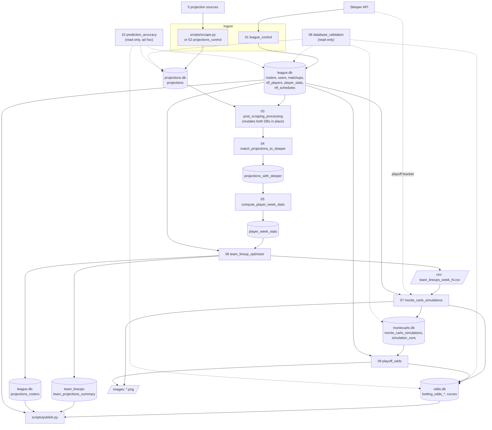

# 02 – Data Pipeline

Everything here runs on the operator's machine. Paths are relative to `backend/data/` unless noted. Databases live in `databases/`, CSVs in `csv/`, PNGs in `images/`.

## Flow

Notebooks 06→07 hand off through a **CSV file**, not the database. Every notebook has its own hardcoded config block (see [Configuration](#configuration)).

## Projection sources

All scrapers live in `backend/scrapers/`, have no shared base class, and follow the same duck-typed shape: context manager, `scrape_week_projections(...)` returning a list of dicts, and `scrape_and_save(...)` which upserts via `ProjectionsDB.insert_projections_batch`. None require authentication.

| `source_website` | Class | How | Notes / fragility |
|---|---|---|---|
| `sleeper.com` | `SleeperScraper` | `requests` against the undocumented `api.sleeper.app/v1/projections/nfl/regular/{season}/{week}` | Most stable. Uses `pts_ppr` or computes PPR itself. Drops IDP and <0.1 pt players. |
| `espn.com` | `ESPNScraper` | Selenium: clicks through PPR / This Week / position tabs | Most fragile. Many `time.sleep`s, retries, reads three table fragments and pairs them by row index. First page only (~50/position). |
| `fantasypros.com` | `FantasyProsScraper` | Selenium on per-position rankings pages | URL has no week, so it gets whatever week the site currently shows. Assumes the last column is projected points. |
| `firstdown.studio` | `FirstDownStudioScraper` | Selenium on `/rankings/{pos}` | No DST. `scoring` argument is ignored. No week in the URL. |
| `fanduel.com` | `FanDuelScraper` | Playwright: loads the research page and intercepts the GraphQL `getProjections` response | Must run in a **subprocess** (Playwright's sync API conflicts with Jupyter). |

Every row stores: source, week (`"Week N"`), first name, last name (split on first space), position, team, projected points. `ProjectionsDB` standardizes positions (`D/ST`/`DEF`→`DST`, `FB`→`RB`) and team codes (`WSH`→`WAS`, `JAC`→`JAX`, `LA`→`LAR`) on insert.

### `scripts/scrape.py`

The preferred entry point for scraping (notebook 02 does the same work without the safety checks).

1. For each requested source: delete that source's rows for the week, run the scraper (FanDuel via `python -m backend.scrapers.scraper_fanduel` subprocess, 300 s timeout), count the rows, and record `OK` / `EMPTY` / `FAILED`. One failing source does not stop the others.
2. Print a summary table. Optionally run `validate_scraping`.
3. Exit code: a full run passes with ≥3 successful sources and ≥150 projections; a `--sources` subset passes only if every requested source succeeded.

### `scripts/validate_scraping.py`

Checks one week: rows per expected source, coverage of `QB/RB/WR/TE/K/DST`, and duplicate (source, name, position) groups. **PASS** = ≥3 sources, ≥150 rows, no missing positions; **WARN** = missing positions only; otherwise **FAIL**. Duplicates are reported but don't change status. `--json` for machine output.

## Notebook reference

| # | Reads | Does | Writes |
|---|---|---|---|
| **01** league_control | Sleeper API; `.env` `SLEEPER_USERNAME`, `LEAGUE_ID` | Upserts rosters and matchups for `CURRENT_WEEK`, plus that week's player stats. Prints standings. The one-time `initial_data_load()` (league, all players, schedule) is commented out. | `league.db` |
| **02** projections_control | Source sites | Same scraper calls as `scrape.py`, one cell per source; FanDuel via a generated temp script. No stale-row deletion or thresholds. | `projections.db.projections` |
| **03** post_scraping_processing | Both DBs | Raw SQL `UPDATE`/`DELETE` across **all weeks**: team code fixes, `D/ST`/`DEF`→`DST`, `FB`→`RB`, delete IDP rows, Travis Hunter→WR, blank FirstDown positions→QB. Mostly overlaps insert-time standardization. | Mutates `projections`, `nfl_players`; `csv/cleaned_*.csv` |
| **04** match_projections_to_sleeper | `projections`, `nfl_players` | Matches every projection to a Sleeper ID. Order: DST by team → hardcoded map (one entry) → index on `(team, position, first-word-of-last-name, first initial)`. Unmatched rows kept with NULL ID. Table rebuilt every run. | `projections_with_sleeper`; `csv/unmatched_projections.csv` |
| **05** compute_player_week_stats | `projections_with_sleeper`, `nfl_players` | Per player-week: μ = mean across sources, σ = blend of source disagreement and position baseline ([03](03-modeling-and-odds.md#1-player-distributions)). | `projections.db.player_week_stats` |
| **06** team_lineup_optimizer | `rosters`, `users`, `nfl_players`, `nfl_schedules`, `player_week_stats` | Greedy best lineup per team, excluding injured/bye players and substituting replacement players ([03](03-modeling-and-odds.md#2-lineups-and-replacement-players)). | `team_lineups`, `team_projections_summary` (projections.db); `projections_rosters` (league.db); `csv/team_lineups_week_N.csv` |
| **07** monte_carlo_simulations | `csv/team_lineups_week_N.csv`; `league.db.matchups` or live Sleeper bracket (playoffs) | 50,000 lognormal simulations per team; derives all weekly markets and chart curves ([03](03-modeling-and-odds.md#3-simulation)). | `montecarlo.db`; `odds.db` betting and curve tables; CSVs; ~7 PNG types |
| **08** database_validation | All four DBs | Row counts, coverage, null/negative checks, probability sums, betting-page consistency. Assumes 12 teams/6 matchups, so it fails by design in playoff weeks. | Nothing |
| **09** playoff_odds | `rosters`, `users`, `matchups`; latest run in `montecarlo.db` | Adds each simulation's current-week result to current standings and ranks teams. Only the current week is simulated, not the rest of the schedule. | `odds.db`: `betting_odds_first_place`, `betting_odds_make_playoffs`, `standings_probability_matrix`; 5 PNGs |
| **10** prediction_accuracy | `projections_with_sleeper`, `player_week_stats`, `team_projections_summary`, `league.db.player_stats`, `matchups`, `betting_odds_team_ou` | MAE/RMSE/bias per source, position, and tier vs. actual points; O/U and pick accuracy. | Nothing (inline plots only) |

## Configuration

There is no central config. Each notebook defines its own block at the top, and they must be edited by hand every week.

| Setting | Where | Current value |
|---|---|---|
| `CURRENT_WEEK` / `WEEK` | 01, 05, 06, 07 = `16`; 08, 09 = `14`; 02 = `"Week 16"` | Must be edited each week, independently |
| `SEASON` | 01, 02, 06, `scrape.py` | `"2025"` (some scraper method defaults still say `"2024"`) |
| `LEAGUE_ID` | 06, 07, 09 (01 reads `.env`) | `1226433368405585920` default |
| `PLAYOFFS`, `PLAYOFF_START_WEEK` | 01, 07 | `True`, `15` |
| Project paths | 01–09 | Absolute `C:\Users\Samer Faizi\...` path |
| Model parameters | 05 (`ALPHA`, `BETA`, `POS_SIGMA`), 06 (`BENCHMARKS`, `ROSTER_SLOTS`), 07 (`SEED`, `N_SIMULATIONS`) | See [03](03-modeling-and-odds.md) |
| Scraper DB path | Every scraper/DB class | Relative `backend/data/databases/...`, so they depend on the working directory |

The only environment variables the pipeline reads are `SLEEPER_USERNAME` and `LEAGUE_ID` (notebook 01), and `DATABASE_URL` (`publish.py`).
