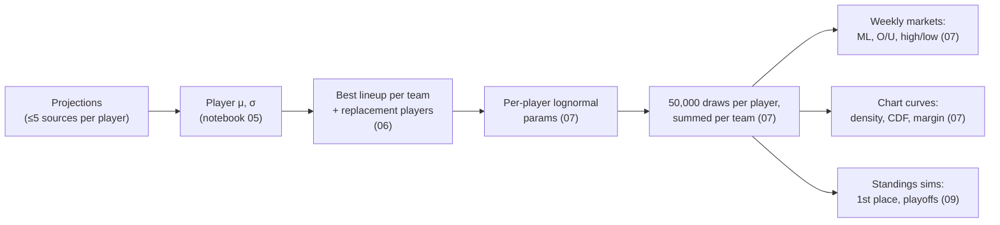

# 03 – Modeling & Odds

How raw projections become prices. All scoring is PPR.

## 1. Player distributions

Notebook 05, per `(sleeper_player_id, week)` using every matched source projection:

- **μ** = mean of the source projections
- **s** = sample standard deviation across sources (`ddof=1`); `0` when only one source
- **σ** = √((α·s)² + (β·σ_pos)²)

| Parameter | Value |
|---|---|
| α (source-disagreement weight) | 2.0 |
| β (baseline weight) | 1.0 |
| σ_pos | QB 7, RB 9, WR 10, TE 8, K 4, DST 7; default 8 |

Players whose projections disagree get wider distributions; a player every source agrees on keeps roughly the positional baseline.

## 2. Lineups and replacement players

Notebook 06, per team:

1. **Eligibility.** Drop players with injury status `Out`, `IR`, `PUP`, `Suspended`, or `Doubtful`. Players on bye stay but get μ = 0.
2. **Replacement benchmark.** For each position, the player at a fixed rank by μ across the whole player pool is the benchmark: QB 18, RB 40, WR 50, TE 22, K 18, DEF 18.
3. **Greedy fill.** Sort by μ and fill slots QB 1, RB 2, WR 2, TE 1, FLEX 1 (RB/WR/TE), K 1, DEF 1 (9 starters). If a starter's μ is below the position benchmark, the benchmark player's μ/σ is used instead, flagged `is_replacement`.
4. **Summary.** Team `total_mu = Σμ`, `combined_sigma = √Σσ²` (assumes independence).

Replacement players model the reality that an owner with a bad or empty slot will usually pick someone up from waivers before kickoff.

## 3. Simulation

Notebook 07, seed `1738`, `N_SIMULATIONS = 50,000`.

**Lognormal parameterization** (per player, from μ and σ):

- φ = √(σ² + μ²)
- μ_ln = ln(μ² / φ)
- σ_ln = √(ln((φ/μ)²))

This keeps the simulated mean and standard deviation equal to μ and σ while preventing negative scores and giving a right skew. Edge cases: σ ≈ 0 gives a near-degenerate draw at μ; μ ≤ 0 is clamped to 1e-6.

**Draws.** Each lineup player gets an independent `np.random.lognormal(μ_ln, σ_ln, 50000)` array; a team's score for simulation *i* is the sum of its players' *i*-th draws. There is **no correlation** between players (e.g. QB–WR stacks) or between opposing teams. Because the seed is reset once and draws are consumed in team/lineup order, results change if the order of teams or players changes.

**Matchups.** Regular season: pairs from `league.db.matchups` for the week. Playoffs (`PLAYOFFS = True`): the live Sleeper `winners_bracket` API is walked to find the teams still alive, and only those are simulated.

## 4. Markets

All prices are **fair odds with no vig**, rounded to whole numbers and stored as strings.

**Probability → American odds**

| | Formula |
|---|---|
| p ≥ 0.5 | −100 · p / (1 − p) |
| p < 0.5 | +100 · (1 − p) / p |

The pipeline clamps p to [0.001, 0.999] before converting, so a team that never wins in the simulation is priced `+99900` rather than the `"-∞"`/`"+∞"` strings notebook 07 stored (Flask parses the string with `int()`, so it must stay numeric). Every market shares the one converter in `pipeline/steps/odds.py`.

| Market | Table | Derived from |
|---|---|---|
| **Moneyline** | `betting_odds_matchup_ml` | P(team1 > team2) across paired simulations; ties tracked separately |
| **Team over/under** | `betting_odds_team_ou` | Line = the team's simulated **median**, so over/under are ≈50/50 and paid at `EVEN` |
| **Matchup over/under** | `betting_odds_matchup_ou` | Line = median of combined score. **Computed but not published or offered.** |
| **Highest / lowest scorer** | `betting_odds_highest_scorer`, `_lowest_scorer` | Share of simulations in which each team has the max/min score (ties credit every tied team) |
| **First place** | `betting_odds_first_place` | Notebook 09: P(rank 1) after adding each simulated week to current standings |
| **Make playoffs** | `betting_odds_make_playoffs` | Notebook 09: P(rank ≤ 8). Offered in the app as the `ammad_playoff` bet type |

Notebook 09 ranking: +1 win for the higher simulated score (an exact tie counts as a loss for both), then sort by wins, then total points for. Only rows with 0.01 ≤ p ≤ 0.99 are stored.

## 5. Analytics curves

Precomputed in notebook 07 so the web app never touches raw simulations (the 400+ MB `montecarlo.db` is not published).

| Table | Content |
|---|---|
| `team_distribution_curves` | Per owner: a 160-point x-grid shared across all teams (spanning the pooled 0.5th–99.5th percentiles, padded 5%), `gaussian_kde` density, empirical CDF, plus mean, p10, p50, p90, n_sims |
| `team_matchup_margin_curves` | For **every ordered pair** of owners (not just scheduled matchups): margin = team − opponent on a grid of −40…40 (161 points), left tail CDF and right tail survival, win/loss/tie probabilities |

Arrays are stored as JSON text. The notebook fails if any owner has a different set of `sim_id`s, since margins pair draws by `sim_id`.

The pairwise margin table lets the analytics page compare any two teams, not just the scheduled pair. Moneylines are only shown for the scheduled pair.

## 6. Playoff odds

The `playoffs` step (`pipeline/steps/playoffs.py`) replaces notebook 09. The notebook ranked teams after the current week only; the step simulates every week left in the regular season, 20,000 seasons per run.

1. **Current week.** The first 20,000 draws of the simulate step's latest run for the week, paired by `league.db.matchups`.
2. **Each later week** (`week + 1` to `playoff_week_start − 1`):
   - *Projections.* The sources that publish future weeks (Sleeper, ESPN, FantasySharks) are scraped, then cleaned, matched and turned into player μ/σ exactly as the weekly steps do. Sleeper is always scraped because the others are checked against it, and a failing Sleeper stops the step; any other source that fails its checks is dropped for that week, with its rows deleted and one warning naming the weeks. `--sources` narrows the others. These projections live only for the run: once the later weeks are simulated, or the step fails part-way, their rows in `projections`, `projections_with_sleeper` and `player_week_stats` are deleted, and the current week's are never touched. Because of that cleanup the step refuses a week the weekly steps have already moved past (a later regular-season week has `team_lineups` rows): repricing week 4's futures after week 5's run would otherwise delete week 5's projections.
   - *Lineups.* Each roster starts its best lineup from its own players, with the lineups step's eligibility and slot rules but **no replacement players**, since nobody can know who will be on waivers in six weeks. An empty slot scores 0.
   - *Draws.* The same sampler as the simulate step, seeded with `seed + week`.
   - *Pairings.* Sleeper's `/league/{id}/matchups/{week}`, which lists the whole regular season in advance.
3. **Standings.** Start from each roster's record to date (`wins`, `ties` and points for = `fpts + fpts_decimal / 100`; notebook 09 added the hundredths unscaled) and add every simulated week: the higher score wins, an exact tie is a tie for both, and every score counts toward points for. Rank by wins, then ties, then points for, then lower `roster_id` (`pipeline/standings.py`).

| Market | Table | Probability |
|---|---|---|
| **First place** | `betting_odds_first_place` | Share of seasons a team finishes 1st |
| **Make playoffs** | `betting_odds_make_playoffs` | Share of seasons it finishes in the top `playoff_teams` (league setting; 8 in 2026) |
| — | `standings_probability_matrix` | Every team at every finishing position, including 0% |

The step fails unless first place sums to 1 and make playoffs to `playoff_teams`, each within 1e-6. The two betting tables keep only 0.01 ≤ p ≤ 0.99, as before; the matrix is not published because the web app does not read it. All three tables carry `run_id` and `season`, and a rerun replaces the week's rows whichever run wrote them, so a week has one set of futures.

Limits: weeks are independent draws from today's rosters, so trades, waiver moves and injuries after today are not modeled. A league with divisions is refused, since division winners would change who makes the playoffs. From `playoff_week_start` on the step writes nothing and warns that the playoffs have started.

## 7. Prediction accuracy

The `accuracy` step (`pipeline/steps/accuracy.py`) replaces the ad hoc notebook 10 and writes what it finds. It grades the week before the run's week once that week is over: every game final in `league.db.nfl_schedules` (ESPN's status, refreshed by the league step; the 2025 schedules migrated without one count as played) and the stat lines in `league.db.player_stats`. It runs before `lineups` in the weekly order.

**Players.** Every source, and the consensus μ the model used (`player_week_stats`), are scored on the players the consensus projected for at least 2 points; benchwarmers who score 0 would otherwise flatter every source. A source that lists a player twice under two spellings is scored on the mean of the two, positions come from Sleeper, and a player without a stat line scored 0. For each source at each position and over all positions (`ALL`):

| Measure | Definition |
|---|---|
| `n` | Players scored |
| `mae` | Mean \|projected − actual\| |
| `bias` | Mean (projected − actual); positive means the source projected too high |
| `corr` | Pearson's r; empty under 3 players or when either side is constant |

**Teams.** Each roster's projected total (`team_projections_summary.total_mu`, or the sum of `team_lineups.mu`) is compared with its matchup points, with whether the score fell inside the simulated 10th–90th percentile range (`team_distribution_curves`) and the moneyline win probability (`betting_odds_matchup_ml`), both from the latest odds run for the week. A tie or a week without an opponent has no result.

**Summary.** Consensus MAE, bias and correlation over all positions; the most accurate source at each position among those with at least 20 players scored; team MAE; the share of teams inside their 80% range (`coverage_80`); and the moneyline Brier score, the mean of (win probability − won)².

Results go to `prediction_accuracy` (one row per source and position) and `team_accuracy` (one row per roster) in `projections.db`, both published and replaced whenever the week is graded again. The step warns and writes nothing when the week has no stat lines yet, still has games to finish (a player yet to play has no stat line and would count as scoring 0), or has no projections; scores players only when there are no lineups, and leaves the range and moneyline columns empty, with a warning counting the teams affected, when the odds for that week are missing.
