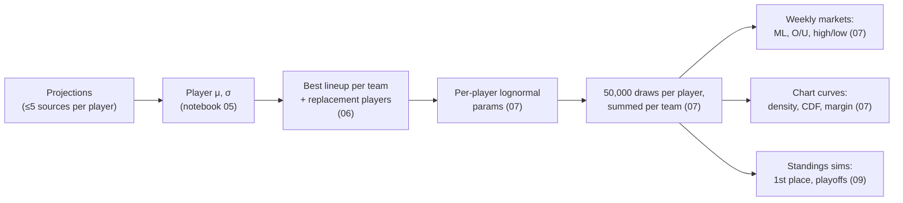

# 03 – Modeling & Odds

How raw projections become prices. All scoring is PPR.

## 1. Player distributions

Notebook 05, per `(sleeper_player_id, week)` using every matched source projection:

- **μ** = mean of the source projections
- **s** = sample standard deviation across sources (`ddof=1`); `0` when only one source
- **σ** = √((α·s)² + (β·σ_pos)²)

| Parameter | Value |
|---|---|
| α (source-disagreement weight) | 2.0 |
| β (baseline weight) | 1.0 |
| σ_pos | QB 7, RB 9, WR 10, TE 8, K 4, DST 7; default 8 |

Players whose projections disagree get wider distributions; a player every source agrees on keeps roughly the positional baseline.

## 2. Lineups and replacement players

Notebook 06, per team:

1. **Eligibility.** Drop players with injury status `Out`, `IR`, `PUP`, `Suspended`, or `Doubtful`. Players on bye stay but get μ = 0.
2. **Replacement benchmark.** For each position, the player at a fixed rank by μ across the whole player pool is the benchmark: QB 18, RB 40, WR 50, TE 22, K 18, DEF 18.
3. **Greedy fill.** Sort by μ and fill slots QB 1, RB 2, WR 2, TE 1, FLEX 1 (RB/WR/TE), K 1, DEF 1 (9 starters). If a starter's μ is below the position benchmark, the benchmark player's μ/σ is used instead, flagged `is_replacement`.
4. **Summary.** Team `total_mu = Σμ`, `combined_sigma = √Σσ²` (assumes independence).

Replacement players model the reality that an owner with a bad or empty slot will usually pick someone up from waivers before kickoff.

## 3. Simulation

Notebook 07, seed `1738`, `N_SIMULATIONS = 50,000`.

**Lognormal parameterization** (per player, from μ and σ):

- φ = √(σ² + μ²)
- μ_ln = ln(μ² / φ)
- σ_ln = √(ln((φ/μ)²))

This keeps the simulated mean and standard deviation equal to μ and σ while preventing negative scores and giving a right skew. Edge cases: σ ≈ 0 gives a near-degenerate draw at μ; μ ≤ 0 is clamped to 1e-6.

**Draws.** Each lineup player gets an independent `np.random.lognormal(μ_ln, σ_ln, 50000)` array; a team's score for simulation *i* is the sum of its players' *i*-th draws. There is **no correlation** between players (e.g. QB–WR stacks) or between opposing teams. Because the seed is reset once and draws are consumed in team/lineup order, results change if the order of teams or players changes.

**Matchups.** Regular season: pairs from `league.db.matchups` for the week. Playoffs (`PLAYOFFS = True`): the live Sleeper `winners_bracket` API is walked to find the teams still alive, and only those are simulated.

## 4. Markets

All prices are **fair odds with no vig**, rounded to whole numbers and stored as strings.

**Probability → American odds**

| | Formula |
|---|---|
| p ≥ 0.5 | −100 · p / (1 − p) |
| p < 0.5 | +100 · (1 − p) / p |

Notebook 07 returns `"-∞"`/`"+∞"` at p = 1/0; notebook 09 returns `"N/A"`. The two functions are copy-pasted, not shared.

| Market | Table | Derived from |
|---|---|---|
| **Moneyline** | `betting_odds_matchup_ml` | P(team1 > team2) across paired simulations; ties tracked separately |
| **Team over/under** | `betting_odds_team_ou` | Line = the team's simulated **median**, so over/under are ≈50/50 and paid at `EVEN` |
| **Matchup over/under** | `betting_odds_matchup_ou` | Line = median of combined score. **Computed but not published or offered.** |
| **Highest / lowest scorer** | `betting_odds_highest_scorer`, `_lowest_scorer` | Share of simulations in which each team has the max/min score (ties credit every tied team) |
| **First place** | `betting_odds_first_place` | Notebook 09: P(rank 1) after adding each simulated week to current standings |
| **Make playoffs** | `betting_odds_make_playoffs` | Notebook 09: P(rank ≤ 8). Offered in the app as the `ammad_playoff` bet type |

Notebook 09 ranking: +1 win for the higher simulated score (an exact tie counts as a loss for both), then sort by wins, then total points for. Only rows with 0.01 ≤ p ≤ 0.99 are stored.

## 5. Analytics curves

Precomputed in notebook 07 so the web app never touches raw simulations (the 400+ MB `montecarlo.db` is not published).

| Table | Content |
|---|---|
| `team_distribution_curves` | Per owner: a 160-point x-grid shared across all teams (spanning the pooled 0.5th–99.5th percentiles, padded 5%), `gaussian_kde` density, empirical CDF, plus mean, p10, p50, p90, n_sims |
| `team_matchup_margin_curves` | For **every ordered pair** of owners (not just scheduled matchups): margin = team − opponent on a grid of −40…40 (161 points), left tail CDF and right tail survival, win/loss/tie probabilities |

Arrays are stored as JSON text. The notebook fails if any owner has a different set of `sim_id`s, since margins pair draws by `sim_id`.

The pairwise margin table lets the analytics page compare any two teams, not just the scheduled pair. Moneylines are only shown for the scheduled pair.
