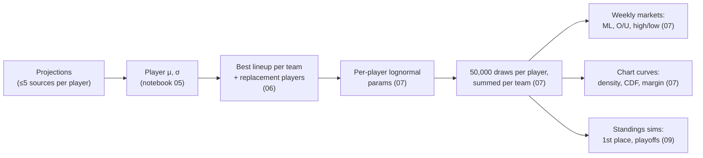

# 03 – Modeling & Odds

How raw projections become prices. All scoring is PPR.

## 1. Player distributions

The `stats` step (`pipeline/steps/stats.py`) replaces notebook 05. For each `(sleeper_player_id, week)` it combines every matched source projection under the parameters of the run's model version, a JSON file in `pipeline/model/params/` chosen by `PIPELINE_MODEL_VERSION` (default `v1`):

- **μ** = mean of each source's projection minus that source's `bias` at the player's position, weighted by its `weight`. A source the file does not list counts at weight 1, bias 0, and a position missing from a source's `bias` at bias 0.
- **s** = sample standard deviation of those bias-corrected projections (`ddof=1`); `0` with one source.
- **σ** = the version's formula below.

Each `player_week_stats` row records the `model_version` that produced it.

| | v1: notebook 05's formulas, frozen | v2: fitted on 2025 weeks 10–16 |
|---|---|---|
| Sources (weight, bias) | 1, 0 for every source | ESPN 0.99, +0.61; FanDuel 1.09, +0.35; FirstDown 0.83, −0.72; Sleeper 1.09, +0.92 |
| σ | √((2s)² + σ_pos²); σ_pos QB 7, RB 9, WR 10, TE 8, K 4, DEF 7, default 8 | max(1, a + b·μ) per position; s is not used |
| Dud game | None | Chance 1 / (1 + e^−(c + d·μ)) per position; a dud scores uniformly on [0, 0.25·μ] |
| Teammates | Independent | Correlated when they play for the same NFL team ([§3](#3-simulation)) |

A positive bias means the source projects too high, so v2 lowers a typical μ by 0.2–0.3 points. FantasyPros is not in v2 because its 2025 numbers were rank-implied rather than projections, and FantasySharks has no 2025 data; both count at weight 1, bias 0.

Under v1, sources that disagree widen a player's distribution, and a player every source agrees on keeps the positional baseline. Under v2 the width grows with the projection instead: in 2025 the size of a player's miss tracked his μ (correlation 0.07–0.37 by position) but not the sources' disagreement (within ±0.05). A low projection also carries a real chance of a near-zero game:

| Position | a | b | c | d | σ at μ = 10 | Dud chance at μ = 10 |
|---|---|---|---|---|---|---|
| QB | 5.71 | 0.094 | 2.68 | −0.297 | 6.6 | 0.43 |
| RB | 3.33 | 0.323 | −0.31 | −0.186 | 6.6 | 0.10 |
| WR | 3.61 | 0.297 | 0.28 | −0.189 | 6.6 | 0.17 |
| TE | 1.54 | 0.544 | −0.29 | −0.173 | 7.0 | 0.12 |
| K | −0.11 | 0.595 | −1.32 | −0.102 | 5.8 | 0.09 |
| DEF | 2.73 | 0.599 | – | – | 8.7 | 0 |

A QB projected for 10 is usually a backup who may not play, hence the high dud chance; at μ = 20 it is 0.04. DEF has no dud because only ESPN projects defenses and the dud fit needs two sources per player-week. How the values were fitted and how v2 compares with v1 is in [Model fitting and calibration](#model-fitting-and-calibration).

## 2. Lineups and replacement players

Notebook 06, per team:

1. **Eligibility.** Drop players with injury status `Out`, `IR`, `PUP`, `Suspended`, or `Doubtful`. Players on bye stay but get μ = 0.
2. **Replacement benchmark.** For each position, the player at a fixed rank by μ across the whole player pool is the benchmark: QB 18, RB 40, WR 50, TE 22, K 18, DEF 18.
3. **Greedy fill.** Sort by μ and fill slots QB 1, RB 2, WR 2, TE 1, FLEX 1 (RB/WR/TE), K 1, DEF 1 (9 starters). If a starter's μ is below the position benchmark, the benchmark player's μ/σ is used instead, flagged `is_replacement`.
4. **Summary.** Team `total_mu = Σμ`, `combined_sigma = √Σσ²` (assumes independence).

Replacement players model the reality that an owner with a bad or empty slot will usually pick someone up from waivers before kickoff.

## 3. Simulation

The `simulate` step (`pipeline/steps/simulate.py`, sampler in `pipeline/model/sampling.py`) replaces notebook 07's draws: seed `1738`, 50,000 simulations, each starter's μ and σ from `team_lineups`, and the dud and correlation blocks of the run's model version ([§1](#1-player-distributions)).

**Lognormal parameterization** (per player, from a mean m and σ):

- φ = √(σ² + m²)
- μ_ln = ln(m² / φ)
- σ_ln = √(ln((φ/m)²))

This keeps the simulated mean and standard deviation equal to m and σ while preventing negative scores and giving a right skew. Edge cases: σ ≈ 0 gives a near-degenerate draw at m; m ≤ 0 is clamped to 1e-6.

**Draws.** One standard normal z per starter and simulation, from `np.random.default_rng(seed)` in roster then slot order, so the same lineups and seed reproduce the same totals and reordering the starters changes them. Each z becomes points:

- *No dud chance* (every player under v1, DEF under v2): exp(μ_ln + σ_ln·z) with m = μ.
- *Dud chance p*: with u = Φ(z), a draw with u < p is a dud scoring (u/p)·0.25·μ, uniform on [0, 0.25·μ]; any other draw takes the lognormal's quantile at (u − p)/(1 − p). The lognormal's mean is raised to m = (μ − p·0.25·μ/2)/(1 − p) so the mixture still averages μ, and σ is the standard deviation of the non-dud games.

A team's score for simulation *i* is the sum of its starters' *i*-th points. The totals go to `sims/<season>/wkNN/<run_id>.parquet` for the odds step.

**Teammate correlation.** When the version has a `correlation` block (v2), the z's of starters who play for the same NFL team, on any fantasy roster, are correlated before they become points: each group's normals are multiplied by the Cholesky factor of the matrix of pair correlations (QB–WR 0.22, QB–TE 0.21, QB–RB 0.07, RB–WR −0.05; any other pair 0). This Gaussian copula keeps every player's own distribution while making a QB's big game raise his receivers' odds of one. Players on different NFL teams stay independent, opponents in the same game included; v1 draws every starter independently.

**Matchups.** The week's pairs from `league.db.matchups`. From `playoff_week_start` on, only the rosters Sleeper gives a matchup that week, the teams still playing, are simulated.

## 4. Markets

All prices are **fair odds with no vig**, rounded to whole numbers and stored as strings.

**Probability → American odds**

| | Formula |
|---|---|
| p ≥ 0.5 | −100 · p / (1 − p) |
| p < 0.5 | +100 · (1 − p) / p |

The pipeline clamps p to [0.001, 0.999] before converting, so a team that never wins in the simulation is priced `+99900` rather than the `"-∞"`/`"+∞"` strings notebook 07 stored (Flask parses the string with `int()`, so it must stay numeric). Every market shares the one converter in `pipeline/steps/odds.py`.

| Market | Table | Derived from |
|---|---|---|
| **Moneyline** | `betting_odds_matchup_ml` | P(team1 > team2) across paired simulations; ties tracked separately |
| **Team over/under** | `betting_odds_team_ou` | Line = the team's simulated **median**, so over/under are ≈50/50 and paid at `EVEN` |
| **Matchup over/under** | `betting_odds_matchup_ou` | Line = median of combined score. **Computed but not published or offered.** |
| **Highest / lowest scorer** | `betting_odds_highest_scorer`, `_lowest_scorer` | Share of simulations in which each team has the max/min score (ties credit every tied team) |
| **First place** | `betting_odds_first_place` | Notebook 09: P(rank 1) after adding each simulated week to current standings |
| **Make playoffs** | `betting_odds_make_playoffs` | Notebook 09: P(rank ≤ 8). Offered in the app as the `ammad_playoff` bet type |

Notebook 09 ranking: +1 win for the higher simulated score (an exact tie counts as a loss for both), then sort by wins, then total points for. Only rows with 0.01 ≤ p ≤ 0.99 are stored.

## Model fitting and calibration

A model version is a JSON file in `pipeline/model/params/`. `v1` holds notebook 05's formulas, frozen as the baseline; later versions are fitted on a season's projections and actual points, and switching between them is a setting (`PIPELINE_MODEL_VERSION`), not a code change.

**Fitting** (`pipeline/model/fit.py`), for example `python -m pipeline fit-model --season 2025 --weeks 10-16 --out v2 --exclude-sources fantasypros.com`. The training rows are the matched projections of the non-excluded sources for players at QB, RB, WR, TE, K or DEF whose plain mean projection is at least 2 points, each joined to the player's PPR points in `league.db.player_stats` (no stat line means he did not play and scored 0). Each stage uses the one before it:

1. **Sources.** For each source and position with rows in at least 3 weeks, bias = mean(projected − actual) over those rows; a position with fewer weeks is left out of the source's `bias` and counts as 0. A source with rows in at least 3 weeks gets weight = 1 / its mean squared error once those biases are taken out, scaled so the weights average 1 and clipped to [0.25, 4]; a source with fewer weeks gets weight 1 and no bias. The bias is per position because a source can project one position too high and another too low, and one number per source then corrects one of them the wrong way.
2. **μ** per player-week with those weights and biases, by the stats step's own formula.
3. **Dud.** Per position, on player-weeks with at least 2 sources, a dud is an actual under 0.25·μ, and c, d are the maximum-likelihood logistic fit of the dud chance on μ. A position with fewer than 50 player-weeks or 5 duds gets no dud.
4. **σ.** Per position, on the non-dud player-weeks: residuals from the lognormal part's mean ([§3](#3-simulation)), grouped by μ into bins of about 50; a and b are the least-squares line through the bins' residual standard deviations, weighted by bin size. A position with fewer than 100 player-weeks gets its overall residual standard deviation and b = 0.
5. **Correlation.** For each pair type, Pearson's r of the standardized residuals (actual − μ)/σ over every pair of teammates at the two positions in the same week, clipped to [−0.1, 0.4], and 0 with fewer than 100 pairs. Teammates share `nfl_players.team`, the team when the league data was fetched, so a player traded mid-season counts with his new team throughout. The four values are then scaled down together, if needed, until the matrix the sampler builds for the largest likely group of teammates (QB, 3 RB, 5 WR, 2 TE) has no eigenvalue under 0.05, because the sampler's Cholesky factorization fails on a matrix that is not positive definite. The 2025 values needed no scaling.

`--out v1` is refused, and an excluded source with no projections in the window is an error, to catch typos.

**Gate** (`pipeline/model/evaluate.py`). Each training week is held out in turn and scored under parameters fitted on the other weeks; v1 is scored on the same rows.

- *Players.* The PIT u = F(actual) under the player's distribution, F(x) = p·min(x/(0.25·μ), 1) + (1 − p)·F_lognormal(x). A calibrated model puts 80% of the u's inside [0.10, 0.90], and likewise for the central 50% and 95%. An actual of 0 or less, usually a player who did not play, is a dud whose size the model does not resolve, so its PIT is the whole interval [0, p] rather than a point, and it covers a band by the share of that interval inside it (the non-randomized PIT of Czado, Gneiting and Held, 2009). Without a dud, in v1 and at DEF, the interval is [0, 0] and misses every band. The share of actuals at 0 or less is reported beside the coverage.
- *Teams.* Each week's `team_lineups` starters, re-projected with the held-out parameters and simulated 20,000 times: how often the actual score lands inside [p10, p90], the MAE of the simulated mean, and the moneyline Brier score, the mean of (P(team 1 wins) − result)² over the week's games. A tie has no result and is left out, as in the accuracy step.
- *Pass* when 80% coverage is within [0.70, 0.90] at each of QB, RB, WR and TE, team coverage within [0.72, 0.88], and the moneyline is not significantly worse than v1's. For each game, d is the fitted version's squared error minus v1's; the fit fails the moneyline only when the mean of d is more than two standard errors (sd(d)/√n) above 0, or above 0 at all with fewer than 2 games.

The result is stored in the version's `gate` block, with v1's metrics and the game-by-game Brier difference and its standard error beside the fitted version's. A version that fails can still be adopted, but only as a deliberate choice.

**v2 on 2025 weeks 10–16** (2,311 player-weeks, 84 team-weeks, 42 games, none tied):

| | QB | RB | WR | TE | K | DEF | All | Teams | MAE | Brier | Brier − v1's (se) |
|---|---|---|---|---|---|---|---|---|---|---|---|
| v2, 80% coverage | 0.798 | 0.750 | 0.776 | 0.766 | 0.746 | 0.617 | 0.754 | 0.786 | 20.08 | 0.2368 | +0.0004 (0.0017) |
| v1, 80% coverage | 0.688 | 0.712 | 0.629 | 0.657 | 0.643 | 0.679 | 0.662 | 0.833 | 20.30 | 0.2365 | |
| Actual ≤ 0 | 8% | 11% | 24% | 19% | 8% | 11% | 16% | | | | |

v2 passes the gate. Its player coverage rose with the zero rule: when every 0 counted as a miss, however large the player's dud chance, no model could cover more than 76% of WRs or 81% of TEs, and v2 stood at RB 0.695, WR 0.613 and TE 0.645. v1 has no dud, so its coverage is unchanged and still misses the bounds at QB, WR and TE. v2 also fixes v1's thin left tail: QB scores above 0 but below the 2.5th percentile fell from 11.6% of QB player-weeks under v1 to 2.7%. Its weak spot is DEF, which has no dud and is not gated: 0.617 against v1's 0.679, with 26% of its actuals above the 90th percentile. At the team level v2's intervals are narrower, covering 0.786 against 0.833, both inside the bounds. Its moneylines are no better than v1's: it did worse on 20 of the 42 games and better on 22, and the mean difference of +0.0004 is well inside two standard errors (0.0034), though the old rule of a Brier score no higher than v1's counted it as a failure. `PIPELINE_MODEL_VERSION` still defaults to v1; switching is a separate decision.

**Calibration** (the `calibrate` step, `pipeline/steps/calibrate.py`) checks the model as it actually ran, season to date, without refitting. It runs right after the accuracy step ([§7](#7-prediction-accuracy)) and scores every earlier week of the season that step has graded, which it does only once every game of the week is final:

- *Players* with μ ≥ 2: PIT coverage of the central 50%, 80% and 95% by position and overall, scored as in the gate from the stored μ and σ and the dud block of the version that stored each row, with the share of actuals at 0 or less beside it.
- *Teams:* the share of `team_accuracy` rows whose score fell inside the week's latest [p10, p90]. A team without a curve is left out, and a week whose teams all lack one is listed.
- *Moneylines:* the Brier score of the win chances the accuracy step recorded in `team_accuracy` against the results. A tie has no result and is left out.

The metrics go to `odds.db.calibration_metrics`, which is published: one row per metric and position, counts included, recorded at the run's week under the run's model version, and replaced when that week is recalibrated. The step also draws the 80% coverage by position as `calibration_week_N.png`. Until the accuracy step has graded a week it warns `no week graded by the accuracy step yet` and writes nothing. Run as week 17 of 2025 after the accuracy step graded weeks 10–16, it found the notebooks' distributions covered 65.5% of 2,335 player-weeks at 80% (QB 0.62, RB 0.72, WR 0.62, TE 0.65, K 0.66, DEF 0.69), 17% of which scored 0 or less, teams 85% of 60 team-weeks (week 13 has no curves), and a moneyline Brier score of 0.229 over 36 games.

## 5. Analytics curves

Precomputed in notebook 07 so the web app never touches raw simulations (the 400+ MB `montecarlo.db` is not published).

| Table | Content |
|---|---|
| `team_distribution_curves` | Per owner: a 160-point x-grid shared across all teams (spanning the pooled 0.5th–99.5th percentiles, padded 5%), `gaussian_kde` density, empirical CDF, plus mean, p10, p50, p90, n_sims |
| `team_matchup_margin_curves` | For **every ordered pair** of owners (not just scheduled matchups): margin = team − opponent on a grid of −40…40 (161 points), left tail CDF and right tail survival, win/loss/tie probabilities |

Arrays are stored as JSON text. The notebook fails if any owner has a different set of `sim_id`s, since margins pair draws by `sim_id`.

The pairwise margin table lets the analytics page compare any two teams, not just the scheduled pair. Moneylines are only shown for the scheduled pair.

## 6. Playoff odds

The `playoffs` step (`pipeline/steps/playoffs.py`) replaces notebook 09. The notebook ranked teams after the current week only; the step simulates every week left in the regular season, 20,000 seasons per run.

1. **Current week.** The first 20,000 draws of the simulate step's latest run for the week, paired by `league.db.matchups`.
2. **Each later week** (`week + 1` to `playoff_week_start − 1`):
   - *Projections.* The sources that publish future weeks (Sleeper, ESPN, FantasySharks) are scraped, then cleaned, matched and turned into player μ/σ exactly as the weekly steps do. Sleeper is always scraped because the others are checked against it, and a failing Sleeper stops the step; any other source that fails its checks is dropped for that week, with its rows deleted and one warning naming the weeks. `--sources` narrows the others. These projections live only for the run: once the later weeks are simulated, or the step fails part-way, their rows in `projections`, `projections_with_sleeper` and `player_week_stats` are deleted, and the current week's are never touched. Because of that cleanup the step refuses a week the weekly steps have already moved past (a later regular-season week has `team_lineups` rows): repricing week 4's futures after week 5's run would otherwise delete week 5's projections.
   - *Lineups.* Each roster starts its best lineup from its own players, with the lineups step's eligibility and slot rules but **no replacement players**, since nobody can know who will be on waivers in six weeks. An empty slot scores 0.
   - *Draws.* The same sampler as the simulate step, seeded with `seed + week`.
   - *Pairings.* Sleeper's `/league/{id}/matchups/{week}`, which lists the whole regular season in advance.
3. **Standings.** Start from each roster's record to date (`wins`, `ties` and points for = `fpts + fpts_decimal / 100`; notebook 09 added the hundredths unscaled) and add every simulated week: the higher score wins, an exact tie is a tie for both, and every score counts toward points for. Rank by wins, then ties, then points for, then lower `roster_id` (`pipeline/standings.py`).

| Market | Table | Probability |
|---|---|---|
| **First place** | `betting_odds_first_place` | Share of seasons a team finishes 1st |
| **Make playoffs** | `betting_odds_make_playoffs` | Share of seasons it finishes in the top `playoff_teams` (league setting; 8 in 2026) |
| — | `standings_probability_matrix` | Every team at every finishing position, including 0% |

The step fails unless first place sums to 1 and make playoffs to `playoff_teams`, each within 1e-6. The two betting tables keep only 0.01 ≤ p ≤ 0.99, as before; the matrix is not published because the web app does not read it. All three tables carry `run_id` and `season`, and a rerun replaces the week's rows whichever run wrote them, so a week has one set of futures.

Limits: weeks are independent draws from today's rosters, so trades, waiver moves and injuries after today are not modeled. A league with divisions is refused, since division winners would change who makes the playoffs. From `playoff_week_start` on the step writes nothing and warns that the playoffs have started.

## 7. Prediction accuracy

The `accuracy` step (`pipeline/steps/accuracy.py`) replaces the ad hoc notebook 10 and writes what it finds. It grades the week before the run's week once that week is over: every game final in `league.db.nfl_schedules` (ESPN's status, refreshed by the league step; the 2025 schedules migrated without one count as played) and the stat lines in `league.db.player_stats`. It runs before `lineups` in the weekly order.

**Players.** Every source, and the consensus μ the model used (`player_week_stats`), are scored on the players the consensus projected for at least 2 points; benchwarmers who score 0 would otherwise flatter every source. A source that lists a player twice under two spellings is scored on the mean of the two, positions come from Sleeper, and a player without a stat line scored 0. For each source at each position and over all positions (`ALL`):

| Measure | Definition |
|---|---|
| `n` | Players scored |
| `mae` | Mean \|projected − actual\| |
| `bias` | Mean (projected − actual); positive means the source projected too high |
| `corr` | Pearson's r; empty under 3 players or when either side is constant |

**Teams.** Each roster's projected total (`team_projections_summary.total_mu`, or the sum of `team_lineups.mu`) is compared with its matchup points, with whether the score fell inside the simulated 10th–90th percentile range (`team_distribution_curves`) and the moneyline win probability (`betting_odds_matchup_ml`), both from the latest odds run for the week. A tie or a week without an opponent has no result.

**Summary.** Consensus MAE, bias and correlation over all positions; the most accurate source at each position among those with at least 20 players scored; team MAE; the share of teams inside their 80% range (`coverage_80`); and the moneyline Brier score, the mean of (win probability − won)².

Results go to `prediction_accuracy` (one row per source and position) and `team_accuracy` (one row per roster) in `projections.db`, both published and replaced whenever the week is graded again. The step warns and writes nothing when the week has no stat lines yet, still has games to finish (a player yet to play has no stat line and would count as scoring 0), or has no projections; scores players only when there are no lineups, and leaves the range and moneyline columns empty, with a warning counting the teams affected, when the odds for that week are missing.
