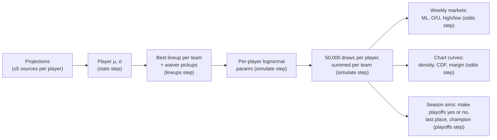

# 03 – Modeling & Odds

How raw projections become prices. All scoring is PPR.

## 1. Player distributions

The `stats` step (`pipeline/steps/stats.py`) turns the matched projections into each player's distribution. For each `(sleeper_player_id, week)` it combines every matched source projection under the parameters of the run's model version, a JSON file in `pipeline/model/params/` chosen by `PIPELINE_MODEL_VERSION` (default `v2.3`):

- **μ** = mean of each source's projection minus that source's `bias` at the player's position, weighted by its `weight`. A source the file does not list counts at weight 1, bias 0, and a position missing from a source's `bias` at bias 0.
- **s** = sample standard deviation of those bias-corrected projections (`ddof=1`); `0` with one source.
- **σ** = the version's formula below.

Each `player_week_stats` row records the `model_version` that produced it.

| | v1: the 2025 pipeline's formulas, frozen | v2.1: fitted on 2025 weeks 10–16 |
|---|---|---|
| Sources (weight, bias) | 1, 0 for every source | Weight ESPN 0.99, FanDuel 1.08, FirstDown 0.82, Sleeper 1.11; bias per position, below |
| σ | √((2s)² + σ_pos²); σ_pos QB 7, RB 9, WR 10, TE 8, K 4, DEF 7, default 8 | max(1, a + b·μ) per position; s is not used |
| Dud game | None | Chance 1 / (1 + e^−(c + d·μ)) per position; a dud scores uniformly on [0, 0.25·μ] |
| Floor | 0 at every position | −5 at DEF, 0 elsewhere ([§3](#3-simulation)) |
| Teammates | Independent | Correlated when they play for the same NFL team ([§3](#3-simulation)) |

| v2.1 bias | QB | RB | WR | TE | K | DEF |
|---|---|---|---|---|---|---|
| ESPN | +1.00 | +0.86 | +1.77 | +0.54 | +0.11 | −1.45 |
| FanDuel | +0.70 | −0.24 | +0.61 | +0.34 | | |
| FirstDown | +0.29 | −1.33 | −0.49 | −1.07 | | |
| Sleeper | +4.41 | 0.00 | +0.89 | +0.43 | +0.47 | |

A positive bias means the source projects too high. An empty cell is a position the source projected in fewer than 3 of the weeks, or not at all, and counts as 0. With each week held out in turn, v2.1's mean μ came within 0.16 points of the mean actual score at every position, where v1's ran 1.9 points high at QB and 1.4 low at DEF. FantasyPros is not in the fit because its 2025 numbers were rank-implied rather than projections, and FantasySharks has no 2025 data; both count at weight 1, bias 0.

v2.2, the default from 2026-09-28 to 2026-09-30, is v2.1 with Sleeper's QB bias at +1.45 in place of +4.41 and nothing else changed. Sleeper's QB projections fell between seasons: over shared players Sleeper ran 3.30 points above ESPN at QB in 2025 weeks 10–16 and 0.45 above in 2026 week 4, while ESPN's level held, so the 2025 correction would have put every QB's μ about 1.5 points low in a Sleeper-plus-ESPN run. 1.45 is ESPN's fitted QB bias plus the 2026 gap. Nothing was refitted, and the file's gate block is v2.1's; the check is the week-4 `prediction_accuracy` row for Sleeper's QBs, which should show a bias near +1.45 rather than +4.4 (`docs/design/sources-2026-research.md` §9).

v2.3, the default since 2026-09-30, is the same fit repeated with FFToday's backfilled 2025 weeks 10–16 among the sources (2347 rows; see Backfilling below). FFToday enters at weight 0.98 with biases of −0.04 QB, −0.90 RB, +0.49 WR and +0.40 TE; the other sources' parameters moved by hundredths and the gate is within noise of v2.2 (player coverage 0.774, team MAE 20.03, moneyline Brier 0.2356). The refit put Sleeper's QB bias back at 4.38, so v2.3 carries the same hand amendment to +1.45, with the same week-4 check.

Under v1, sources that disagree widen a player's distribution, and a player every source agrees on keeps the positional baseline. Under v2.1 the width grows with the projection instead: in 2025 the size of a player's miss tracked his μ (correlation 0.06–0.38 by position) but not the sources' disagreement (−0.09 to +0.04). A low projection also carries a real chance of a near-zero game:

| Position | a | b | c | d | σ at μ = 10 | Dud chance at μ = 10 |
|---|---|---|---|---|---|---|
| QB | 4.80 | 0.160 | 2.35 | −0.302 | 6.4 | 0.34 |
| RB | 3.03 | 0.325 | 0.14 | −0.211 | 6.3 | 0.12 |
| WR | 3.61 | 0.308 | 0.28 | −0.197 | 6.7 | 0.16 |
| TE | 1.43 | 0.541 | −0.26 | −0.169 | 6.8 | 0.12 |
| K | −1.42 | 0.719 | −2.14 | 0.020 | 5.8 | 0.13 |
| DEF | 1.50 | 0.599 | – | – | 7.5 | 0 |

A QB projected for 10 is usually a backup who may not play, hence the high dud chance; at μ = 20 it is 0.02. A kicker's dud chance barely moves with μ: 0.15 at μ = 20. DEF has no dud because only ESPN projects defenses and the dud fit needs two sources per player-week; its floor lets a defense score down to −5 instead. How the values were fitted, and how v2.1 compares with v1 and with v2, the first fit of the same weeks, is in [Model fitting and calibration](#model-fitting-and-calibration).

## 2. Lineups and replacement players

The `lineups` step (`pipeline/steps/lineups.py`, waiver fill in `pipeline/waivers.py`), per team:

1. **Eligibility.** A rostered player can start unless he is on the roster's reserve (IR) or taxi list, his injury status is `Out`, `IR`, `PUP`, `Sus` (suspended) or `Doubtful`, his NFL team is on bye, or he has no `player_week_stats` row for the week.
2. **Greedy fill.** The league's starting slots, today QB 1, RB 2, WR 2, TE 1, K 1, DEF 1 and FLEX 1 (RB/WR/TE), 9 starters: each fixed slot in turn takes the eligible player with the highest μ who may play there, then FLEX takes the best of those left. A player may play any position in his Sleeper `fantasy_positions`.
3. **Waiver fill.** A slot still empty is a hole. The free-agent pool is every unrostered player who could start and has projections from at least 2 sources. Position by position, FLEX last, the teams with a hole claim in waiver order, most FAAB remaining first and then the lower `waiver_position`, and the i-th team takes the i-th best free agent left. A pickup keeps his own σ, but his μ is capped at the median μ of the league's starters at that position; he is flagged `is_replacement`. A hole the pool cannot fill scores 0.
4. **Summary.** Team `total_mu = Σμ`, `combined_sigma = √Σσ²` (assumes independence), and the number of waiver pickups.

Waiver pickups model the owner who fills an empty slot from waivers before kickoff. A healthy starter is never replaced, however low his projection.

**Locked starters.** On a rerun after some of the week's games, a player is locked when his NFL game is final (`nfl_schedules.status = 'STATUS_FINAL'` for his team), decided by status and never by points. For a final game the owner's actual Sleeper starters (`matchups.starters`, in slot order) are pinned in their slots before the greedy fill, at their real league points (`matchups.players_points`, 0 when missing), even when no source projects them any more: `is_locked` 1, `locked_points` and μ at those points, σ 0. The owner's other rostered players from that game can no longer enter the lineup and are labelled `played` in `projections_rosters`; the model fills every other slot as above. Sleeper locks a slot at its player's kickoff, so pinning reads a fact rather than guessing the owner. The step's summary counts the pinned starters (`n_locked`).

## 3. Simulation

The `simulate` step (`pipeline/steps/simulate.py`, sampler in `pipeline/model/sampling.py`) draws the week's totals: seed `1738`, 50,000 simulations, each starter's μ and σ from `team_lineups`, and the dud, floor and correlation blocks of the run's model version ([§1](#1-player-distributions)).

**Lognormal parameterization** (per player, from a mean m and σ):

- φ = √(σ² + m²)
- μ_ln = ln(m² / φ)
- σ_ln = √(ln((φ/m)²))

This keeps the simulated mean and standard deviation equal to m and σ while giving a right skew and no draw under 0, or under the position's floor below. Edge cases: σ ≈ 0 gives a near-degenerate draw at m; m ≤ 0 is clamped to 1e-6.

**Draws.** One standard normal z per starter and simulation, from `np.random.default_rng(seed)` in roster then slot order, so the same lineups and seed reproduce the same totals and reordering the starters changes them. Each z becomes points:

- *No dud chance* (every player under v1, DEF under v2 and v2.1): f + exp(μ_ln + σ_ln·z) with m = μ − f, where f ≤ 0 is the position's floor in the version's `floor` block, 0 where the block does not list the position. The draws keep mean μ and standard deviation σ but reach down to f instead of 0.
- *Dud chance p*: with u = Φ(z), a draw with u < p is a dud scoring (u/p)·0.25·μ, uniform on [0, 0.25·μ]; any other draw takes the lognormal's quantile at (u − p)/(1 − p). The lognormal's mean is raised to m = (μ − p·0.25·μ/2)/(1 − p) so the mixture still averages μ, and σ is the standard deviation of the non-dud games.

A team's score for simulation *i* is the sum of its starters' *i*-th points. The totals go to `sims/<season>/wkNN/<run_id>.parquet` for the odds step.

**Teammate correlation.** When the version has a `correlation` block (v2 and v2.1), the z's of starters who play for the same NFL team, on any fantasy roster, are correlated before they become points: each group's normals are multiplied by the Cholesky factor of the matrix of pair correlations (in v2.1 QB–WR 0.22, QB–TE 0.22, QB–RB 0.07, RB–WR −0.05; any other pair 0). This Gaussian copula keeps every player's own distribution while making a QB's big game raise his receivers' odds of one. Players on different NFL teams stay independent, opponents in the same game included; v1 draws every starter independently.

**Locked starters.** A starter the lineups step pinned ([§2](#2-lineups-and-replacement-players)) scores his `locked_points` in every simulation, and the run records how many there are in `simulation_runs.n_locked`. The normals are still drawn for every column and only the locked columns are overwritten, so every other starter's draws are bit-identical to an unlocked run: the model links only players of the same NFL team, and a final game fixes all of its players at once. A game still in progress does not stop the run; its players are simulated as unplayed and the step warns, naming the game.

**Matchups.** The week's pairs from `league.db.matchups`. From `playoff_week_start` on, only the rosters Sleeper gives a matchup that week, the teams still playing, are simulated.

## 4. Markets

All prices are **fair odds with no vig**, rounded to whole numbers and stored as strings.

**Probability → American odds**

| | Formula |
|---|---|
| p ≥ 0.5 | −100 · p / (1 − p) |
| p < 0.5 | +100 · (1 − p) / p |

Chances are not clamped, so a selection that wins one simulation in 50,000 is priced `+4999900` (the owner's decision of 2026-09-28, `docs/design/odds-models-2026.md` §10). A chance of exactly 0 or 1, a selection that wins in no simulation or in every one, has no price: its row keeps the probability, and the price column is NULL, which marks the selection as not offered. Every market shares the one converter in `pipeline/steps/odds.py`.

**Win rules.** The rule of every market lives in `pipeline/markets.py`, and the odds step prices through it. The module imports only numpy and the standard library, so the Flask app can use the same rules: settlement judges every keyed bet through them ([06](06-betting-lifecycle.md#settlement)), and re-pricing will. A rule reads a run's score matrix, one row per simulation and one column per roster, and says for each simulation whether the selection won and whether it pushed:

| Rule | Wins | Pushes |
|---|---|---|
| Moneyline | the team's score is above its opponent's | equal scores |
| Over | the total, a team's score or a matchup's combined score, is above the line | the total is on the line |
| Under | the total is below the line | the total is on the line |
| Spread (no market yet) | the team's score plus the line is above its opponent's | exactly equal |
| Highest / lowest scorer | the team has the simulation's top (bottom) score, and every tied team wins | never |

Scores are compared exactly, in float64. A selection's chance is its share of all simulations, so a push counts against both sides: when some simulations land on a total's line, its over and under sum to less than 1. Total lines are the simulated median rounded to cents, and both sides are priced at the rounded line. The module also encodes the score matrix that publish stores for every run ([04](04-data-model.md#publishing-map)).

The futures have three rules of their own, read from a run's simulated seasons rather than its scores: the finishing places, one row per simulated season and one column per roster (1 is first), and each season's champion as a column index. None of them pushes.

| Rule | Wins |
|---|---|
| `make_playoffs(positions, team, playoff_teams, side)` | `yes`: the team finishes within the top `playoff_teams`; `no`: it finishes outside them |
| `last_place(positions, team)` | the team finishes last |
| `champion(champions, team)` | the team wins the bracket's final |

The playoffs step prices the futures through these rules ([§6](#6-playoff-odds)), and the app prices a futures parlay through them on the same seasons ([06](06-betting-lifecycle.md#parlays)). The module encodes the seasons too (`encode_standings`).

| Market | Table | Derived from |
|---|---|---|
| **Moneyline** | `betting_odds_matchup_ml` | P(team1 > team2) across paired simulations; ties tracked separately |
| **Team over/under** | `betting_odds_team_ou` | Line = the team's simulated **median** rounded to cents, so over/under are ≈50/50 and paid at `EVEN` |
| **Matchup over/under** | `betting_odds_matchup_ou` | Line = median of the combined score, rounded to cents. Published, not yet offered. |
| **Highest / lowest scorer** | `betting_odds_highest_scorer`, `_lowest_scorer` | Share of simulations in which each team has the max/min score (ties credit every tied team) |
| **Make playoffs** | `betting_odds_make_playoffs` | The `playoffs` step: YES = P(finishing in the top `playoff_teams`), NO = 1 − YES, each with its own fair odds, for every team; a side at exactly 0 or 1 has NULL odds. Offered in the app as the `make_playoffs` market |
| **Last place**, **Champion** | `betting_odds_last_place`, `betting_odds_champion` | The `playoffs` step: P(last in the standings) and P(winning the bracket) |

The futures come from simulated seasons: every remaining regular-season week added to the standings to date, ranked by wins, then ties, then points for, and the top teams played through the bracket ([§6](#6-playoff-odds)). Last place and the champion store only rows with 0.01 ≤ p ≤ 0.99; make playoffs stores a row for every team.

## Model fitting and calibration

A model version is a JSON file in `pipeline/model/params/`. `v1` holds the 2025 pipeline's formulas, frozen as the baseline; later versions are fitted on a season's projections and actual points, and switching between them is a setting (`PIPELINE_MODEL_VERSION`), not a code change.

**Backfilling a source's past weeks** (`pipeline/backfill.py`). A source added mid-season has no past rows to fit on. `python -m pipeline backfill --season 2025 --weeks 10-16 --source fftoday` fetches, verifies and stores its projections for weeks already played, a week counting as played when `league.db.player_stats` holds its actual scores, and runs `clean` and `match` for each of them so `projections_with_sleeper` carries the rows the fit reads. Every check but `value_agreement` refuses a week as it does in the weekly scrape; `value_agreement` is advisory, its numbers printed and the rows stored regardless, because on a past season it measures Sleeper's level rather than the source's: Sleeper's 2025 QBs ran about 3 points above every other source, so FFToday's 2025 weeks 10–16 failed it at QB in six of seven weeks (r 0.72–0.88, median gaps 3.0–4.3 points) while every other check passed. A plain refit on 2025 puts Sleeper's QB bias back near 4.4, so the version `fit-model` writes is amended by hand to 1.45 with an `amended` block, as v2.2 was ([§1](#1-player-distributions)), until a 2026 fit replaces it.

**Fitting** (`pipeline/model/fit.py`), for example `python -m pipeline fit-model --season 2025 --weeks 10-16 --out v2.1 --exclude-sources fantasypros.com`. The training rows are the matched projections of the non-excluded sources for players at QB, RB, WR, TE, K or DEF whose plain mean projection is at least 2 points, each joined to the player's PPR points in `league.db.player_stats` (no stat line means he did not play and scored 0). Each stage uses the one before it:

1. **Sources.** For each source and position with rows in at least 3 weeks, bias = mean(projected − actual) over those rows; a position with fewer weeks is left out of the source's `bias` and counts as 0. A source with rows in at least 3 weeks gets weight = 1 / its mean squared error once those biases are taken out, scaled so the weights average 1 and clipped to [0.25, 4]; a source with fewer weeks gets weight 1 and no bias. The bias is per position because a source can project one position too high and another too low, and one number per source then corrects one of them the wrong way.
2. **μ** per player-week with those weights and biases, by the stats step's own formula.
3. **Dud.** Per position, on player-weeks with at least 2 sources, a dud is an actual under 0.25·μ, and c, d are the maximum-likelihood logistic fit of the dud chance on μ. A position with fewer than 50 player-weeks or 5 duds gets no dud.
4. **Floor.** A position without a dud gets the floor f = min(0, ⌊lowest actual⌋ − 1) over its player-weeks, and its lognormal part is drawn above f instead of above 0 ([§3](#3-simulation)); a position with a dud keeps f = 0, because its scores of 0 or less belong to the dud. A lognormal cannot go under 0, yet a defense that allows many points does, so without a floor every negative defense score fell outside its distribution. The floor sits a point under the lowest score so that score, too, lies inside the distribution.
5. **σ.** Per position, on the non-dud player-weeks: residuals from the lognormal part's mean ([§3](#3-simulation)), grouped by μ into bins of about 50; a and b are the least-squares line through the bins' residual standard deviations, weighted by bin size. A position with fewer than 100 player-weeks gets its overall residual standard deviation and b = 0. The floor moves where the lognormal part starts but not its mean or standard deviation, so σ is fitted the same way with or without one.
6. **Correlation.** For each pair type, Pearson's r of the standardized residuals (actual − μ)/σ over every pair of teammates at the two positions in the same week, clipped to [−0.1, 0.4], and 0 with fewer than 100 pairs. Teammates share `nfl_players.team`, the team when the league data was fetched, so a player traded mid-season counts with his new team throughout. The four values are then scaled down together, if needed, until the matrix the sampler builds for the largest likely group of teammates (QB, 3 RB, 5 WR, 2 TE) has no eigenvalue under 0.05, because the sampler's Cholesky factorization fails on a matrix that is not positive definite. The 2025 values needed no scaling.

`--out v1` is refused, and an excluded source with no projections in the window is an error, to catch typos.

**Gate** (`pipeline/model/evaluate.py`). Each training week is held out in turn and scored under parameters fitted on the other weeks; v1 is scored on the same rows.

- *Players.* The PIT u = F(actual) under the player's distribution, F(x) = p·clip(x/(0.25·μ), 0, 1) + (1 − p)·F_lognormal(x − f), with f the position's floor. A calibrated model puts 80% of the u's inside [0.10, 0.90], and likewise for the central 50% and 95%. An actual at or under the floor counts as the floor. At a floor of 0, an actual of 0 or less, usually a player who did not play, is a dud whose size the model does not resolve, so its PIT is the whole interval [0, p] rather than a point, and it covers a band by the share of that interval inside it (the non-randomized PIT of Czado, Gneiting and Held, 2009). Without a dud the interval is [0, 0] and misses every band: in v1, and at DEF in v2, which has no floor. The share of actuals at 0 or less is reported beside the coverage.
- *Starters.* The eligible player-weeks whose player is in one of the week's `team_lineups` are scored again on their own: 80% coverage, the share of actuals at 0 or less and the count, by position and overall. They are the players the odds are built from; the other eligible rows are bench players and free agents, whose misses never reach a team total.
- *Teams.* Each week's `team_lineups` starters, re-projected with the held-out parameters and simulated 20,000 times: how often the actual score lands inside [p10, p90], the MAE of the simulated mean, and the moneyline Brier score, the mean of (P(team 1 wins) − result)² over the week's games, paired from `league.db.matchups` of the league mirrored for that season. A tie has no result and is left out, as in the accuracy step.
- *Pass* when 80% coverage is within [0.70, 0.90] at each of QB, RB, WR, TE, K and DEF, team coverage within [0.72, 0.88], and the moneyline is not significantly worse than v1's. K and DEF were gated from v2.1 on: each is one of the nine starters in every lineup, and v2's DEF miss went unflagged while only QB, RB, WR and TE were checked. For each game, d is the fitted version's squared error minus v1's; the fit fails the moneyline only when the mean of d is more than two standard errors (sd(d)/√n) above 0, or above 0 at all with fewer than 2 games. The player bounds hold the eligible rows, not the starters alone: the starters' distributions come from the same formulas in μ, and there are too few of them to judge a position against bounds 0.10 either side of 0.80. Two standard errors of a coverage near 0.80 are about ±0.02 on 2,300 rows, ±0.03 on 700 starters and ±0.10 on 64 DEF starters.

The result is stored in the version's `gate` block, with v1's metrics and the game-by-game Brier difference and its standard error beside the fitted version's. A version that fails can still be adopted, but only as a deliberate choice.

**v2.1 on 2025 weeks 10–16** (2,311 player-weeks, 701 of them starters, 84 team-weeks, 42 games, none tied), beside v2's stored result and v1 on the same rows:

| | QB | RB | WR | TE | K | DEF | All | Teams | MAE | Brier | Brier − v1's (se) |
|---|---|---|---|---|---|---|---|---|---|---|---|
| v2.1, 80% coverage | 0.789 | 0.778 | 0.770 | 0.780 | 0.767 | 0.751 | 0.773 | 0.798 | 20.14 | 0.2352 | −0.0013 (0.0028) |
| v2.1, starters | 0.779 | 0.796 | 0.764 | 0.805 | 0.837 | 0.813 | 0.791 | | | | |
| v2, 80% coverage | 0.798 | 0.750 | 0.776 | 0.766 | 0.746 | 0.617 | 0.754 | 0.786 | 20.08 | 0.2368 | +0.0004 (0.0017) |
| v1, 80% coverage | 0.688 | 0.712 | 0.629 | 0.657 | 0.643 | 0.679 | 0.662 | 0.833 | 20.30 | 0.2365 | |
| v1, starters | 0.792 | 0.800 | 0.771 | 0.706 | 0.694 | 0.766 | 0.765 | | | | |
| Actual ≤ 0 | 8% | 11% | 24% | 19% | 8% | 11% | 16% | | | | |
| Starters' actual ≤ 0 | 0% | 2% | 5% | 2% | 3% | 0% | 3% | | | | |
| Starters | 77 | 185 | 218 | 85 | 72 | 64 | 701 | | | | |

The v2 row is v2.json's stored gate block, from when the fit had one bias per source and no floor and only QB, RB, WR and TE were gated; v2.json stays as the record of the first fit, and its gate is not re-run, since the gate refits each fold with the current code and would score v2.1's method instead.

v2.1 passes the gate, K and DEF included, and differs from v2 most at DEF. ESPN, the only source that projects defenses, projected them 1.45 points too low, but v2 fitted one bias per source, and ESPN's +0.61, learned mostly from its other positions, lowered its defense projections further: held out, v2's mean DEF μ was 4.54 against a mean actual of 6.60, and 26% of actuals fell above the 90th percentile. v2.1's DEF bias of −1.45 brings the mean μ to 6.61, yet on its own it moved coverage only from 0.617 to 0.622: the 11% of defenses that scored 0 or less still missed every band, and 21% of actuals now fell below the 10th percentile. The floor of −5, a point under 2025's lowest DEF score of −4, brings coverage to 0.751, with 13% of actuals below the 10th percentile and 12% above the 90th. The league's scoring lets a defense reach −11 (−4 for allowing 35 or more points, −7 for 550 or more yards), so a score under −5 is possible; the model gives it no chance, and the gate would count one as a miss.

Over all eligible rows v2.1 covers 0.773, against v2's 0.754 and v1's 0.662, which misses the bounds at every position but RB. v1's shortfall is almost all its zeros, each a miss for a model without a dud: it covers 79% of the rows that scored above 0. Only 3% of starters scored 0 or less, against 16% of all rows, so on the starters the gap is smaller, 0.791 against v1's 0.765. The bias per position also takes out the QB lean: Sleeper projects QBs 4.4 points high, and held out, v2's mean QB μ ran 1.5 points above the mean actual and v1's 1.9, where v2.1's runs 0.15 above. v2.1 keeps v2's fix of v1's thin left tail: QB scores above 0 but below the 2.5th percentile are 1.8% of QB player-weeks under v2.1, 2.7% under v2 and 11.6% under v1. At the team level v2.1 covers 0.798 against v1's 0.833, both inside the bounds, with an MAE of 20.14 against 20.30. Its moneylines beat v1's on 27 of the 42 games and lost on 15, but the mean difference of −0.0013 is inside two standard errors (0.0056), so the gain is not significant. v2.1 was the default from 2026-09-27, and v2.2, the same fit with Sleeper's QB bias at +1.45 ([§1](#1-player-distributions)), has been since 2026-09-28; `PIPELINE_MODEL_VERSION=v1` restores v1's formulas.

**Calibration** (the `calibrate` step, `pipeline/steps/calibrate.py`) checks the model as it actually ran, season to date, without refitting. It runs right after the accuracy step ([§7](#7-prediction-accuracy)) and scores every earlier week of the season that step has graded, which it does only once every game of the week is final:

- *Players* with μ ≥ 2: PIT coverage of the central 50%, 80% and 95% by position and overall, scored as in the gate from the stored μ and σ and the dud and floor blocks of the version that stored each row, with the share of actuals at 0 or less beside it.
- *Starters:* the same rows again, limited to the players in the week's `team_lineups` at a slot the simulate step fills: 80% coverage, the share at 0 or less and the count, by position and overall. Before the lineups step has run in the data dir, no one has started.
- *Teams:* the share of `team_accuracy` rows whose score fell inside the week's latest [p10, p90]. A team without a curve is left out, and a week whose teams all lack one is listed.
- *Moneylines:* the Brier score of the win chances the accuracy step recorded in `team_accuracy` against the results. A tie has no result and is left out.

The metrics go to `odds.db.calibration_metrics`, which is published: one row per metric and position, counts included, recorded at the run's week under the run's model version, and replaced when that week is recalibrated. The step also draws the 80% coverage by position, over every row and over the starters, as `calibration_week_N.png`. Until the accuracy step has graded a week it warns `no week graded by the accuracy step yet` and writes nothing. Run as week 17 of 2025 after the accuracy step graded weeks 10–16, it found the 2025 pipeline's distributions covered 65.5% of 2,335 player-weeks at 80% (QB 0.62, RB 0.72, WR 0.62, TE 0.65, K 0.66, DEF 0.69), 17% of which scored 0 or less, and 75.6% of the 701 starters among them (QB 0.78, RB 0.79, WR 0.77, TE 0.68, K 0.71, DEF 0.72), 3% of whom scored 0 or less. Teams landed inside their [p10, p90] in 85% of 60 team-weeks (week 13 has no curves), and the moneyline Brier score was 0.229 over 36 games.

## 5. Analytics curves

The `odds` step precomputes these from the run's Parquet draws under `backend/data/sims/`, which are never published, so the analytics page never touches raw simulations.

| Table | Content |
|---|---|
| `team_distribution_curves` | Per owner: a 300-point x-grid from 0 to 300 shared across all teams, `gaussian_kde` density, empirical CDF, plus mean, p10, p50, p90, n_sims |
| `team_matchup_margin_curves` | For **every ordered pair** of owners (not just scheduled matchups): margin = team − opponent on a grid of −40…40 (161 points), left tail CDF and right tail survival, win/loss/tie probabilities |

Arrays are stored as JSON text. A margin pairs the two teams' scores from the same simulation.

The pairwise margin table lets the analytics page compare any two teams, not just the scheduled pair. Moneylines are only shown for the scheduled pair.

## 6. Playoff odds

The `playoffs` step (`pipeline/steps/playoffs.py`) simulates every week left in the regular season and the playoff weeks after it, 20,000 seasons per run, prices three futures from them through the win rules in `pipeline/markets.py` ([§4](#4-markets)), and stores the run's simulated seasons.

1. **Current week.** The first 20,000 draws of the simulate step's latest run for the week, paired by `league.db.matchups`.
2. **Each later week** (`week + 1` to `playoff_week_start − 1`, then one week per playoff round from `playoff_week_start`):
   - *Projections.* The sources that publish future weeks (Sleeper, ESPN, FantasySharks) are scraped, then cleaned, matched and turned into player μ/σ exactly as the weekly steps do. Sleeper is always scraped because the others are checked against it, and a failing Sleeper stops the step; any other source that fails its checks is dropped for that week, with its rows deleted and one warning naming the weeks. `--sources` narrows the others. These projections live only for the run: once the later weeks are simulated, or the step fails part-way, their rows in `projections`, `projections_with_sleeper` and `player_week_stats` are deleted, and the current week's are never touched. Because of that cleanup the step refuses a week the weekly steps have already moved past (a later week, playoff weeks included, has `team_lineups` rows): repricing week 4's futures after week 5's run would otherwise delete week 5's projections.
   - *Lineups.* Each roster starts its best lineup from its own players, with the lineups step's eligibility and slot rules but **no waiver pickups**, since nobody can know who will be on waivers in six weeks. An empty slot scores 0.
   - *Draws.* The same sampler as the simulate step, seeded with `seed + week`.
   - *Pairings.* Regular-season weeks only: Sleeper's `/league/{id}/matchups/{week}`, which lists the whole regular season in advance. The playoff weeks need none; the bracket pairs the teams.
3. **Standings.** Start from each roster's record to date (`wins`, `ties` and points for = `fpts + fpts_decimal / 100`) and add every simulated regular-season week: the higher score wins, an exact tie is a tie for both, and every score counts toward points for. Rank by wins, then ties, then points for, then lower `roster_id` (`pipeline/standings.py`). The standings end at `playoff_week_start − 1`.
4. **Bracket.** Each simulated season's top `playoff_teams` are seeded in finishing order and play Sleeper's fixed bracket on the playoff weeks' scores (`standings.play_bracket`): seed *i* opens against seed `playoff_teams + 1 − i`, and later rounds pair the winners in bracket order without reseeding, so with eight teams the winner of 1v8 meets the winner of 4v5, the winner of 2v7 meets the winner of 3v6, and those two meet in the final. There are no byes; each round is one week, so eight teams play weeks `playoff_week_start` to `playoff_week_start + 2`. The higher score advances, and **a tied playoff game advances the higher seed**.

| Market | Table | Probability |
|---|---|---|
| **Make playoffs** | `betting_odds_make_playoffs` | YES (`probability`, `american_odds`): share of seasons a team finishes in the top `playoff_teams` (league setting; 8 in 2026). NO (`no_probability`, `no_american_odds`): 1 − YES, at its own fair odds. A row for every team |
| **Last place** | `betting_odds_last_place` | Share of seasons it finishes `num_teams`th |
| **Champion** | `betting_odds_champion` | Share of seasons it wins the bracket's final |
| — | `standings_probability_matrix` | Every team at every finishing position, including 0% |
| | `simulation_standings` | The run's simulated seasons, one row per simulation run |

The step fails unless make playoffs' YES side sums to `playoff_teams` and last place and the champion each to 1, each within 1e-6. The last-place and champion tables keep only a team whose chance is within 0.01 ≤ p ≤ 0.99, as before: a team sure of a finish, or with no chance of it, is not offered. Make playoffs has no band: every team gets a row, so every team gets a card. A side whose chance is exactly 0 or 1, a team that misses or makes the playoffs in every simulated season, keeps its probability with NULL odds (`american_odds` and `no_american_odds` are nullable in that table), as the weekly markets mark a selection not offered ([§4](#4-markets)); the card shows "No price" there and the app refuses a bet on it. The matrix keeps every number, a team's chance of first place included; it is published too, though the web app does not read it yet. The four tables carry `season` and the `run_id` of the simulation the step read, not the pipeline run's, and a rerun replaces the week's rows whichever run wrote them, so a week has one set of futures and a rerun of the step alone leaves its run id as it was.

**Simulated seasons.** The step also stores the seasons it priced in `odds.db.simulation_standings`, the futures counterpart of the score matrix: one row per simulation run, under that run's `run_id`, holding every simulated season's finishing places and its champion. `encode_standings(positions, champions)` in `pipeline/markets.py` packs them as uint8, n_sims × (n_teams + 1), each season's place for every roster (1 is first) in `roster_ids` order and then its champion's column, zlib-compressed: 20,000 × 13 bytes is 260 KB before compression. A rerun of the step for the same simulation run replaces the row. Publish appends it to production beside the score matrices ([04](04-data-model.md#publishing-map)), and the app prices a futures parlay on it, season by season ([06](06-betting-lifecycle.md#parlays)).

Limits: weeks are independent draws from today's rosters, so trades, waiver moves and injuries after today are not modeled. The step refuses, naming the setting, a league with divisions (division winners would change who makes the playoffs), a `playoff_seed_type` other than 0 (reseeding), a `playoff_round_type` other than 0 (two-week rounds), and a `playoff_teams` that is not a power of two (a bracket with byes). From `playoff_week_start` on the step writes nothing and warns that the playoffs have started, so no futures, the champion included, are priced during the playoffs.

## 7. Prediction accuracy

The `accuracy` step (`pipeline/steps/accuracy.py`) grades the week before the run's week once that week is over: every game final in `league.db.nfl_schedules` (ESPN's status, refreshed by the league step; the 2025 schedules migrated without one count as played) and the stat lines in `league.db.player_stats`. It runs before `lineups` in the weekly order and writes what it finds.

**Players.** Every source, and the consensus μ the model used (`player_week_stats`), are scored on the players the consensus projected for at least 2 points; benchwarmers who score 0 would otherwise flatter every source. A source that lists a player twice under two spellings is scored on the mean of the two, positions come from Sleeper, and a player without a stat line scored 0. For each source at each position and over all positions (`ALL`):

| Measure | Definition |
|---|---|
| `n` | Players scored |
| `mae` | Mean \|projected − actual\| |
| `bias` | Mean (projected − actual); positive means the source projected too high |
| `corr` | Pearson's r; empty under 3 players or when either side is constant |

**Teams.** Each roster's projected total is compared with its matchup points, with whether the score fell inside the simulated 10th–90th percentile range (`team_distribution_curves`) and the moneyline win probability (`betting_odds_matchup_ml`), both from the week's latest run with `n_locked = 0`, Wednesday's, so a rerun's real Thursday points never flatter the model. The projected total graded is that run's `team_distribution_curves.mean`, because a rerun that pins real points overwrites `team_projections_summary` and `team_lineups`. A week with only locked runs has its players graded and its teams not, with a warning. The calibrate step reads what this step graded, so it follows the same run. A tie or a week without an opponent has no result.

**Summary.** Consensus MAE, bias and correlation over all positions; the most accurate source at each position among those with at least 20 players scored; team MAE; the share of teams inside their 80% range (`coverage_80`); and the moneyline Brier score, the mean of (win probability − won)².

Results go to `prediction_accuracy` (one row per source and position) and `team_accuracy` (one row per roster) in `projections.db`, both published and replaced whenever the week is graded again. The step warns and writes nothing when the week has no stat lines yet, still has games to finish (a player yet to play has no stat line and would count as scoring 0), or has no projections; scores players only when there are no lineups, and leaves the range and moneyline columns empty, with a warning counting the teams affected, when the odds for that week are missing.
