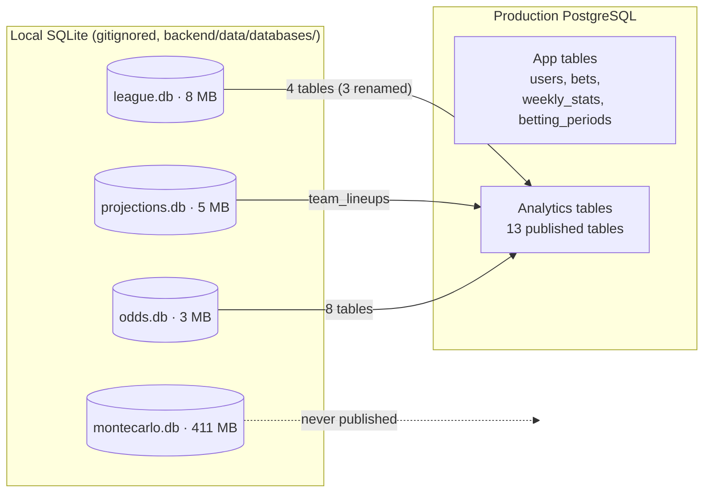
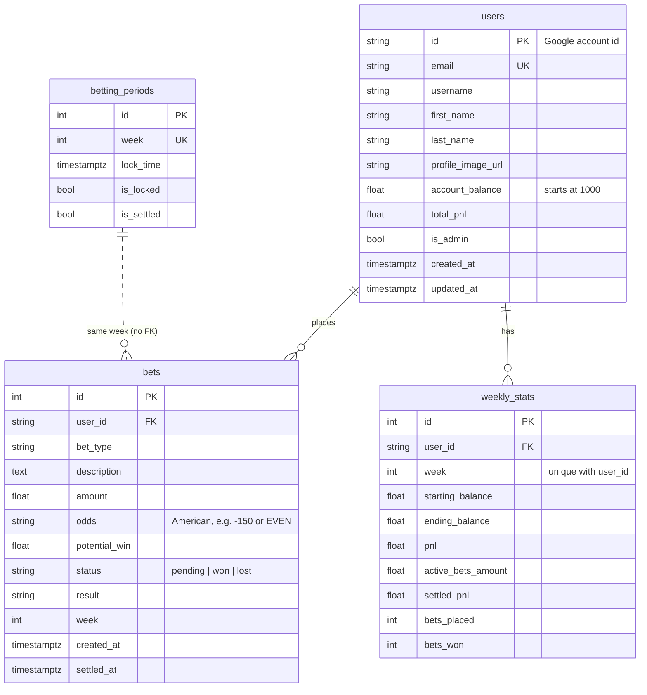

# 04 – Data Model

Four SQLite files on the operator's machine and one PostgreSQL database in production. `*` marks primary-key columns. Row counts are from the end of the 2025 season and are only there for scale.

## Where data lives



## league.db — Sleeper league data

Written by the `league` step, which mirrors Sleeper and the ESPN schedule, and by the `lineups` step (`projections_rosters`). The 2025 file came from notebooks 01 and 06; `python -m pipeline migrate-legacy` brought it into this shape.

| Table | Key | Rows | Contents |
|---|---|---|---|
| `leagues` | league_id* | 1 | League settings; JSON blobs for roster positions and scoring |
| `users` | user_id* | 12 | Sleeper users: `username`, `display_name` (the **owner** key used everywhere else) |
| `rosters` | (roster_id*, league_id*) | 22 | Team per league: `owner_id` → users, `team_name`, record, points, JSON player lists. Holds rows from more than one league ID. |
| `matchups` | matchup_id* (`{league}_{week}_{roster}`) | 192 | One row per team per week: `week`, `roster_id`, `matchup_id_number` (the two teams sharing it play each other), `points` |
| `nfl_players` | player_id* | 3,968 | Sleeper player master: name, position, team, `injury_status`, etc. Replaced on every `league` run. The 2025 copy is an end-of-season snapshot (last refreshed 2025-12-17, for week 16), so its `team` is each player's end-of-season team. |
| `nfl_schedules` | (season*, week*, team*) | 576 | Per team per week: `opponent`, `is_home`, `is_bye`, `game_date`. The 2025 rows came from the notebooks' hardcoded bye weeks and carry only `is_bye` (`is_home` is 0, the rest NULL). |
| `player_stats` | stat_id* | 36,052 | Actual weekly stats; `pts_ppr` is used for accuracy analysis |
| `transactions` | transaction_id* | 347 | Adds/drops/trades. Stored but not used. |
| `projections_rosters` | (season*, week*, sleeper_player_id*) | 172 | Each rostered player's μ/var for the week (0 when unprojected), `starting_status` (1 in the optimal lineup) and `roster_status` (`starter`, `bench`, `out`, `bye` or `unprojected`). The migrated 2025 rows are `starter`, `bench` or `unprojected`. |

## projections.db — projections and lineups

Written by the `scrape`, `clean`, `match`, `stats` and `lineups` steps, each replacing its rows for the week. `season` and `week` are integers throughout. The 2025 file came from notebooks 02–06; `migrate-legacy` converted its `"Week N"` text weeks and `DST` positions (now `DEF`), and dropped an empty `player_stats` table and five stale `betting_odds_*` copies that nothing read.

| Table | Key | Contents |
|---|---|---|
| `projections` | id*, unique on (source, season, week, first, last, position) | Scraped projections, cleaned in place by `clean`: `team`, `projected_points`, `external_id` |
| `projections_with_sleeper` | id*, unique like `projections` | `projections` + `sleeper_player_id` and `match_method` (`external_id`, `def_team`, `hardcoded`, `exact_team`, `exact`, `last_initial`, or NULL; the 2025 rows keep notebook 04's `dst_team_match`, `hardcoded` and `automatic`) |
| `player_week_stats` | (season*, week*, sleeper_player_id*) | `mu`, `sigma`, `var`, `n_sources`, the sources' `spread`, `model_version`, and the player's NFL `team`. For 2025 the migration recovered `spread` from the notebook's sigma and back-filled `team` from `nfl_players`. |
| `team_lineups` | (season*, week*, roster_id*, slot*) | Chosen starters: `owner`, `slot` (`QB`, `RB1`, `RB2`, `WR1`, `WR2`, `TE`, `FLEX`, `K`, `DEF`), `sleeper_player_id`, `player_name`, `nfl_team`, `mu`, `sigma`, `is_replacement`. For 2025 the migration back-filled `sleeper_player_id` from the week's one `player_week_stats` row with the same name and position, and `nfl_team` from `nfl_players`; the 56 `Waiver Pickup` rows have no player and stay NULL. |
| `team_projections_summary` | (season*, week*, roster_id*) | `total_mu`, `combined_sigma`, `total_var`, `waiver_pickups` |

## odds.db — prices and curves

Written by the `simulate`, `odds` and `playoffs` steps (notebooks 07 and 09 in 2025). The `odds` tables start with `run_id`, `week` and `season`; the `playoffs` tables keep notebook 09's shape with `season` added last.

| Table | Key | Written by | Contents |
|---|---|---|---|
| `simulation_runs` | run_id* | simulate | `season`, `week`, `seed`, `n_sims`, `model_version`, `n_teams`, `created_at`, and `draws_path`: the run's draws as Parquet under the data directory (`sims/{season}/wk{week}/{run_id}.parquet`, one row per simulation per team) |
| `betting_odds_matchup_ml` | (run_id*, week*, team1_id*, team2_id*) | odds | `team{1,2}_win_prob`, `team{1,2}_ml`, `ties` |
| `betting_odds_matchup_ou` | (run_id*, week*, team1_id*, team2_id*) | odds | Combined-score line and prices. Not published. |
| `betting_odds_team_ou` | (run_id*, week*, team_id*) | odds | `line`, `over_prob`/`over_odds`, `under_prob`/`under_odds`, `push_count` |
| `betting_odds_highest_scorer`, `_lowest_scorer` | (run_id*, week*, team_id*) | odds | `count`, `probability`, `odds` |
| `team_distribution_curves` | (run_id*, week*, owner*) | odds | JSON arrays `x_values`, `density_values`, `cdf_values`; `mean`, `p10`, `p50`, `p90`, `n_sims` |
| `team_matchup_margin_curves` | (run_id*, week*, team_owner*, opponent_owner*) | odds | Win/loss/tie probability, JSON `left_*`/`right_*` tail arrays |
| `betting_odds_first_place`, `_make_playoffs` | id* (autoincrement), unique on (run_id, week, team_id) | playoffs | `run_id`, `week`, `team_id`, `owner`, `probability`, `american_odds`, `season` |
| `standings_probability_matrix` | id*, unique on (run_id, week, team_id, position) | playoffs | P(team finishes in each position). Not published. |

The `odds` step's tables carry the `run_id` of the simulation they were priced from. Rerunning `odds` replaces that run's rows, and each new `simulate` run adds a set beside the old ones; `publish` uploads only each week's latest run (newest `created_at`, then highest `run_id`). The 2025 curves had no run id, so the migration gave them their week's odds run.

## montecarlo.db — raw simulations (2025 only)

| Table | Key | Contents |
|---|---|---|
| `monte_carlo_simulations` | (run_id*, week*, sim_id*, team_id*) | One row per team per simulation (`total_points`). 50,000 × 12 = 600k rows per run; 3M total. |
| `simulation_runs` | run_id* | Notebook 07's run metadata: seed, N, distribution, team count, `n_matchups` (recorded as 0 on a fresh run — bug). |

Only notebook 09 read it back (latest run for the week). It is never published, and the pipeline neither reads nor migrates it: the `simulate` step writes its draws to Parquet and records the run in odds.db's `simulation_runs`.

## Validation before publish

The `validate` step runs after `odds` and `playoffs` and before `publish`, and writes nothing. It reads the week's rows, each odds table at the run `publish` would upload, and logs every check as `name: status - detail`. Any `fail` stops the run before `publish`; a `warn` becomes a step warning. The teams in play are the week's matchup rosters (in the playoffs only those with a game), or every roster while league.db has no matchups for the week.

| Check | Fails when |
|---|---|
| `lineup_slots` | a roster has no `team_lineups` row for one of the league's starting slots |
| `lineup_mu` | a lineup row has a NULL `mu`, `sigma` or `var` |
| `probabilities` | a probability in the odds, futures, standings or margin-curve tables is NULL or outside [0, 1] |
| `moneyline_sums` | a moneyline's two win probabilities and `ties / n_sims` do not sum to 1 within 1e-6 |
| `matchup_consistency` | the priced games differ from league.db's, a team in play has other than one moneyline, or the team O/U lines miss a team in play or price a team without a game |
| `scorer_markets` | the highest or lowest scorer market misses a team in play or prices a team without a game |
| `curves` | a team in play has no distribution curve (or a team without a game has one), or an ordered pair of teams in play has no margin curve |
| `simulation_draws` | the week has no simulation run, or its Parquet file is missing or does not hold `n_sims × n_teams` rows |
| `odds_run` | the odds were priced from an older simulation than the week's latest |
| `frozen_tables` | a table Flask reads for the week has no rows; missing futures only warn, and only before `playoff_week_start` |
| `owners` | an owner name in the lineups, odds or curves is not a league user's display name or username |
| `unique_orderings` | a team O/U owner or a moneyline matchup repeats, which breaks Flask's pairing of rows by position |

## PostgreSQL (production)

One database holds both halves.



App tables are created by `db.create_all()` on startup and patched by `app/migrations.py` (idempotent `ALTER`s, errors logged and swallowed). There is no migration framework.

The analytics tables have **no foreign keys to the app tables or each other**. The app joins them by `week`, `owner`, `team_id`/`roster_id`, or `team_name`, depending on the table.

## Publishing map

`scripts/publish.py` copies **whole tables (all weeks)**, not just the current week.

| SQLite source | Postgres table |
|---|---|
| `odds.db` `betting_odds_matchup_ml`, `_team_ou`, `_highest_scorer`, `_lowest_scorer`, `_first_place`, `_make_playoffs` | same names |
| `odds.db` `team_distribution_curves`, `team_matchup_margin_curves` | same names |
| `projections.db` `team_lineups` | `team_lineups` |
| `league.db` `rosters` | `sleeper_rosters` |
| `league.db` `users` | `sleeper_users` |
| `league.db` `matchups` | `sleeper_matchups` |
| `league.db` `projections_rosters` | `projections_rosters` |

```mermaid
sequenceDiagram
    participant S as SQLite
    participant P as publish.py
    participant PG as Postgres
    loop each table in TABLE_MAP
        P->>S: read table (pandas)
        P->>PG: to_sql(<name>_staging, if_exists=replace)
        P->>PG: count rows = source rows?
    end
    Note over P,PG: any error → drop staged tables, exit 1, live tables untouched
    P->>PG: BEGIN
    P->>PG: DROP <name>; RENAME <name>_staging → <name> (all tables)
    P->>PG: COMMIT
```

Safety rails: refuses to target `users`, `bets`, `weekly_stats`, or `betting_periods`. `--dry-run` still writes the staging tables to production to validate them, then drops them instead of swapping. Postgres column types come from pandas inference, so the analytics schema in prod is whatever `to_sql` produces (no primary keys or indexes).
