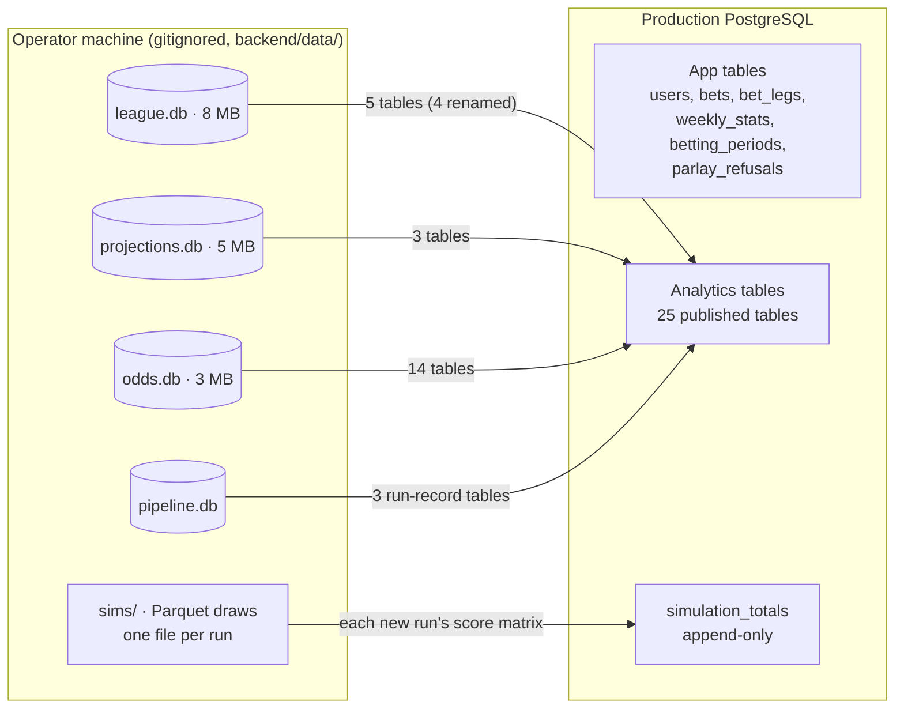
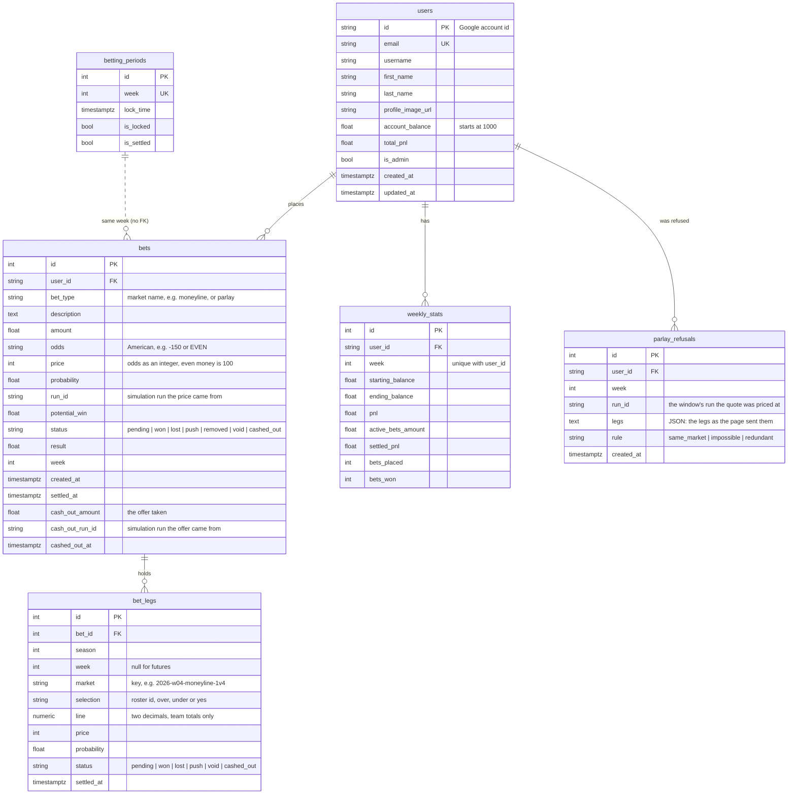

# 04 – Data Model

Four SQLite files and a folder of Parquet draws on the operator's machine, and one PostgreSQL database in production. `*` marks primary-key columns. Row counts are from the end of the 2025 season and are only there for scale.

## Where data lives



## league.db — Sleeper league data

Written by the `league` step, which mirrors Sleeper and the ESPN schedule, and by the `lineups` step (`projections_rosters`). The 2025 rows were written by the retired notebooks and converted by `python -m pipeline migrate-legacy`.

| Table | Key | Rows | Contents |
|---|---|---|---|
| `leagues` | league_id* | 1 | League settings; JSON blobs for roster positions, scoring and `settings` (Sleeper's league settings: `num_teams`, `playoff_teams`, `playoff_week_start`, `playoff_seed_type`, `playoff_round_type`, …). Published as `sleeper_leagues`. |
| `users` | user_id* | 12 | Sleeper users: `username`, `display_name` (the **owner** key used everywhere else) |
| `rosters` | (roster_id*, league_id*) | 22 | Team per league: `owner_id` → users, `team_name`, record, points, JSON player lists. Holds rows from more than one league ID. |
| `matchups` | matchup_id* (`{league}_{week}_{roster}`) | 192 | One row per team per week: `week`, `roster_id`, `matchup_id_number` (the two teams sharing it play each other), `points` |
| `nfl_players` | player_id* | 3,968 | Sleeper player master: name, position, team, `injury_status`, etc. Replaced on every `league` run. The 2025 copy is an end-of-season snapshot (last refreshed 2025-12-17, for week 16), so its `team` is each player's end-of-season team. |
| `nfl_schedules` | (season*, week*, team*) | 576 | Per team per week: `opponent`, `is_home`, `is_bye`, `game_date`. The 2025 rows were written by the retired notebooks from hardcoded bye weeks and converted by `migrate-legacy`; they carry only `is_bye` (`is_home` is 0, the rest NULL). |
| `player_stats` | stat_id* | 36,052 | Actual weekly stats; `pts_ppr` is used for accuracy analysis |
| `transactions` | transaction_id* | 347 | Adds/drops/trades. Stored but not used. |
| `projections_rosters` | (season*, week*, sleeper_player_id*) | 172 | Each rostered player's μ/var for the week (0 when unprojected), `starting_status` (1 in the optimal lineup) and `roster_status` (`starter`, `bench`, `out`, `bye` or `unprojected`). The migrated 2025 rows are `starter`, `bench` or `unprojected`. |

## projections.db — projections and lineups

Written by the `scrape`, `clean`, `match`, `stats` and `lineups` steps, each replacing its rows for the week. `season` and `week` are integers throughout. The 2025 rows were written by the retired notebooks and converted by `migrate-legacy`, which turned their `"Week N"` text weeks into integers and `DST` positions into `DEF`, and dropped an empty `player_stats` table and five stale `betting_odds_*` copies that nothing read.

| Table | Key | Contents |
|---|---|---|
| `projections` | id*, unique on (source, season, week, first, last, position) | Scraped projections, cleaned in place by `clean`: `team`, `projected_points`, `external_id` |
| `projections_with_sleeper` | id*, unique like `projections` | `projections` + `sleeper_player_id` and `match_method` (`external_id`, `def_team`, `hardcoded`, `exact_team`, `exact`, `last_initial`, or NULL; the 2025 rows keep the older `dst_team_match`, `hardcoded` and `automatic`) |
| `player_week_stats` | (season*, week*, sleeper_player_id*) | `mu`, `sigma`, `var`, `n_sources`, the sources' `spread`, `model_version`, and the player's NFL `team`. For 2025 the migration recovered `spread` from the stored sigma and back-filled `team` from `nfl_players`. |
| `team_lineups` | (season*, week*, roster_id*, slot*) | Chosen starters: `owner`, `slot` (`QB`, `RB1`, `RB2`, `WR1`, `WR2`, `TE`, `FLEX`, `K`, `DEF`), `sleeper_player_id`, `player_name`, `nfl_team`, `mu`, `sigma`, `is_replacement`. For 2025 the migration back-filled `sleeper_player_id` from the week's one `player_week_stats` row with the same name and position, and `nfl_team` from `nfl_players`; the 56 `Waiver Pickup` rows have no player and stay NULL. |
| `team_projections_summary` | (season*, week*, roster_id*) | `total_mu`, `combined_sigma`, `total_var`, `waiver_pickups` |

## odds.db — prices and curves

Written by the `simulate`, `odds` and `playoffs` steps; the 2025 rows were written by the retired notebooks and converted by `migrate-legacy`. The `odds` tables start with `run_id`, `week` and `season`; the `playoffs` tables keep their 2025 columns with `season` added last.

| Table | Key | Written by | Contents |
|---|---|---|---|
| `simulation_runs` | run_id* | simulate | `season`, `week`, `seed`, `n_sims`, `model_version`, `n_teams`, `created_at`; `draws_path`, the run's draws as Parquet under the data directory (`sims/{season}/wk{week}/{run_id}.parquet`, one row per simulation per team); `n_locked`, the players fixed at their real points (0 until a rerun locks the games already played); `window_closes_at`, the week's first kickoff after `created_at`, when betting on the run closes, NULL when no game is left; and `standings_through_week`, the fewest games any roster has played, so the week the standings are complete through |
| `betting_odds_matchup_ml` | (run_id*, week*, team1_id*, team2_id*) | odds | `team{1,2}_win_prob`, `team{1,2}_ml`, `ties` |
| `betting_odds_matchup_ou` | (run_id*, week*, team1_id*, team2_id*) | odds | `line` on the combined score, `over_prob`/`over_odds`, `under_prob`/`under_odds` |
| `betting_odds_team_ou` | (run_id*, week*, team_id*) | odds | `line`, `over_prob`/`over_odds`, `under_prob`/`under_odds`, `push_count` |
| `betting_odds_highest_scorer`, `_lowest_scorer` | (run_id*, week*, team_id*) | odds | `count`, `probability`, `odds` |
| `team_distribution_curves` | (run_id*, week*, owner*) | odds | JSON arrays `x_values`, `density_values`, `cdf_values`; `mean`, `p10`, `p50`, `p90`, `n_sims` |
| `team_matchup_margin_curves` | (run_id*, week*, team_owner*, opponent_owner*) | odds | Win/loss/tie probability, JSON `left_*`/`right_*` tail arrays |
| `betting_odds_first_place`, `_make_playoffs`, `_last_place`, `_champion` | id* (autoincrement), unique on (run_id, week, team_id) | playoffs | `run_id`, `week`, `team_id`, `team_name`, `owner`, `probability`, `american_odds`, `created_at`, `season`; the four tables have the same columns |
| `standings_probability_matrix` | id*, unique on (run_id, week, team_id, position) | playoffs | P(team finishes in each position) |

The `odds` and `playoffs` steps' tables carry the `run_id` of the simulation they were priced from. The `playoffs` tables carried the pipeline run's id until B10b; since then a rerun of the `playoffs` step alone replaces the week's rows under the same simulation run id, so the week's futures keep a run that `simulation_runs` knows. Rerunning `odds` replaces that run's rows, and each new `simulate` run adds a set beside the old ones; `publish` uploads only each week's latest run (newest `created_at`, then highest `run_id`). The 2025 curves had no run id, so the migration gave them their week's odds run. An `odds.db` whose `simulation_runs` predates `n_locked`, `window_closes_at` and `standings_through_week` gains them, at their defaults for the runs already recorded, the next time `simulate` records a run.

## sims/ — simulation draws

The `simulate` step writes each run's draws to `sims/{season}/wk{week}/{run_id}.parquet` under the data directory: one row per simulation per team (`sim_id`, `roster_id`, `total_points`), 50,000 × 12 = 600k rows a run. Its `simulation_runs` row in odds.db points at the file (`draws_path`). The `odds` and `playoffs` steps read the week's latest run, and `publish` encodes each new run's draws into `simulation_totals`; the files themselves are never published. The 2025 season's draws sit in the retired notebooks' `montecarlo.db`, which nothing reads.

## Validation before publish

The `validate` step runs after `odds` and `playoffs` and before `publish`, and writes nothing. It reads the week's rows, each odds table at the run `publish` would upload, and logs every check as `name: status - detail`. Any `fail` stops the run before `publish`; a `warn` becomes a step warning. The teams in play are the week's matchup rosters (in the playoffs only those with a game), or every roster while league.db has no matchups for the week.

| Check | Fails when |
|---|---|
| `lineup_slots` | a roster has no `team_lineups` row for one of the league's starting slots |
| `lineup_mu` | a lineup row has a NULL `mu`, `sigma` or `var` |
| `probabilities` | a probability in the odds, futures, standings or margin-curve tables is NULL or outside [0, 1] |
| `moneyline_sums` | a moneyline's two win probabilities and `ties / n_sims` do not sum to 1 within 1e-6 |
| `matchup_consistency` | the priced games differ from league.db's, a team in play has other than one moneyline, or the team O/U lines miss a team in play or price a team without a game |
| `scorer_markets` | the highest or lowest scorer market misses a team in play or prices a team without a game |
| `curves` | a team in play has no distribution curve (or a team without a game has one), or an ordered pair of teams in play has no margin curve |
| `simulation_draws` | the week has no simulation run, or its Parquet file is missing or does not hold `n_sims × n_teams` rows |
| `odds_run` | the odds were priced from an older simulation than the week's latest |
| `frozen_tables` | a table Flask reads for the week has no rows; a missing standings matrix (the playoffs step has not run) only warns, and only before `playoff_week_start`; an empty futures market is fine |
| `owners` | an owner name in the lineups, odds or curves is not a league user's display name or username |
| `unique_orderings` | a team O/U owner or a moneyline matchup repeats, which breaks Flask's pairing of rows by position |

## PostgreSQL (production)

One database holds both halves.



A single placed by market key has one `bet_legs` row recording the pick as data: the key, the selection, the line, and the price and chance it was placed at. A parlay (`bet_type = parlay`) has one row per leg, two to four, each with its own single price and chance, while the bet holds the joint ones ([06](06-betting-lifecycle.md#parlays)). A leg is `pending` until its bet closes, then takes the bet's `won`, `lost`, `push`, `cashed_out` or `void` and `settled_at`, except that a parlay settled from the preview gives each leg its own `won`, `lost` or `push`; the legs of a removed bet are `void` with no `settled_at`. A `push` returns the stake because the scores tied or landed on the line; a `void` returns it because the admin found the bet should not stand ([06](06-betting-lifecycle.md#settlement)). Bets placed before market keys existed have no legs, and their `price`, `probability` and `run_id` are null. See [06](06-betting-lifecycle.md#markets) for the keys.

`parlay_refusals` logs each parlay quote refused because two legs share a market (`same_market`), the legs win together in every sim or none (`impossible`), or a leg adds nothing (`redundant`). The app writes it and nothing reads it yet; it is for the owner's SQL on how often the rules bite ([06](06-betting-lifecycle.md#parlays)).

App tables are created by `db.create_all()` on startup and patched by `app/migrations.py` (idempotent `ALTER`s, errors logged and swallowed). There is no migration framework. `create_all` creates a missing table such as `bet_legs` or `parlay_refusals`, so a new table needs no migration, but never alters one that exists, so the `bets` columns `run_id`, `price`, `probability`, `cash_out_amount`, `cash_out_run_id` and `cashed_out_at` are added by `ALTER`s in `app/migrations.py`, which also renames the legacy bet types to their market names once (`team_ou` → `team_total`, `first_seed` → `first_place`, `ammad_playoff` → `make_playoffs`).

The analytics tables have **no foreign keys to the app tables or each other**. The app joins them by `week`, `owner`, `team_id`/`roster_id`, or `team_name`, depending on the table.

## Publishing map

The `publish` step (`pipeline/steps/publish.py`, run as `python -m pipeline run --week N --steps publish`) replaces 25 tables, the `TABLES` list, with the current season's rows and, of each table with a `run_id`, each week's latest run (newest `created_at`, then highest `run_id`). Sleeper's `leagues`, `rosters`, `users` and `matchups` take a `sleeper_` prefix, because `users` is the app's account table.

| SQLite source | Postgres table |
|---|---|
| `odds.db` `betting_odds_matchup_ml`, `_team_ou`, `_matchup_ou`, `_highest_scorer`, `_lowest_scorer`, `_first_place`, `_make_playoffs`, `_last_place`, `_champion` | same names |
| `odds.db` `standings_probability_matrix`, `team_distribution_curves`, `team_matchup_margin_curves` | same names |
| `odds.db` `simulation_runs`, `calibration_metrics` | same names |
| `projections.db` `team_lineups`, `prediction_accuracy`, `team_accuracy` | same names |
| `league.db` `leagues` | `sleeper_leagues` |
| `league.db` `rosters` | `sleeper_rosters` |
| `league.db` `users` | `sleeper_users` |
| `league.db` `matchups` | `sleeper_matchups` |
| `league.db` `projections_rosters` | `projections_rosters` |
| `pipeline.db` `pipeline_runs`, `pipeline_steps`, `source_reviews` | same names |

```mermaid
sequenceDiagram
    participant S as SQLite
    participant P as publish step
    participant A as Droplet charts dir
    participant PG as Postgres
    P->>S: read the season's rows of every table in TABLES (pandas)
    P->>A: scp backend/data/images/*.png (unless --no-charts)
    Note over P,A: a failed upload stops the step before any table is written
    P->>PG: INSERT each new run into simulation_totals
    loop each table in TABLES
        P->>PG: to_sql(<name>_staging, if_exists=replace)
        P->>PG: count rows = source rows?
    end
    Note over P,PG: any error → drop staged tables, step fails, live tables untouched
    P->>PG: BEGIN
    P->>PG: DROP <name>; RENAME <name>_staging → <name> (all tables)
    P->>PG: COMMIT
```

Safety rails: the step refuses to replace the app's tables, `users`, `bets`, `bet_legs`, `weekly_stats`, `betting_periods` and `parlay_refusals` (`PROTECTED_TABLES`), so `parlay_refusals` is never published over, and refuses `simulation_totals` (`APPEND_ONLY_TABLES`). `--dry-run` reads and counts the rows and writes nothing, neither charts nor tables. Postgres column types come from pandas inference, so the analytics schema in prod is whatever `to_sql` produces (no primary keys or indexes); `simulation_totals` is the one table with a declared schema.

The matchup totals and the standings matrix are published for markets the app does not offer yet, and it reads neither. `sleeper_leagues` is the season's row of `leagues` with its columns as they are; the app reads `playoff_week_start`, `playoff_teams` and `num_teams` from its `settings` JSON. `pipeline_runs`, `pipeline_steps` and `source_reviews` are the published run records; `pipeline_runs` and `pipeline_steps` keep every run of the season, because the dashboard lists them all.

**`simulation_totals`** is the one table the step appends to instead of replacing. It holds the full score matrix of every run the step has published this season, so a bet can always be re-priced at the run it was placed at:

| Column | Type | Contents |
|---|---|---|
| `run_id`* | text | the simulation run |
| `season`, `week` | integer | |
| `created_at` | text | the run's `created_at` in `simulation_runs` |
| `n_sims` | integer | 50,000 |
| `roster_ids` | text | the matrix's column order, ascending: `1,2,3,4,5,6,7,8,9,10,11,12` |
| `totals` | bytea (a BLOB in SQLite) | `pipeline.markets.encode_totals` of the matrix: float32, little-endian, one simulation's scores after another, zlib-compressed; about 2.1 MB a run |

The app reads it through `app/matrices.py`, one decoded matrix per run cached in each worker: cash-out prices a bet on the latest run's matrix, a parlay is quoted and placed on the window's run's, and settlement re-prices a parlay with a pushed leg on the matrix of the run it was placed at.

Before it stages anything, the step creates the table if it is missing, reads which of the season's runs it already holds, and inserts the matrix of every other run among the `simulation_runs` rows it is about to upload, built from that run's Parquet draws, with `INSERT ... ON CONFLICT (run_id) DO NOTHING`. A stored row is never rewritten, and a run the site shows always has its matrix, even when the swap that follows fails. A run whose draws file is missing is skipped with a warning naming it. The table is never staged or swapped, because a swap would keep only the runs of this publish, each week's latest, and drop the matrices of the earlier runs that bets were placed at; `write_tables` refuses it by name (`APPEND_ONLY_TABLES`), as it refuses the app's tables.
