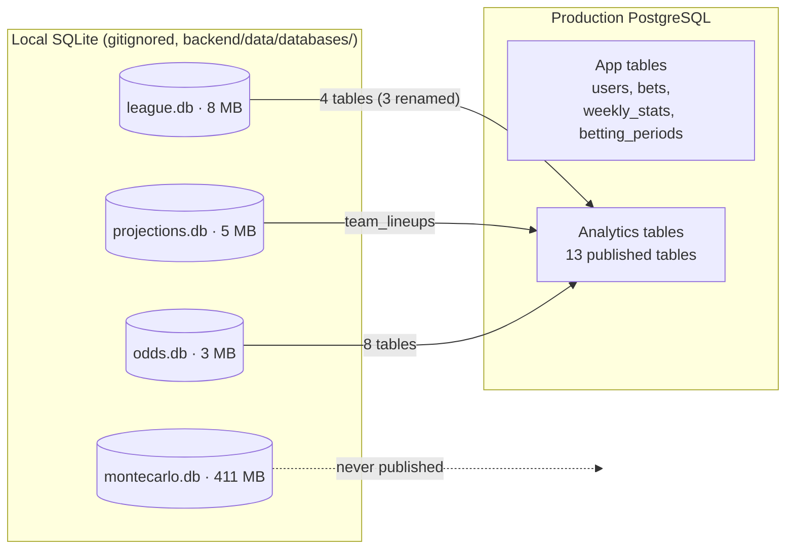
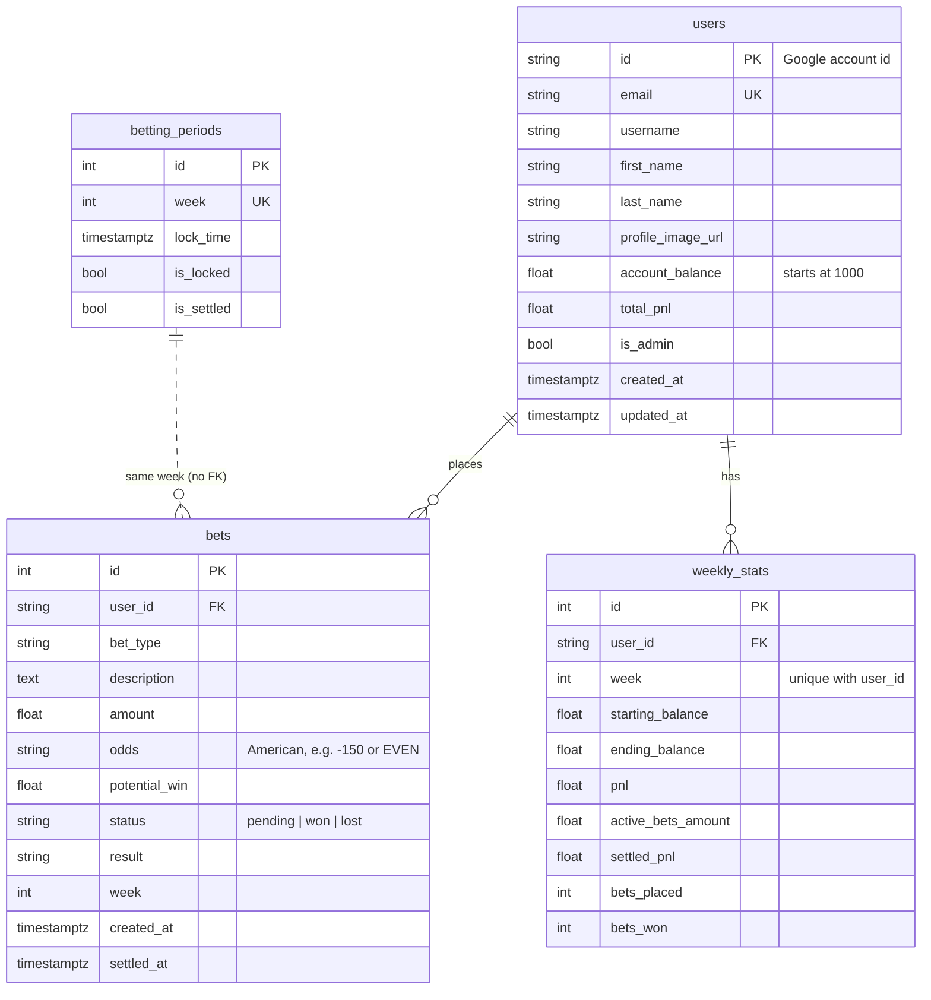

# 04 – Data Model

Four SQLite files on the operator's machine and one PostgreSQL database in production. `*` marks primary-key columns. Row counts are from the end of the 2025 season and are only there for scale.

## Where data lives



## league.db — Sleeper league data

Written by `LeagueDB` (`backend/scrapers/database_league.py`) from notebook 01, and by notebook 06 (`projections_rosters`).

| Table | Key | Rows | Contents |
|---|---|---|---|
| `leagues` | league_id* | 1 | League settings; JSON blobs for roster positions and scoring |
| `users` | user_id* | 12 | Sleeper users: `username`, `display_name` (the **owner** key used everywhere else) |
| `rosters` | (roster_id*, league_id*) | 22 | Team per league: `owner_id` → users, `team_name`, record, points, JSON player lists. Holds rows from more than one league ID. |
| `matchups` | matchup_id* (`{league}_{week}_{roster}`) | 192 | One row per team per week: `week`, `roster_id`, `matchup_id_number` (the two teams sharing it play each other), `points` |
| `nfl_players` | player_id* | 3,968 | Sleeper player master: name, position, team, `injury_status`, etc. |
| `nfl_schedules` | schedule_id* | 576 | Per team per week, `is_bye` flag. Hardcoded 2025 bye weeks. |
| `player_stats` | stat_id* | 36,052 | Actual weekly stats; `pts_ppr` is used for accuracy analysis |
| `transactions` | transaction_id* | 347 | Adds/drops/trades. Stored but not used. |
| `projections_rosters` | (sleeper_player_id*, week*, season*) | 172 | Each rostered player's μ/var for the week and `starting_status` (from notebook 06) |

## projections.db — projections and lineups

Written by `ProjectionsDB` (`backend/scrapers/database.py`) and notebooks 04–06.

| Table | Key | Contents |
|---|---|---|
| `projections` | id*, unique on (source, week, first, last, position) | Raw scraped projections. **`week` is TEXT `"Week N"`.** |
| `projections_with_sleeper` | id* | `projections` + `sleeper_player_id` and `match_method` (`dst_team_match`, `hardcoded`, `automatic`, or NULL). Rebuilt entirely each run. |
| `player_week_stats` | (sleeper_player_id*, week*) | `mu`, `sigma`, `var`, `n_sources`, and the `alpha`/`beta`/`pos_sigma` used |
| `team_lineups` | (team_name*, week*, slot*) | Chosen starters: `roster_id`, `owner`, `slot` (e.g. `RB2`, `FLEX1`), `mu`, `sigma`, `is_replacement` |
| `team_projections_summary` | (team_name*, week*) | `total_mu`, `combined_sigma`, `waiver_pickups` |
| `player_stats` | id* | Empty; unused leftover |
| `betting_odds_*` (5 tables) | — | Stale copies from an earlier pipeline version. Nothing reads them. |

## odds.db — prices and curves

Written by notebooks 07 and 09.

| Table | Key | Written by | Contents |
|---|---|---|---|
| `betting_odds_matchup_ml` | (run_id*, week*, team1_id*, team2_id*) | 07 | `team{1,2}_win_prob`, `team{1,2}_ml`, `ties` |
| `betting_odds_matchup_ou` | (run_id*, week*, team1_id*, team2_id*) | 07 | Combined-score line and prices. Not published. |
| `betting_odds_team_ou` | (run_id*, week*, team_id*) | 07 | `line`, `over_prob`/`over_odds`, `under_prob`/`under_odds`, `push_count` |
| `betting_odds_highest_scorer`, `_lowest_scorer` | (run_id*, week*, team_id*) | 07 | `count`, `probability`, `odds` |
| `team_distribution_curves` | (week*, owner*) | 07 | JSON arrays `x_values`, `density_values`, `cdf_values`; `mean`, `p10`, `p50`, `p90`, `n_sims` |
| `team_matchup_margin_curves` | (week*, team_owner*, opponent_owner*) | 07 | Win/loss/tie probability, JSON `left_*`/`right_*` tail arrays |
| `betting_odds_first_place`, `_make_playoffs` | id* (autoincrement) | 09 | `run_id`, `week`, `team_id`, `owner`, `probability`, `american_odds` |
| `standings_probability_matrix` | id* | 09 | P(team finishes in each position). Not published. |

The five notebook-07 betting tables are keyed by `run_id`, so **re-running a week appends a second set of rows** unless the notebook's `DELETE_WEEK` option is used. The app's queries don't filter by `run_id`, so duplicates show up on the site. The curve tables delete the week first and are safe to re-run.

## montecarlo.db — raw simulations

| Table | Key | Contents |
|---|---|---|
| `monte_carlo_simulations` | (run_id*, week*, sim_id*, team_id*) | One row per team per simulation (`total_points`). 50,000 × 12 = 600k rows per run; 3M total. |
| `simulation_runs` | run_id* | Run metadata: seed, N, distribution, team count, `n_matchups` (recorded as 0 on a fresh run — bug). |

Only notebook 09 reads it back (latest run for the week). It is never published.

## PostgreSQL (production)

One database holds both halves.



App tables are created by `db.create_all()` on startup and patched by `app/migrations.py` (idempotent `ALTER`s, errors logged and swallowed). There is no migration framework.

The analytics tables have **no foreign keys to the app tables or each other**. The app joins them by `week`, `owner`, `team_id`/`roster_id`, or `team_name`, depending on the table.

## Publishing map

`scripts/publish.py` copies **whole tables (all weeks)**, not just the current week.

| SQLite source | Postgres table |
|---|---|
| `odds.db` `betting_odds_matchup_ml`, `_team_ou`, `_highest_scorer`, `_lowest_scorer`, `_first_place`, `_make_playoffs` | same names |
| `odds.db` `team_distribution_curves`, `team_matchup_margin_curves` | same names |
| `projections.db` `team_lineups` | `team_lineups` |
| `league.db` `rosters` | `sleeper_rosters` |
| `league.db` `users` | `sleeper_users` |
| `league.db` `matchups` | `sleeper_matchups` |
| `league.db` `projections_rosters` | `projections_rosters` |

```mermaid
sequenceDiagram
    participant S as SQLite
    participant P as publish.py
    participant PG as Postgres
    loop each table in TABLE_MAP
        P->>S: read table (pandas)
        P->>PG: to_sql(<name>_staging, if_exists=replace)
        P->>PG: count rows = source rows?
    end
    Note over P,PG: any error → drop staged tables, exit 1, live tables untouched
    P->>PG: BEGIN
    P->>PG: DROP <name>; RENAME <name>_staging → <name> (all tables)
    P->>PG: COMMIT
```

Safety rails: refuses to target `users`, `bets`, `weekly_stats`, or `betting_periods`. `--dry-run` still writes the staging tables to production to validate them, then drops them instead of swapping. Postgres column types come from pandas inference, so the analytics schema in prod is whatever `to_sql` produces (no primary keys or indexes).
