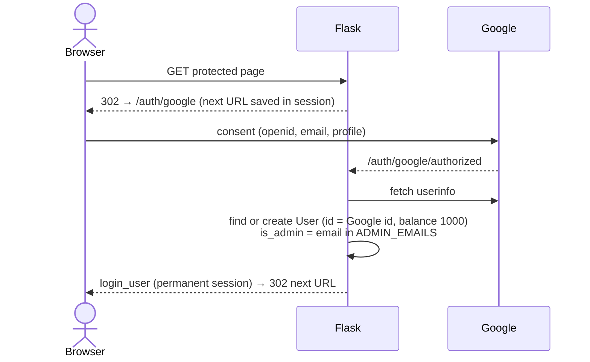

# 05 – Web App

A server-rendered Flask app with vanilla-JS pages that call JSON endpoints. It only reads analytics tables and only writes the four ORM tables.

## Structure

```
app/__init__.py      create_app(): config from env, extensions, blueprints, create_all + migrations
app/auth.py          Google OAuth (Flask-Dance), Flask-Login user loader, /auth/logout
app/models.py        User, Bet, WeeklyStats, BettingPeriod
app/migrations.py    Idempotent ALTERs run on every startup
app/routes/
  helpers.py         query_analytics(), get_current_week(), check_betting_period_lock(),
                     admin_required, owner → display-name mapping
  pages.py           /, /login, /about, /analytics, static + chart images
  account.py         /account, profile update
  odds.py            Odds + analytics JSON API
  betting.py         /betting, /leaderboard, bet placement/removal
  admin.py           /admin + admin JSON API
frontend/templates/  Jinja2 (base.html + one per page)
frontend/static/js/  betting.js, analytics.js, admin.js, base.js (mobile menu only)
```

**Startup** (`create_app`): read `SECRET_KEY` (required unless testing), `DATABASE_URL`, Google OAuth credentials; SQLAlchemy with `pool_pre_ping` and `pool_recycle=300`; `ProxyFix` for nginx; secure cookies when `FLASK_ENV=production`; register blueprints; `db.create_all()` then `run_schema_migrations()`. Module-level `app = create_app()` is what gunicorn imports (skipped under pytest).

**Reading analytics.** Routes call `query_analytics(sql, params)`, which runs raw SQL through `db.session` and returns a list of dicts. There are no ORM models for analytics tables, so a renamed column fails at request time.

## Authentication & authorization



- **Anonymous** users can see `/betting` (odds are public), `/leaderboard`, `/about`, and most odds APIs.
- **Logged in** is required for placing/viewing/removing bets, `/account`, `/analytics` data endpoints (`/api/teams`, `/api/team_distribution`, `/api/team_players`).
- **Admin** (`@admin_required`) is re-derived from `ADMIN_EMAILS` on every login, so removing an email revokes admin at next sign-in.
- Unauthenticated `/api/*` calls get `401` JSON; pages redirect to Google.
- **CSRF**: `CSRFProtect` is installed with default checking **off**. Only `POST /account/update-profile` calls `csrf.protect()`. The JSON `POST`/`DELETE` endpoints rely on the `SameSite=Lax` session cookie and JSON content type.

## Routes

| Route | Method | Auth | Reads | Writes |
|---|---|---|---|---|
| `/` | GET | — | | redirect → `/betting` |
| `/login`, `/about` | GET | — | | |
| `/analytics` | GET | — | PNG filenames in `ANALYTICS_IMAGES_DIR` | |
| `/analytics-images/<file>` | GET | — | PNG files (1-day cache) | |
| `/betting` | GET | — | `betting_periods` | |
| `/leaderboard` | GET | — | `users`, `bets`, `weekly_stats` | |
| `/account` | GET | login | `bets`, `weekly_stats` | |
| `/account/update-profile` | POST | login + CSRF | | `users` |
| `/api/session-check` | GET | — | | |
| `/api/matchups` | GET | — | `betting_odds_matchup_ml`, `sleeper_*` | |
| `/api/team_performance` | GET | — | `betting_odds_team_ou` | |
| `/api/highest_scorer`, `/api/lowest_scorer` | GET | — | `betting_odds_*_scorer` + `team_ou` | |
| `/api/first_place`, `/api/ammad_playoff` | GET | — | `betting_odds_first_place`, `_make_playoffs` | |
| `/api/lineup/<owner>` | GET | — | `team_lineups` | |
| `/api/league_overview` | GET | — | `sleeper_matchups`, `sleeper_rosters`, `sleeper_users`, `team_distribution_curves`, `betting_odds_matchup_ml` | |
| `/api/position_strength` | GET | — | `team_lineups` | |
| `/api/teams` | GET | login | `sleeper_rosters`, `sleeper_users` | |
| `/api/team_distribution` | GET | login | `team_distribution_curves`, `team_matchup_margin_curves`, `betting_odds_matchup_ml` | |
| `/api/team_players` | GET | login | `projections_rosters` (falls back to `team_lineups`) | |
| `/api/place_bet` | POST | login | odds tables, `betting_periods` | `bets`, `users`, `weekly_stats` |
| `/api/my_bets` | GET | login | `bets` | |
| `/api/remove_bet/<id>` | DELETE | login | `betting_periods` | `bets`, `users`, `weekly_stats` |
| `/admin` | GET | admin | | |
| `/api/admin/betting_periods` | GET | admin | `betting_periods` | |
| `/api/admin/set_betting_period` | POST | admin | | `betting_periods` |
| `/api/admin/pending_bets` | GET | admin | `bets` | |
| `/api/admin/settle_bet` | POST | admin | | `bets`, `users`, `weekly_stats` |
| `/api/admin/settle_week` | POST | admin | | `betting_periods` |
| `/api/admin/unlock_period` | POST | admin | | `betting_periods` |
| `/auth/google`, `/auth/google/authorized` | GET | — | | `users` |
| `/auth/logout` | GET | — | | |

Most odds endpoints catch every exception, print it, and return `[]` with status 200, so a missing table looks like "no data" to the frontend.

Every odds/analytics endpoint uses `get_current_week()` (the highest unsettled betting period), so creating a period in `/admin` is what moves the site to a new week.

## Page → API map

```mermaid
flowchart LR
    subgraph Pages
        B[/betting<br/>betting.js/]
        AN[/analytics<br/>analytics.js/]
        AD[/admin<br/>admin.js/]
        LB[/leaderboard/]
        AC[/account/]
    end

    B --> M[/api/matchups]
    B --> TP[/api/team_performance]
    B --> HS[/api/highest_scorer]
    B --> LS[/api/lowest_scorer]
    B --> MB[/api/my_bets]
    B --> LU[/api/lineup/owner]
    B --> PB[/api/place_bet]
    B --> RB[/api/remove_bet]

    AN --> SC[/api/session-check]
    AN --> T[/api/teams]
    AN --> TD[/api/team_distribution]
    AN --> LU
    AN --> TPL[/api/team_players]
    AN --> LO[/api/league_overview]
    AN --> PS[/api/position_strength]

    AD --> ADM[/api/admin/*]

    FP[/api/first_place<br/>/api/ammad_playoff/]:::unused
    classDef unused stroke-dasharray: 5 5
```

`/leaderboard` and `/account` are fully server-rendered with no API calls. `/api/first_place` and `/api/ammad_playoff` exist but **no page calls them**, and the betting page has no UI for the `first_seed` / `ammad_playoff` bet types.

- **betting.js** loads the four odds endpoints in parallel, lazy-loads lineups when a card expands, and updates the bet slip optimistically on place/remove.
- **analytics.js** renders five Chart.js charts from the precomputed curves (matchup distributions, margin, lineup comparison, standings, position strength). The PNG charts from the pipeline are not used on this page any more; `/analytics` only uses the PNG directory to decide which week to show.
