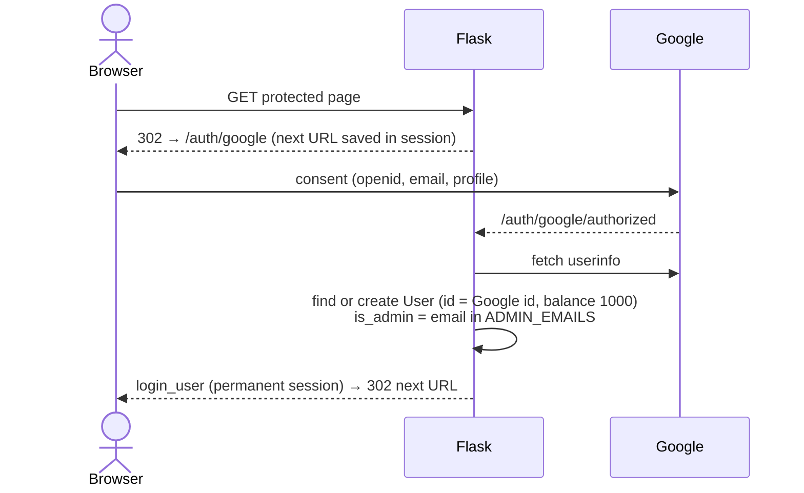

# 05 – Web App

A server-rendered Flask app with vanilla-JS pages that call JSON endpoints. It only reads analytics tables and only writes the six ORM tables.

## Structure

```
app/__init__.py      create_app(): config from env, extensions, blueprints, create_all + migrations
app/auth.py          Google OAuth (Flask-Dance), Flask-Login user loader, /auth/logout
app/cashout.py       What a pending bet is worth now: offer_for(), offers_for()
app/ledger.py        The only code that moves money: open_week, place, remove, settle, push, void,
                     cash_out
app/markets.py       Market keys and their quotes: key_for_row(), parse_key(), find_quote(),
                     price_from_odds(), odds_from_probability(), potential_win()
app/matrices.py      A run's score matrix, cached per worker, and the win rules on it:
                     score_matrix(), leg_outcome(), joint_probability()
app/models.py        User, Bet, BetLeg, ParlayRefusal, WeeklyStats, BettingPeriod
app/migrations.py    Idempotent ALTERs run on every startup
app/parlays.py       Two to four picks priced at their joint chance: quote(), joint_price()
app/settlement.py    Each pending bet's outcome from the published scores: team_scores(),
                     outcomes_for_week(), outcome_for()
app/windows.py       Whether a week is open for betting: betting_window(), from the period,
                     the lock and the latest published run's window
app/routes/
  helpers.py         query_analytics(), get_current_week(), check_betting_period_lock(),
                     admin_required, owner → display-name mapping
  pages.py           /, /login, /about, /analytics, static + chart images
  account.py         /account, profile update
  odds.py            Odds + analytics JSON API
  betting.py         /betting, /leaderboard, parlay quotes, bet placement/removal/cash-out
  admin.py           /admin + admin JSON API
frontend/templates/  Jinja2 (base.html + one per page)
frontend/static/js/  betting.js, analytics.js, admin.js, base.js (mobile menu only)
```

**Startup** (`create_app`): read `SECRET_KEY` (required unless testing), `DATABASE_URL`, Google OAuth credentials; SQLAlchemy with `pool_pre_ping` and `pool_recycle=300`; `ProxyFix` for nginx; secure cookies when `FLASK_ENV=production`; register blueprints; `db.create_all()` then `run_schema_migrations()`. Module-level `app = create_app()` is what gunicorn imports (skipped under pytest).

**Reading analytics.** Routes call `query_analytics(sql, params)`, which runs raw SQL through `db.session` and returns a list of dicts. There are no ORM models for analytics tables, so a renamed column fails at request time.

## Authentication & authorization



- **Anonymous** users can see `/betting` (odds are public), `/leaderboard`, `/about`, and most odds APIs.
- **Logged in** is required for quoting parlays and placing/viewing/removing/cashing out bets, `/account`, `/analytics` data endpoints (`/api/teams`, `/api/team_distribution`, `/api/team_players`).
- **Admin** (`@admin_required`) is re-derived from `ADMIN_EMAILS` on every login, so removing an email revokes admin at next sign-in.
- Unauthenticated `/api/*` calls get `401` JSON; pages redirect to Google.
- **CSRF**: `CSRFProtect` is installed with default checking **off**. Only `POST /account/update-profile` calls `csrf.protect()`. The JSON `POST`/`DELETE` endpoints rely on the `SameSite=Lax` session cookie and JSON content type.

## Routes

| Route | Method | Auth | Reads | Writes |
|---|---|---|---|---|
| `/` | GET | — | | redirect → `/betting` |
| `/login`, `/about` | GET | — | | |
| `/analytics` | GET | — | PNG filenames in `ANALYTICS_IMAGES_DIR` | |
| `/analytics-images/<file>` | GET | — | PNG files (1-day cache) | |
| `/betting` | GET | — | `betting_periods` | |
| `/api/betting_window` | GET | — | `betting_periods`, `simulation_runs` | `betting_periods` (lazy lock) |
| `/leaderboard` | GET | — | `users`, `bets`, `weekly_stats` | |
| `/account` | GET | login | `bets`, `weekly_stats` | |
| `/account/update-profile` | POST | login + CSRF | | `users` |
| `/api/session-check` | GET | — | | |
| `/api/matchups` | GET | — | `betting_odds_matchup_ml`, `sleeper_*` | |
| `/api/team_performance` | GET | — | `betting_odds_team_ou` | |
| `/api/highest_scorer`, `/api/lowest_scorer` | GET | — | `betting_odds_*_scorer` + `team_ou` | |
| `/api/first_place`, `/api/make_playoffs` | GET | — | `betting_odds_first_place`, `_make_playoffs` | |
| `/api/lineup/<owner>` | GET | — | `team_lineups` | |
| `/api/league_overview` | GET | — | `sleeper_matchups`, `sleeper_rosters`, `sleeper_users`, `team_distribution_curves`, `betting_odds_matchup_ml` | |
| `/api/position_strength` | GET | — | `team_lineups` | |
| `/api/teams` | GET | login | `sleeper_rosters`, `sleeper_users` | |
| `/api/team_distribution` | GET | login | `team_distribution_curves`, `team_matchup_margin_curves`, `betting_odds_matchup_ml` | |
| `/api/team_players` | GET | login | `projections_rosters` (falls back to `team_lineups`) | |
| `/api/parlay_quote` | POST | login | odds tables, `betting_periods`, `simulation_runs`, `simulation_totals` | `parlay_refusals` |
| `/api/place_bet` | POST | login | odds tables, `betting_periods`, `simulation_runs`, `simulation_totals` (parlays) | `bets`, `bet_legs`, `users`, `weekly_stats` |
| `/api/my_bets` | GET | login | `bets`, `bet_legs`, `betting_periods`, `simulation_runs`, `simulation_totals`, odds tables | |
| `/api/remove_bet/<id>` | DELETE | login | `betting_periods`, `simulation_runs`, odds tables | `bets`, `bet_legs`, `users`, `weekly_stats` |
| `/api/cash_out/<id>` | POST | login | odds tables, `simulation_runs`, `simulation_totals`, `betting_periods` | `bets`, `bet_legs`, `users`, `weekly_stats` |
| `/admin` | GET | admin | | |
| `/api/admin/betting_periods` | GET | admin | `betting_periods` | |
| `/api/admin/set_betting_period` | POST | admin | | `betting_periods` |
| `/api/admin/pending_bets` | GET | admin | `bets` | |
| `/api/admin/settle_bet` | POST | admin | | `bets`, `bet_legs`, `users`, `weekly_stats` |
| `/api/admin/settlement_preview` | GET | admin | `betting_periods` (default week), `bets`, `bet_legs`, `users`, `sleeper_matchups`, `sleeper_rosters`, `sleeper_users`, `simulation_totals` (parlays with a pushed leg) | |
| `/api/admin/settle_outcomes` | POST | admin | `bets`, `bet_legs`, `sleeper_matchups`, `sleeper_rosters`, `sleeper_users`, `simulation_totals` (parlays with a pushed leg) | `bets`, `bet_legs`, `users`, `weekly_stats` |
| `/api/admin/void_bet` | POST | admin | `bets` | `bets`, `bet_legs`, `users`, `weekly_stats` |
| `/api/admin/settle_week` | POST | admin | | `betting_periods` |
| `/api/admin/unlock_period` | POST | admin | | `betting_periods` |
| `/auth/google`, `/auth/google/authorized` | GET | — | | `users` |
| `/auth/logout` | GET | — | | |

Most odds endpoints catch every exception, print or log it, and return `[]` with status 200, so a missing table looks like "no data" to the frontend.

Every odds/analytics endpoint except the two futures endpoints uses `get_current_week()` (the highest unsettled betting period), so creating a period in `/admin` is what moves the site to a new week. `/api/first_place` and `/api/make_playoffs` list the latest futures run instead, the highest published `week` of the season, because that run may not have reached the current week. The odds listings read only the latest published season. Each row carries its `market` key and `run_id`, which a bet sends back, and the roster ids behind it (`team1_id`/`team2_id` or `team_id`); prices pass through as the table has them, null included.

### Bet endpoints

| Endpoint | Request | Response |
|---|---|---|
| `GET /api/betting_window` | `week` in the query, the current week by default | `success`, `week`, `state` (`open`, `paused` or `closed`), `closes_at`, `run_created_at` |
| `POST /api/parlay_quote` | `legs` (each `market`, `selection`, and `line` for team totals) and `run_id`; needs an open window | `success`, `run_id`, `probability`, `odds`, `price`, `legs` (each `market`, `selection`, `line`, `odds`, `price`, `probability`) |
| `POST /api/place_bet` | a single: `market`, `selection`, `run_id`, `amount`, and `line` for team totals; a parlay: `legs` as for a quote, `run_id`, `amount`; a `legs` list of one entry is a single; nothing else is read; needs an open window | `success`, `new_balance`, `bet_id`, `market`, `selection`, `price`, `legs` (the market keys); `market` and `selection` are null for a parlay and `price` is its joint price |
| `GET /api/my_bets` | | The user's pending bets, each with `id`, `description`, `amount`, `odds`, `potential_win`, `status`, `week`, `bet_type`, `market`, `selection`, `line`, `price`, `probability`, `run_id`, `removable`, `cash_out_offer`, `legs` (each `market`, `selection`, `line`, `price`, `odds`) |
| `DELETE /api/remove_bet/<id>` | needs an open window | `success`, `new_balance` |
| `POST /api/cash_out/<id>` | `offer`, the amount the page showed; needs an open window and a newer run than the bet's | `success`, `new_balance`, `cash_out_amount` |

`betting_window` reports the week's state as `app/windows.py` computes it ([06](06-betting-lifecycle.md#betting-period-one-per-week)): `closes_at` is the latest run's `window_closes_at` and `run_created_at` its `created_at`, both ISO 8601 UTC and null when the week has no run or the lock or the period closed it. The lock time is not sent.

A refusal is `success: false` with an `error` message. `place_bet`, `parlay_quote` and `remove_bet` first need the week's window open, and refuse otherwise: `"Bets are locked as of 2026-10-04 01:30 PM UTC"` when the admin's lock closed the week, `"Betting is paused until the odds update"` while the latest run's window has closed and no newer run has published, and `"Betting is closed for week 4"` when the week has no period, is settled, or its run has no window. Then `place_bet` prices the bet from the row its `market` and `selection` find ([06](06-betting-lifecycle.md#markets)); when that row's `run_id` differs from the request's, or a team total's `line` has moved, it refuses with `"Odds have changed"` and adds the row's `run_id`, `price`, `odds` and `line`. In `my_bets`, the six fields from `market` to `run_id` are null and `legs` is empty on bets placed before market keys existed.

`parlay_quote` and a parlay's `place_bet` price the legs at the window's run ([06](06-betting-lifecycle.md#parlays)). A refusal adds its `rule` (`size`, `leg`, `same_market`, `odds_changed`, `no_price`, `impossible` or `redundant`) and the offending market keys as `legs`, and `"Odds have changed"` adds the window's `run_id`. `parlay_quote` writes a `parlay_refusals` row for `same_market`, `impossible` and `redundant`. In `my_bets` a parlay lists one `legs` entry per leg, with the leg's own `price` and its `odds` as text (`+186`, `-150`), and its `market`, `selection` and `line` are null, so it marks no card side; a single lists its one leg.

`removable` is true while the bet's week's window is open and its market's row, or every leg's for a parlay, still carries the bet's `run_id`; a legacy bet has no market to check and is removable while the window is open. `my_bets` looks each distinct week up once, not once per bet. `remove_bet` applies the same rule, refusing a bet whose run has been replaced with `"Odds have changed since this bet was placed"`. A removed bet keeps its row, with status `removed`.

`cash_out_offer` is what the bet can be cashed out for now, from `cashout.offers_for`, or null when it has no offer ([06](06-betting-lifecycle.md#cash-out)): the window is not open, the bet's run is still the latest, or the latest run cannot price it. An offer needs a newer run than the bet's and removal needs the bet's own, so `removable` is false whenever `cash_out_offer` is set. `offers_for` decodes each run's score matrix and looks each week's window up once per request. `cash_out` refuses, in order: `"Bet not found"` when the bet is not the user's or not pending; the reason `offer_for` gives when there is no offer, such as `"Odds have not changed since this bet was placed; remove it instead"` or `"Betting is paused until the odds update"`; and `"Offer has changed"`, adding the new `offer`, when the recomputed offer differs from the request's at two decimals. The profit or loss posts to the current week's `weekly_stats`, which the route opens first.

### Admin endpoints

| Endpoint | Request | Response |
|---|---|---|
| `GET /api/admin/settlement_preview` | `week` in the query, the current week by default | `success`, `week`, `scores` (each `roster_id`, `team`, `points`), `bets` (each `id`, `user`, `description`, `amount`, `odds`, `potential_win`, `market`, `selection`, `line`, `legs` (each `market`, `selection`, `line`), `outcome`, `reason`), `decided`, `undecided` |
| `POST /api/admin/settle_outcomes` | `week`, and `bets`: each `id` with the `outcome` the page showed | `success`, `settled` (bet ids), `skipped` (each `id`, `reason`) |
| `POST /api/admin/void_bet` | `bet_id` | `success` |

The preview lists the week's pending bets in id order. `points` is null for a roster that has not played. `user` is the bettor's first and last name, or `User #` and the first eight characters of the id when both are empty. `market`, `selection` and `line` are null on legacy bets and parlays; `legs` lists a parlay's picks, a single's one, and nothing for a legacy bet. `potential_win` is the bet's stored value, before any re-price for a pushed leg, which the reason shows. `outcome` is `won`, `lost`, `push` or `undecided`; `decided` counts the bets with one of the first three and `undecided` the rest. `settle_outcomes` settles a bet only when its recomputed outcome matches the one sent, and gives every other bet a skip reason ([06](06-betting-lifecycle.md#settlement)). A refusal is `success: false` with an `error`: `"Week required"` from `settle_outcomes`; `"Bet ID required"`, `"Bet not found"` and `"Bet already settled"` from `void_bet`. `settlement_preview` and `settle_outcomes` refuse a week whose scores come from more than one league.

## Page → API map

```mermaid
flowchart LR
    subgraph Pages
        B[/betting<br/>betting.js/]
        AN[/analytics<br/>analytics.js/]
        AD[/admin<br/>admin.js/]
        LB[/leaderboard/]
        AC[/account/]
    end

    B --> BW[/api/betting_window]
    B --> M[/api/matchups]
    B --> TP[/api/team_performance]
    B --> HS[/api/highest_scorer]
    B --> LS[/api/lowest_scorer]
    B --> FP[/api/first_place]
    B --> MPO[/api/make_playoffs]
    B --> MB[/api/my_bets]
    B --> LU[/api/lineup/owner]
    B --> PQ[/api/parlay_quote]
    B --> PB[/api/place_bet]
    B --> RB[/api/remove_bet]
    B --> CO[/api/cash_out]

    AN --> SC[/api/session-check]
    AN --> T[/api/teams]
    AN --> TD[/api/team_distribution]
    AN --> LU
    AN --> TPL[/api/team_players]
    AN --> LO[/api/league_overview]
    AN --> PS[/api/position_strength]

    AD --> BW
    AD --> BPS[/api/admin/betting_periods]
    AD --> SBP[/api/admin/set_betting_period]
    AD --> ULP[/api/admin/unlock_period]
    AD --> SPV[/api/admin/settlement_preview]
    AD --> SOC[/api/admin/settle_outcomes]
    AD --> PEN[/api/admin/pending_bets]
    AD --> STB[/api/admin/settle_bet]
    AD --> VDB[/api/admin/void_bet]
    AD --> STW[/api/admin/settle_week]
```

`/leaderboard` and `/account` are fully server-rendered with no API calls. The betting page's Futures tab lists `/api/first_place` and `/api/make_playoffs` in two groups.

- **betting.js** loads the six odds endpoints and the betting window in parallel, lazy-loads lineups when a card expands, and updates the balance optimistically on place/remove before reloading `my_bets`; a cash-out sets it from the reply. The window fills the banner in the prize strip, in the visitor's own zone: `Odds updated Wed 7:00 PM. Betting closes Thu 8:15 PM.`, `Betting paused since Thu 8:15 PM, until the odds update.` or `Betting is closed for week 4.`, each in its own colour. Outside an open window the place and cancel buttons are disabled with the banner's text as their tooltip, and a refused place or cancel reloads the window and the bets so a page kept open across a kickoff shows why. Each card carries its row's `market` key and each pick button its `selection`; a bet marks the card side whose market and selection match its own, so a legacy bet is listed as active but marks no card. A side with a null price shows "No price" instead of a pick button, the cancel button shows only on `removable` bets, and an `"Odds have changed"` refusal reloads the tab at the new quote. A bet with a `cash_out_offer` shows a `Cash out $74.38` button in its card's placed strip and its active chip instead; it asks `confirm()` with the bet and the amount before sending, is disabled outside an open window like place and cancel, and a refusal reloads the window and the bets so the offers shown are current. A picked side also offers "Add to parlay": the slip (`#slip`, fixed bottom-right on desktop, a bottom sheet on a phone) gathers the legs, quotes them together through `/api/parlay_quote` 250 ms after each change, shows the joint odds and chance or the refusal with the offending legs flagged, and places the parlay through `/api/place_bet` with `legs`; an `"Odds have changed"` reply reloads the rows, points the legs at the new run and re-quotes once. A parlay's chip reads "3-leg parlay" at the joint odds and marks no card.
- **analytics.js** renders five Chart.js charts from the precomputed curves (matchup distributions, margin, lineup comparison, standings, position strength). The PNG charts from the pipeline are not used on this page any more; `/analytics` only uses the PNG directory to decide which week to show.
- **admin.js** loads the betting periods, then the Settle Week preview and the Pending Bets list for the current week. The active week banner adds the window from `/api/betting_window` beside the countdown to the lock: `Window: open until Thu 8:15 PM`, `Window: paused since Thu 8:15 PM` or `Window: closed`, and the Set Betting Period card says to set the lock at the week's last window close. Settling the decided bets, settling one by hand and voiding one each reload both cards; after settling the decided bets they reload even when the reply is an error, because the bets settled before a failure stand. Bettors set their own names on the account page and team names come from Sleeper, so the two cards escape every name, description and reason they render.
