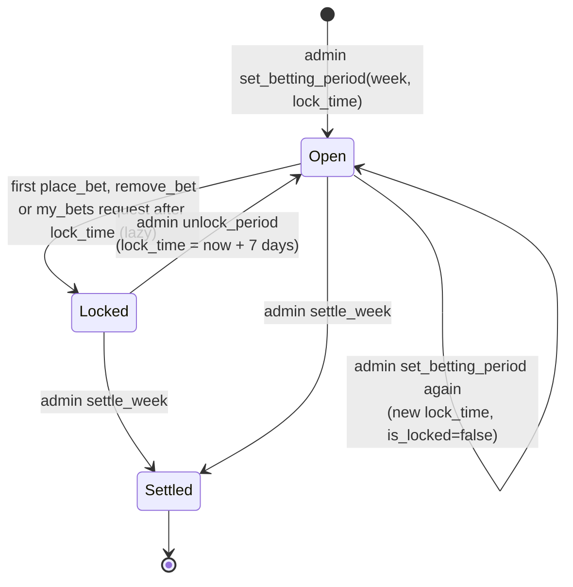
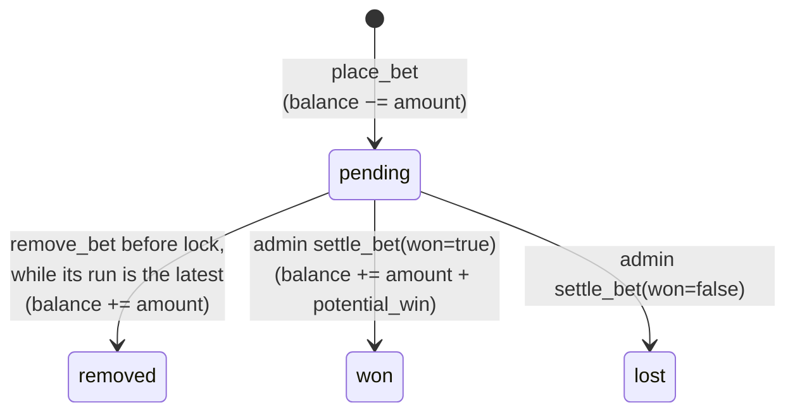
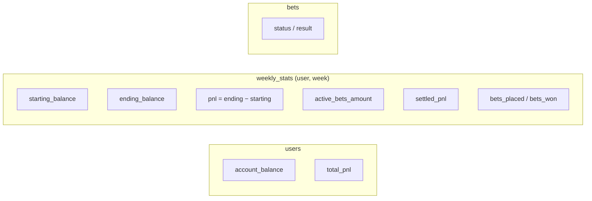

# 06 – Betting Lifecycle

All money is fake. Every user starts with **1,000**. Code: `app/routes/betting.py`, `app/routes/admin.py`, `app/routes/helpers.py`, `app/ledger.py`, `app/markets.py`.

## Betting period (one per week)

- `lock_time` is entered in the admin form as a naive datetime and **stored as UTC**.
- The lock is lazy: `check_betting_period_lock(week)` flips `is_locked` when it sees `now ≥ lock_time`. It is called from `place_bet`, `remove_bet`, and `my_bets` for each pending bet's `removable`; the `/betting` route itself doesn't check it.
- **Current week** = highest-numbered unsettled period. Settling week *N* moves the site to the next unsettled period; if there is none, it falls back to week 10. Creating the week *N+1* period before settling *N* moves the site forward immediately.
- `settle_week` **only sets `is_settled`**. It doesn't touch bets; pending bets stay pending.

## Bet

The app has no knowledge of real results. The admin looks at each pending bet (`/admin`, filtered by week, the current week by default) and clicks won or lost. A bet's legs settle with it, taking its status and `settled_at` in the same transaction.

A pending bet can be removed while its week is open and its market still shows the run it was priced at. Once a new run is published for the market, `remove_bet` refuses with `"Odds have changed since this bet was placed"` and the bet rides to settlement. A legacy bet has no market to check and is removable while its week is open. `my_bets` reports the rule as each bet's `removable`, and the betting page shows the cancel button only when it is true. A removed bet keeps its row with status `removed` and its legs `void`; the account page lists it as Removed, and the leaderboard's popular-bet counts leave it out.

### Markets

A bet names a market by key and picks one selection in it. `app/markets.py` builds the key from an odds row, parses it back, and finds the quote: the row's price, chance, line and `run_id` for that selection. From the request, `place_bet` reads only the key, the selection, the `run_id`, the amount and, for team totals, the line; the price always comes from the table.

| Market (`bet_type`) | Key | Selection | Line | Priced from | Price, chance |
|---|---|---|---|---|---|
| `moneyline` | `2026-w04-moneyline-1v4`, lower roster id first | a roster id from the key | | `betting_odds_matchup_ml` by season, week, `team1_id`, `team2_id` | `team1_ml`/`team2_ml`, `team1_win_prob`/`team2_win_prob` |
| `team_total` | `2026-w04-team_total-4` | `over` or `under` | the row's `line`, two decimals | `betting_odds_team_ou` by season, week, `team_id` | `over_odds`/`under_odds`, `over_prob`/`under_prob` |
| `highest_scorer` | `2026-w04-highest_scorer` | a roster id with a row that week | | `betting_odds_highest_scorer` by season, week, `team_id` | `odds`, `probability` |
| `lowest_scorer` | `2026-w04-lowest_scorer` | a roster id with a row that week | | `betting_odds_lowest_scorer` by season, week, `team_id` | `odds`, `probability` |
| `first_place` | `2026-first_place` | a roster id in the latest futures run | | `betting_odds_first_place` by season, `team_id`, at the season's highest `week` | `american_odds`, `probability` |
| `make_playoffs` | `2026-make_playoffs-4` | `yes` | | `betting_odds_make_playoffs` by season, `team_id`, at the season's highest `week` | `american_odds`, `probability` |

Only the latest published season is quoted. Weekly markets must be for the current week. Futures keys have no week; a futures bet's `week` is the current week, where its weekly stats post. After the lock, amount and balance checks, `place_bet` refuses without moving money when:

| Refusal | When |
|---|---|
| `"Unknown market"` | the key is not exactly one of the shapes above, or no row has it |
| `"Not this week's market"` | a weekly key names another week |
| `"Unknown selection"` | the market has no such selection: a roster id not in the key, `yes` on a moneyline, `over` on a scorer market, a roster with no row |
| `"Odds have changed"` | the row's `run_id` differs from the request's, or a team total's line is missing or differs at two decimals; the reply adds the row's `run_id`, `price`, `odds` and `line` |
| `"Not offered"` | the side's price is null because its simulated chance is 0 or 1; the page shows "No price" there |

The bet stores the table's `odds` text, `price` (the odds as an integer: `+150` is 150, `-150` is −150, even money is 100), and the row's `probability` and `run_id`. Its one `bet_legs` row records the pick as data: the key, the selection, the line, the price and the chance. The `description` keeps the old wording for the weekly markets (`Samer vs Ammad: Samer -143`, `Samer: Highest Scorer +474`), with team-total lines now at two decimals (`Samer O/U 110.63: Over`); futures read `Samer: First Place +139` and `Ammad: Make Playoffs -114`. The admin still settles by reading it.

**Legacy bets.** Bets placed before market keys existed have no legs and null `price`, `probability` and `run_id`. They keep their `description` and `odds` as the only record of the pick, show on the account page, the leaderboard and the admin page like any other bet, and settle by hand as before. Their `bet_type` was renamed once to the market names (`team_ou` → `team_total`, `first_seed` → `first_place`, `ammad_playoff` → `make_playoffs`); their descriptions keep the old wording ("#1 Seed", "Ammad Playoff").

### Payout math

| Odds | `potential_win` (profit) |
|---|---|
| `+X` | amount × X / 100 |
| `−X` | amount × 100 / X |
| `EVEN` | amount |

`place_bet` works it out from the bet's `price`, where even money is 100, so an even-money win pays the stake. On a win the user receives `amount + potential_win` (stake back plus profit). On a loss nothing is returned; the stake was already deducted when the bet was placed.

## Accounting

Three places hold money state. `app/ledger.py` is the only code that changes them, with one function per event (`open_week`, `place`, `remove`, `settle`):

| Event | `users` | `weekly_stats` | `bets`, `bet_legs` |
|---|---|---|---|
| First bet of the week | | row created, `starting_balance` = current balance | |
| **Place** | balance −= amount | placed +1, active += amount, ending = balance | insert `pending`, with a `pending` leg |
| **Remove** | balance += amount | placed −1, active −= amount, ending = balance | `removed`; legs `void` |
| **Settle won** | balance += amount + win; total_pnl += win | active −= amount, settled_pnl += win, won +1, ending = balance | `won`, result = +win; legs `won` |
| **Settle lost** | total_pnl −= amount | active −= amount, settled_pnl −= amount, ending = balance | `lost`, result = −amount; legs `lost` |

`weekly_stats.pnl` includes the cost of still-open bets (balance-based), while `settled_pnl` only counts resolved bets. The leaderboard uses `users.total_pnl` for all-time and `weekly_stats.settled_pnl` for weekly rankings.

There is no ledger table: balances change in place, so history can only be reconstructed from `bets`.

### Concurrent requests

Place, remove and settle each run as one transaction that opens with a conditional guard: a statement that changes a row only while the event is still allowed. The route commits once when the guard changed a row and rolls back when it changed none:

| Event | Guard | When it changes no row |
|---|---|---|
| **Place** | `UPDATE users SET account_balance = account_balance - :stake WHERE id = :user AND account_balance >= :stake` | `"Insufficient balance"` |
| **Remove** | `UPDATE bets SET status = 'removed' WHERE id = :bet AND status = 'pending'` | `"Bet not found"` |
| **Settle** | `UPDATE bets SET status = :status, result = :result, settled_at = :now WHERE id = :bet AND status = 'pending'` | `"Bet already settled"` |

The statements after the guard change the stored values by SQL arithmetic (`bets_placed = bets_placed + 1`) and read `ending_balance` and `pnl` from the user's balance by subquery, so no request writes back a number it read earlier. The effects table above therefore holds when requests arrive together: a stake never takes a balance below zero, and a bet is paid or refunded at most once. On PostgreSQL a guard that meets a row another request is changing waits for that request to finish, then re-checks its condition against the new value; SQLite runs one writer at a time.

The week's `weekly_stats` row is created in its own short transaction before any money moves. When two requests create it at once, the loser fails on `uq_user_week`, rolls back and uses the winner's row. `place_bet`'s balance check before the guard is only an early answer, and `new_balance` in the reply is re-read from the database after the commit.
