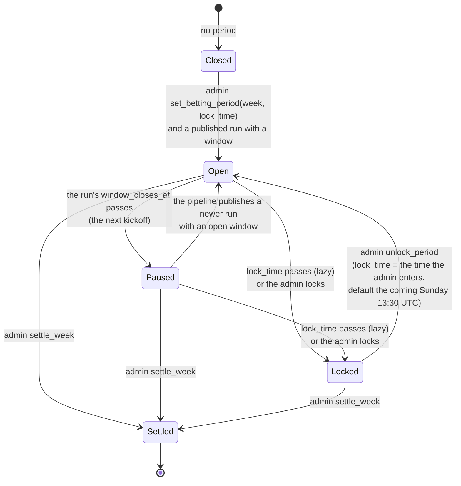
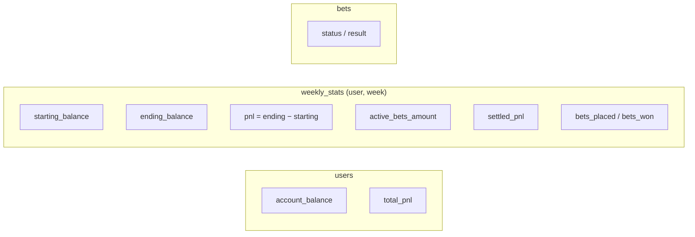

# 06 – Betting Lifecycle

All money is fake. Every user starts with **1,000**. Code: `app/routes/betting.py`, `app/routes/admin.py`, `app/routes/helpers.py`, `app/windows.py`, `app/ledger.py`, `app/markets.py`, `app/parlays.py`, `app/matrices.py`, `app/settlement.py`, `app/cashout.py`.

## Betting period (one per week)

Betting is open when the odds on the page come from a run made before the next kickoff, and nothing else. `betting_window(week)` in `app/windows.py` reads the week's `BettingPeriod`, the admin's lock and the week's latest `simulation_runs` row ([04](04-data-model.md)) into one of three states:

| State | When | Place, remove, cash out |
|---|---|---|
| `open` | the period exists and is neither settled nor locked, and now is before the latest run's `window_closes_at` | allowed |
| `paused` | the same, but the run's window has closed and no newer run has published: Thursday night until the Friday rerun, Sunday morning until the week is settled | refused, `"Betting is paused until the odds update"` |
| `closed` | no period, or the period is settled, or the admin's lock (`is_locked`, or `lock_time` passed), or the latest run has no window | refused, `"Bets are locked as of …"` under the lock, else `"Betting is closed for week 4"` |



The window comes from the runs: Wednesday's run closes at Thursday's kickoff, the Friday rerun after Thursday's game closes at Sunday's first kickoff, and a Saturday rerun the same. With no rerun published, the latest run's window has closed and betting stays paused, which is the safe default. A window closing never flips `is_locked`; the lock is the admin's backstop and kill switch.

- `lock_time` is entered in the admin form as a naive datetime and **stored as UTC**. Set it at the week's last window close, Sunday's first kickoff (week 4: `2026-10-04T13:30` UTC), never Thursday's: a Thursday lock keeps the week shut after the Friday rerun.
- The lock is lazy: `check_betting_period_lock(period)`, given the period `betting_window` loaded, flips `is_locked` when it sees `now ≥ lock_time`. `betting_window` is its one caller, so the lock still flips on the first `place_bet`, `remove_bet`, `cash_out`, `my_bets` or `betting_window` request after `lock_time`; the `/betting` route itself doesn't check it.
- **Current week** = highest-numbered unsettled period. Settling week *N* moves the site to the next unsettled period; if there is none, it falls back to week 10. Creating the week *N+1* period before settling *N* moves the site forward immediately.
- `settle_week` **only sets `is_settled`**. It doesn't touch bets; pending bets stay pending. The admin page shows only the current week's bets, so settle them ([Settlement](#settlement)) before creating the next week's period or marking this one settled.

## Bet

```mermaid
stateDiagram-v2
    [*] --> pending: place_bet<br/>(balance −= amount)
    pending --> removed: remove_bet while the window is open<br/>and its run is the latest<br/>(balance += amount)
    pending --> won: admin settle_outcomes<br/>or settle_bet(won=true), singles only<br/>(balance += amount + potential_win;<br/>a parlay with pushed legs pays its adjusted potential_win)
    pending --> lost: admin settle_outcomes<br/>or settle_bet(won=false), singles only
    pending --> push: admin settle_outcomes,<br/>tie or score on the line<br/>(balance += amount)
    pending --> void: admin void_bet<br/>(balance += amount)
    pending --> cashed_out: cash_out while the window is open<br/>and a newer run has moved the odds<br/>(balance += offer)
```



The app judges each weekly bet placed by market key against the league's published scores, and the standings futures against the final standings in the regular season's last week, and the admin confirms the outcomes it shows ([Settlement](#settlement)); the champion and legacy bets are settled by hand as won or lost. A bet's legs settle with it in the same transaction, taking its `settled_at` and its status, except a parlay settled from the preview, whose legs each take their own outcome. A push and a void both return the stake. A push is a result and stays on the record: the account page lists it as Push, and the leaderboard's popular-bet counts include it and show Push when nothing in the group won or lost. A void means the bet should never have stood, so it leaves `bets_placed` as a remove does, the account page lists it as Void, and the popular-bet counts leave it out with the removed bets.

A pending bet can be removed while its week's window is open and its `run_id` is still the week's latest run, the one the window names; a futures bet, which has no window run, is removable while its odds row still shows the run it was priced at. Once a newer run is published, `remove_bet` refuses with `"Odds have changed since this bet was placed"`, and removal gives way to cash-out. A legacy bet has no market to check and is removable while the window is open. `my_bets` reports the rule as each bet's `removable`, and the betting page shows the cancel button only when it is true. A removed bet keeps its row with status `removed` and its legs `void`; the account page lists it as Removed, and the leaderboard's popular-bet counts leave it out.

### Cash-out

Once a newer run has moved a bet's odds, the bettor can close it for 95% of its fair value in that run, while the window is open; otherwise it rides to settlement. `app/cashout.py` prices the offer and never moves money:

```
fair value = (amount + potential_win) × p_win      p_win from the latest run, at the bet's own line
offer      = round(0.95 × fair value, 2)
```

| | Weekly bet | Futures bet |
|---|---|---|
| Latest run | `betting_window(bet.week).run_id` | the `run_id` of the market's latest futures quote |
| Window that must be open | the bet's week | the current week |
| `p_win` | the share of that run's `simulation_totals` sims in which every leg wins, through each leg's market's win rule, at the leg's own line and selection | the quote's `probability` |

A single is the one-leg case, so a parlay's offer is the joint chance of its legs in the latest run times its payout, the same rule: $100 on a two-leg parlay at +186 pays $286, and a rerun in which both legs win in 4 of 10 sims makes it worth $114.40 and offers $108.68. A parlay never holds a futures leg today; futures legs will follow the same path once their per-simulation standings are published.

The 5% margin covers news the latest run has not seen and keeps holding a bet the better choice when the odds have barely moved. The latest run must differ from the bet's `run_id`, so a bet is either removable or offered, never both. `my_bets` carries each bet's offer as `cash_out_offer`, and `POST /api/cash_out/<id>` sends back the offer the page showed. The route recomputes it and refuses without moving money when:

| Refusal | When |
|---|---|
| `"Bet not found"` | the bet is not the user's or not pending, or another request closed it first |
| `"No offer for this bet"` | the bet has no legs (a legacy bet), or a leg's market key fails to parse |
| `"Betting is paused until the odds update"`, `"Betting is closed for week 4"` | the window is not open; the admin's lock reads as closed |
| `"Odds have not changed since this bet was placed; remove it instead"` | the latest run is the bet's own |
| `"No offer until the next run: the standings are behind"` | futures: the run's `standings_through_week` is below the current week − 1 |
| `"No offer: the latest run cannot price this bet"` | the bet (every leg of a parlay together) wins in every sim or in none, the latest run has no stored matrix or no column for a roster in the key, the futures market or selection is gone from the latest run, or the offer rounds below one cent |
| `"Offer has changed"` | the recomputed offer differs from the one sent at two decimals; the reply adds the new `offer` |

Only the profit or loss of a cash-out, `offer − amount`, reaches `total_pnl` and a leaderboard, and it posts to the week the cash-out is taken, not the bet's week, so cashing out a week-4 futures bet in week 9 leaves week 4's leaderboard as it was. The bet keeps its row with status `cashed_out`, the result, and the offer, run and time it was taken at, which is the log the margin is reviewed against. The account page lists it as Cashed out with its signed result. The leaderboard counts it as placed: the popular-bet counts include it with neither a win nor a loss and show Cashed out when every bet in the group was, and the best- and worst-bet lists, which read only won and lost bets, leave it out.

### Markets

A bet names a market by key and picks one selection in it. `app/markets.py` builds the key from an odds row, parses it back, and finds the quote: the row's price, chance, line and `run_id` for that selection, or for a spread the price and chance at the requested line from the week's latest score matrix. From the request, `place_bet` reads only the key, the selection, the `run_id`, the amount and, for team totals and spreads, the line; the price always comes from the table or the matrix, never from the request.

| Market (`bet_type`) | Key | Selection | Line | Priced from | Price, chance |
|---|---|---|---|---|---|
| `moneyline` | `2026-w04-moneyline-1v4`, lower roster id first | a roster id from the key | | `betting_odds_matchup_ml` by season, week, `team1_id`, `team2_id` | `team1_ml`/`team2_ml`, `team1_win_prob`/`team2_win_prob` |
| `spread` | `2026-w04-spread-1v4`, lower roster id first | a roster id from the key | the selected roster's, signed: a multiple of 0.5 within ±40, as requested | the week's latest `simulation_runs` row's `simulation_totals` matrix, at the requested line, for a matchup with a `betting_odds_matchup_ml` row | the share of the run's sims in which the side covers, at fair odds (`odds_from_probability`) |
| `team_total` | `2026-w04-team_total-4` | `over` or `under` | the row's `line`, two decimals | `betting_odds_team_ou` by season, week, `team_id` | `over_odds`/`under_odds`, `over_prob`/`under_prob` |
| `highest_scorer` | `2026-w04-highest_scorer` | a roster id with a row that week | | `betting_odds_highest_scorer` by season, week, `team_id` | `odds`, `probability` |
| `lowest_scorer` | `2026-w04-lowest_scorer` | a roster id with a row that week | | `betting_odds_lowest_scorer` by season, week, `team_id` | `odds`, `probability` |
| `first_place` | `2026-first_place` | a roster id in the latest futures run | | `betting_odds_first_place` by season, `team_id`, at the season's highest `week` | `american_odds`, `probability` |
| `make_playoffs` | `2026-make_playoffs-4` | `yes` | | `betting_odds_make_playoffs` by season, `team_id`, at the season's highest `week` | `american_odds`, `probability` |
| `last_place` | `2026-last_place` | a roster id in the latest futures run | | `betting_odds_last_place` by season, `team_id`, at the season's highest `week` | `american_odds`, `probability` |
| `champion` | `2026-champion` | a roster id in the latest futures run | | `betting_odds_champion` by season, `team_id`, at the season's highest `week` | `american_odds`, `probability` |

**Spread lines.** A line belongs to the selected roster: roster 4 at +5.5 covers when its score plus 5.5 beats roster 1's, pushes when the two are equal, and roster 1 at −5.5 is the other side of the same line. Pricing (through `leg_outcome`), cash-out and settlement all apply the one rule, `win_rules.spread(scores, picked, other, line)`. A matchup's main line is the median of `team1 − team2` over the latest run's sims, rounded to the nearest 0.5 and negated for team1, so a favourite by 5.7 shows −5.5 and team2 +5.5; the alternates run from the main line −10 to +10 in half points, inside ±40. On the seeded test run roster 1's median margin is 4: at −4.0 each side covers in 9 of 20 sims and 2 land on the line, both at `+122`. A spread has no odds table: the quote is priced when it is asked for, from the run `windows.latest_run_id(week)` names, which is the window's run read without the lazy lock. A side that covers in every sim or in none has no price, as the owner's no-cap, no-edge rule has it ([design decision 2](../design/odds-models-2026.md#10-evidence)).

Only the latest published season is quoted. Weekly markets must be for the current week. Futures keys have no week; a futures bet's `week` is the current week, where its placement and stake post; its result posts to the week it settles in ([Accounting](#accounting)). After the window, amount and balance checks, `place_bet` refuses without moving money when:

| Refusal | When |
|---|---|
| `"Unknown line"` | a spread without a line, or with one that is not a number, not a multiple of 0.5, or beyond ±40; checked before the market |
| `"Unknown market"` | the key is not exactly one of the shapes above, or no row has it |
| `"Not this week's market"` | a weekly key names another week |
| `"Unknown selection"` | the market has no such selection: a roster id not in the key, `yes` on a moneyline, `over` on a scorer market, a roster with no row |
| `"Odds have changed"` | the row's `run_id` differs from the request's, or a team total's line is missing or differs at two decimals; a spread is quoted at the requested line, so only its run can move; the reply adds the quote's `run_id`, `price`, `odds` and `line` |
| `"Not offered"` | the side's price is null because its simulated chance is 0 or 1, or a spread's run has no stored matrix; the page shows "No price" there |

The bet stores the table's `odds` text, `price` (the odds as an integer: `+150` is 150, `-150` is −150, even money is 100), and the row's `probability` and `run_id`. Its one `bet_legs` row records the pick as data: the key, the selection, the line, the price and the chance. The `description` keeps the old wording for the weekly markets (`Samer vs Ammad: Samer -143`, `Samer: Highest Scorer +474`), with team-total lines now at two decimals (`Samer O/U 110.63: Over`); a spread names the matchup, then the pick with its signed line at one decimal and the odds (`Samer vs Ammad: Samer -5.5 -110`), and its leg's `line` is the selected roster's; futures read `Samer: First Place +139`, `Ammad: Make Playoffs -114`, `Bob B: Last Place +230` and `Alice A: Champion +233`. The admin page shows it beside each bet's outcome; only the champion and legacy bets are still settled by reading it.

**Legacy bets.** Bets placed before market keys existed have no legs and null `price`, `probability` and `run_id`. They keep their `description` and `odds` as the only record of the pick, show on the account page, the leaderboard and the admin page like any other bet, and settle by hand as before. Their `bet_type` was renamed once to the market names (`team_ou` → `team_total`, `first_seed` → `first_place`, `ammad_playoff` → `make_playoffs`); their descriptions keep the old wording ("#1 Seed", "Ammad Playoff").

#### Parlays

A parlay is one bet on two to four of the current week's picks, and it wins only if every leg wins. Its legs come from the five weekly markets, `moneyline`, `spread`, `team_total`, `highest_scorer` and `lowest_scorer`; futures are refused. A spread leg carries its `line` and is quoted at it. `app/parlays.py` prices the legs together at the joint chance, the share of the week's latest run's sims in which every leg wins, read from that run's `simulation_totals` matrix through each market's win rule (`app/matrices.py`, cached per worker). The run is the window's `run_id`, and every leg's own quote must come from it.

```
joint  = share of the run's sims in which every leg wins
odds   = odds_from_probability(joint)          fair American odds, rounded as the pipeline rounds
price  = price_from_odds(odds)
payout = potential_win(amount, price)
```

On the seeded test run, roster 1 beats roster 2 in 11 of 20 sims and tops its 110.5 line in 9, and does both in 7: the parlay is 35% at `+186`, where the two singles at -150 and -120 multiply to 33%. There is no cap and no house edge ([design decision 2](../design/odds-models-2026.md#10-evidence)): a parlay that wins in one sim of 50,000 is offered at +4999900, and one that wins in every sim or in none has no price and is not offered.

`POST /api/parlay_quote` prices the legs for the page's slip and moves no money; `place_bet` with a `legs` list of two or more prices them again and places the parlay. A `legs` list of one entry is a single. Both first need the window open, then refuse, in this order, with the refusal's `rule` and the market keys at fault in `legs`:

| Refusal | `rule` | When |
|---|---|---|
| `"Odds have changed"` | `odds_changed` | the request's `run_id` is not the window's: the page showed another run's prices, so every leg is named |
| `"A parlay has 2 to 4 legs"` | `size` | fewer than two legs or more than four, or `legs` is not a list |
| `"Unknown market"`, `"Unknown selection"`, `"Unknown line"`, `"Not this week's market"`, `"Futures cannot be parlayed"` | `leg` | a leg's key fails to parse or finds no row, names another week, or is a futures market, a spread leg's line is missing or not a half point within ±40, or the entry is not an object or names no market (named as null); every faulty leg is named under the first one's text. A spread leg on a run without a stored matrix is refused here too, as `"Not offered"` |
| `"Two legs from one market"` | `same_market` | two legs share a key: both sides of a matchup, a team's over and under, two highest-scorer picks, two spread legs of one matchup at any lines. They could only win together on a tie, or say one thing twice |
| `"Odds have changed"` | `odds_changed` | a leg's row is at another run than the window's, or a team total's line is missing or differs at two decimals |
| `"Not offered"` | `no_price` | a leg's price is null (the leg is named), or the run's matrix is not stored (none is) |
| `"Not offered: the simulations cannot price this parlay"` | `impossible` | the legs win together in every sim or in none |
| `"A leg adds nothing to this parlay"` | `redundant` | without the leg the others win in exactly as many sims: "Alice A is the highest scorer" already wins "Alice A beats Bob B", and so does "Alice A −4.0"; the pair would pay what the single pays. Every such leg is named |

An `"Odds have changed"` reply adds the window's `run_id`, so the page reloads the tab and quotes again. A quote refused as `same_market`, `impossible` or `redundant` writes one `parlay_refusals` row ([04](04-data-model.md#postgresql-production)): the user, week and run, the legs as the page sent them in JSON, and the rule. Malformed legs, moved odds and missing prices are not logged, and neither are refusals at placement, which follows a quote. Nothing reads the log yet; it is for the owner's SQL after weeks 5 and 6, to decide whether scorer legs stay in parlays ([design §1.4](../design/odds-models-2026.md#14-which-legs-belong)).

A placed parlay is a `bets` row with `bet_type` `parlay`, the joint `odds`, `price` and `probability`, the run's `run_id` and the `potential_win` of the joint price, and one `bet_legs` row per leg holding the leg's own single price, chance and line. Its `description` joins the legs' single descriptions with ` + `: `Alice A vs Bob B: Alice A -150 + Alice A O/U 110.50: Over`. It is removable while the bet's run is still the week's latest; once a newer run has moved the odds it is offered a cash-out at the joint chance of its legs in that run, like a single ([Cash-out](#cash-out)), or rides to settlement ([Settlement](#settlement)). The leaderboard counts it like any bet, except the popular-bet groups, which are the four single markets `moneyline`, `team_total`, `highest_scorer` and `lowest_scorer`. A spread is a bet like any other for money and the best- and worst-bet lists, and has no popular-bet group of its own.

### Payout math

| Odds | `potential_win` (profit) |
|---|---|
| `+X` | amount × X / 100 |
| `−X` | amount × 100 / X |
| `EVEN` | amount |

`place_bet` works it out from the bet's `price`, where even money is 100, so an even-money win pays the stake. On a win the user receives `amount + potential_win` (stake back plus profit). On a loss nothing is returned; the stake was already deducted when the bet was placed. A push or a void returns the stake alone.

## Settlement

`app/settlement.py` judges each pending bet of a week against the league's team scores, published as `sleeper_matchups`. It never moves money or commits; the admin routes settle through the ledger. Every comparison goes through the win rules in `pipeline/markets.py` ([03](03-modeling-and-odds.md#4-markets)), applied to a one-row score matrix of the week's played scores, so the pipeline prices a market and the app settles it by the same rule. The rules compare floats exactly, and nothing is rounded: scores and lines both carry two decimals, and the same two-decimal value always reads back as the same float, so a score on its line is a push.

| Market | Won | Lost | Push | Undecided |
|---|---|---|---|---|
| `moneyline` | the picked roster outscores the other roster in the key | the other way | equal points | either roster has no score |
| `spread` | the picked roster's points plus the leg's `line` beat the other roster's | the other way | equal after the line | either roster has no score |
| `team_total` | `over`: points above the leg's `line`; `under`: below | the other way | points on the line | the roster has no score |
| `highest_scorer`, `lowest_scorer` | the picked roster's points equal the week's highest (lowest) | otherwise | never | any roster of the week's league has no score |
| `first_place`, `make_playoffs`, `last_place` | in the regular season's last week, the picked roster finishes first, within `playoff_teams`, or last (rank `num_teams`) in the final standings | otherwise | never | before the last week, and in it until every roster has a score in every regular-season week |
| `champion` | | | | always: settled by hand after the final |
| a bet without legs | | | | always: settled by hand |
| a key that fails to parse | | | | always, with the parse error as the reason |

- A roster has no score when its row is missing or its `points` are exactly 0. Sleeper lists every roster of a week at 0.0 until the week is played, and no team with a lineup scores exactly zero.
- The moneyline's and the spread's other roster comes from the key, not from `matchup_id_number`. A spread settles at the line stored on its leg, the picked roster's.
- A team total settles at the `line` stored on its leg, never the odds table's current line, which a later run may have moved.
- Every roster tied on the top (or bottom) score wins in full, because the pricing counted each of them the winner.
- A week whose `sleeper_matchups` rows come from more than one league is refused whole: `"Week 4 has scores from 2 leagues; publish only this season's league"`.

Each outcome carries a reason the admin reads beside it: `Bob B 131.20 vs Alice A 110.50`, `Alice A 110.50 -5.5 vs Bob B 105.00` (the pick, its points and its line first), `Alice A 110.50, line 110.50`, `highest 131.20: Bob B, Carol C`, `no score for Bob B`, `3rd of 12: 9-5, 1,612.30 pts`, `regular season not complete: 10 of 12 rosters scored in week 14`, `futures: judged from the final standings`, `champion: settle by hand after the final`, `placed before market keys: settle by hand`.

**Standings futures** settle from the league's own table once the regular season ends. The league's settings are published as `sleeper_leagues` ([04](04-data-model.md)), and `league_settings(league_id)` reads `playoff_week_start`, `playoff_teams` and `num_teams` from its `settings` JSON for the league the week's matchups name; a league without a row there is refused whole, with `"League <id> has no published settings; publish the league step"`. The regular season's last week is `playoff_week_start − 1`, week 14 in the owner's league. Previewing any other week judges only that week's own bets, and a standings future among them is undecided, `futures: judged from the final standings`. Previewing the last week (`final_standings(week)`) also lists every pending `first_place`, `make_playoffs` and `last_place` bet, whatever week it was placed in, and judges it on the standings through that week:

- Every roster of the league (`num_teams`) must have a score in every week from 1 to the last, a score being `points` neither null nor exactly 0, as for the weekly markets. Until then every standings future is undecided, naming the first week short: `regular season not complete: 10 of 12 rosters scored in week 14`.
- `standings_before(week, league_id)` builds each roster's record from the `sleeper_matchups` pairs (a game is the two rows of a week that share `matchup_id_number`): a win, a loss or a tie on the two scores, and points for. It ranks by wins, then points for, then roster id. Sleeper breaks a tie in wins on points for; the pipeline's standings rank ties between wins and points, which cannot differ here because a tie counts for neither side. The analytics page's standings come from the same function.
- `first_place` wins at rank 1, `make_playoffs` at a rank within `playoff_teams`, `last_place` at rank `num_teams`; each loses otherwise. The reason is the picked roster's rank, record and points for: `3rd of 12: 9-5, 1,612.30 pts`, or `4th of 12: 8-5-1, 1,580.10 pts` with a tie.
- `champion` bets are never judged: `champion: settle by hand after the final`. The bracket is played after the regular season and the app does not read it.

**Parlays** settle all or nothing, leg by leg, each leg judged by its market's rule above ([design §1.6](../design/odds-models-2026.md#16-settling-a-parlay)). A pushed leg drops out, and the legs left standing are paid on the run the parlay was placed at, never the latest:

| Legs | Outcome | Reason | Pays |
|---|---|---|---|
| any leg undecided | undecided | `2 of 3 legs decided` | |
| any leg lost | lost | `lost: ` and each lost leg's reason, joined with `; ` | |
| every leg won | won | `won, 3 legs` | the stored `potential_win` |
| some pushed, two or more won | won | `won, 1 leg pushed: pays 66.67 on the rest` | the won legs re-priced at their joint chance on the placement run's matrix (`score_matrix(bet.run_id)`), at their stored lines |
| some pushed, one won | won | `won, 2 legs pushed: pays 83.33 on the rest` | that leg's stored single `price` |
| every leg pushed | push | `push: every leg on its line` | the stake back |
| some pushed, and the placement run's matrix is not stored | undecided | `placement run's matrix not stored: settle by hand` | |

The re-priced win replaces `bets.potential_win` when the bet settles, and each leg takes its own `won`, `lost` or `push`.

**Preview, then confirm.** The Settle Week card on `/admin` shows the week's scores as a strip, then every pending bet of the week, and in the regular season's last week every pending standings future, with its bettor, description, reason and outcome (`GET /api/admin/settlement_preview`). One button, "Settle N decided bets", sends each decided bet with the outcome the page showed (`POST /api/admin/settle_outcomes`). The route recomputes every outcome from the scores published now and settles a bet, through `ledger.settle` or `ledger.push`, only when the two agree. Each bet is its own transaction (guard, commit, next), so a failure part-way leaves the bets before it settled. The others are skipped with a reason, the page lists what settled and what was skipped, and both cards reload:

| Skip reason | When |
|---|---|
| `"scores changed: now push"` | a publish since the preview changed the outcome (`now won`, `now lost` the same way) |
| `"undecided"` | the bet has no outcome from the scores published now |
| `"already settled"` | the bet is no longer pending: settled, pushed, voided, removed or cashed out |
| `"not found"` | no bet has the id, or the preview of that week does not list it |

**Runbook.** When the admin sets the week's period, the lock goes at the week's last window close, Sunday's first kickoff in UTC; the runs open and close betting between Wednesday and then on their own. Locking by hand before that is the kill switch for the week. Unlock asks for the new lock time, defaulting to the coming Sunday 13:30 UTC; a week ahead only when none is sent.

**Which scores.** `sleeper_matchups` has no `run_id` and no fetch time: publish replaces it whole from the pipeline's latest league fetch, so settlement uses whatever the last publish carried, and the app cannot tell when that fetch ran. The design's open hypothesis ([odds models §6](../design/odds-models-2026.md#6-settlement-edge-cases)) is that Sleeper's stat corrections move a few starters by a point or two after Monday night. The test is to fetch week 4's matchups on Tuesday morning and again on Friday and compare `players_points`; until the answer is known, settle on Tuesday's fetch. The admin runs the league fetch and publish on Tuesday, checks the card's scores strip, which shows exactly the points the outcomes use, and then presses the button. A bet settled from Tuesday's scores is not revisited when a correction lands later.

**By hand.** The Pending Bets card keeps a Win and a Loss button on every pending single (`POST /api/admin/settle_bet`). They are how the champion (after the final) and legacy bets settle, and they settle any other pending single as won or lost too, a standings future included. The card lists the week's pending bets and every pending futures bet, whatever week it was placed in, so a champion bet from week 9 is still there after the final. A futures bet settled by hand posts its result to the current week, like one settled from the preview. A parlay shows neither: `settle_bet` refuses a bet with more than one leg (`"Parlays settle from the Settle Week card"`), so a parlay settles only through the preview, which judges it leg by leg. Void stays on every bet. The Void button beside them (`POST /api/admin/void_bet`, after a confirm naming the bet and its stake) refunds a bet that should never have stood: a game not played, an admin mistake.

Both cards show the current week, and the page has no week switch; `settlement_preview` and `pending_bets` take `?week=N` for any other week, and `settle_outcomes` takes the week in its body. Settle the regular season's last week with that week current: its preview is the one that judges the standings futures.

## Accounting

Three places hold money state. `app/ledger.py` is the only code that changes them, with one function per event (`open_week`, `place`, `remove`, `settle`, `push`, `void`, `cash_out`):



| Event | `users` | `weekly_stats` | `bets`, `bet_legs` |
|---|---|---|---|
| First bet of the week | | row created, `starting_balance` = current balance | |
| **Place** | balance −= amount | placed +1, active += amount, ending = balance | insert `pending`, with a `pending` leg |
| **Remove** | balance += amount | placed −1, active −= amount, ending = balance | `removed`; legs `void` |
| **Settle won** | balance += amount + win; total_pnl += win | the bet's week: active −= amount, ending = balance; the result week: settled_pnl += win, won +1, ending = balance | `won`, result = +win; legs `won`. A parlay from the preview: win is its adjusted win, written to `potential_win`, and each leg takes its own outcome |
| **Settle lost** | total_pnl −= amount | the bet's week: active −= amount, ending = balance; the result week: settled_pnl −= amount, ending = balance | `lost`, result = −amount; legs `lost`, or each its own on a parlay from the preview |
| **Push** | balance += amount | the bet's week: active −= amount, ending = balance; the result week: ending = balance | `push`, result = 0; legs `push` |
| **Void** | balance += amount | placed −1, active −= amount, ending = balance | `void`, result = 0; legs `void` |
| **Cash out** | balance += offer; total_pnl += offer − amount | the bet's week: active −= amount, ending = balance; the cash-out week: settled_pnl += offer − amount, ending = balance | `cashed_out`, result = offer − amount, `cash_out_amount` = offer, `cash_out_run_id`, `cashed_out_at`; legs `cashed_out` |

The result week of a settle or a push is the bet's own week for a weekly bet, a parlay and a legacy bet. For a futures bet it is the week the bet settles in: the week being settled in `settle_outcomes`, the current week in `settle_bet`, whose `weekly_stats` row the route opens first. So a week-4 first-place bet settled from week 14's preview adds its profit to week 14's leaderboard, and week 4's row only drops the stake from `active_bets_amount`, as a cash-out's does. `ledger.settle` and `ledger.push` take the week as `week`, defaulting to the bet's own; when the two weeks are the same, one row takes both changes.

A push leaves `total_pnl`, `settled_pnl`, `bets_placed` and `bets_won` as they were: the bet was placed and settled for nothing. A void takes the bet out of `bets_placed`, as a remove does, because it should never have counted. A cash-out leaves `bets_placed` and `bets_won` as they were, and when the bet's week is the cash-out week one row takes both changes. Settle, push, void and cash out set `settled_at` on the bet and its legs.

`weekly_stats.pnl` includes the cost of still-open bets (balance-based), while `settled_pnl` only counts resolved bets. The leaderboard uses `users.total_pnl` for all-time and `weekly_stats.settled_pnl` for weekly rankings, and the account page's Weekly P&L shows `settled_pnl` too, so a cash-out's returned stake never reads as profit anywhere.

There is no ledger table: balances change in place, so history can only be reconstructed from `bets`.

### Concurrent requests

Place, remove, settle, push, void and cash out each run as one transaction that opens with a conditional guard: a statement that changes a row only while the event is still allowed. The route commits once when the guard changed a row and rolls back when it changed none; `settle_outcomes` does this once per bet:

| Event | Guard | When it changes no row |
|---|---|---|
| **Place** | `UPDATE users SET account_balance = account_balance - :stake WHERE id = :user AND account_balance >= :stake` | `"Insufficient balance"` |
| **Remove** | `UPDATE bets SET status = 'removed' WHERE id = :bet AND status = 'pending'` | `"Bet not found"` |
| **Settle** | `UPDATE bets SET status = :status, result = :result, settled_at = :now WHERE id = :bet AND status = 'pending'`, also setting `potential_win` for a parlay whose pushed legs changed its win | `"Bet already settled"` from `settle_bet`; `settle_outcomes` skips the bet as `"already settled"` |
| **Push** | `UPDATE bets SET status = 'push', result = 0, settled_at = :now WHERE id = :bet AND status = 'pending'` | `settle_outcomes` skips the bet as `"already settled"` |
| **Void** | `UPDATE bets SET status = 'void', result = 0, settled_at = :now WHERE id = :bet AND status = 'pending'` | `"Bet already settled"` from `void_bet` |
| **Cash out** | `UPDATE bets SET status = 'cashed_out', result = :result, cash_out_amount = :offer, cash_out_run_id = :run_id, cashed_out_at = :now, settled_at = :now WHERE id = :bet AND status = 'pending'` | `"Bet not found"` |

The statements after the guard change the stored values by SQL arithmetic (`bets_placed = bets_placed + 1`) and read `ending_balance` and `pnl` from the user's balance by subquery, so no request writes back a number it read earlier. The effects table above therefore holds when requests arrive together: a stake never takes a balance below zero, and a bet is paid or refunded at most once. On PostgreSQL a guard that meets a row another request is changing waits for that request to finish, then re-checks its condition against the new value; SQLite runs one writer at a time.

The week's `weekly_stats` row is created in its own short transaction before any money moves; a cash-out opens the current week's row this way before its guard. When two requests create it at once, the loser fails on `uq_user_week`, rolls back and uses the winner's row. `place_bet`'s balance check before the guard is only an early answer, and `new_balance` in the reply is re-read from the database after the commit.
