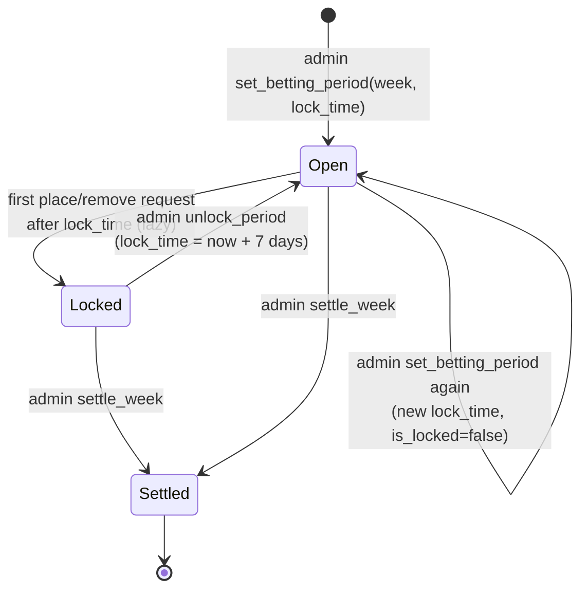
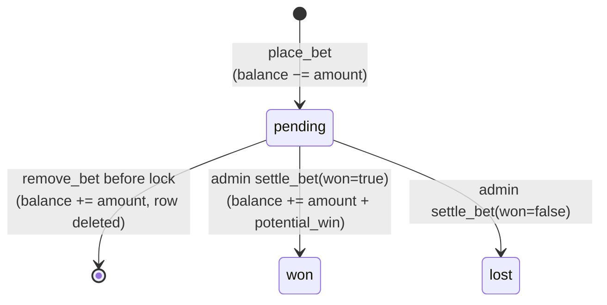
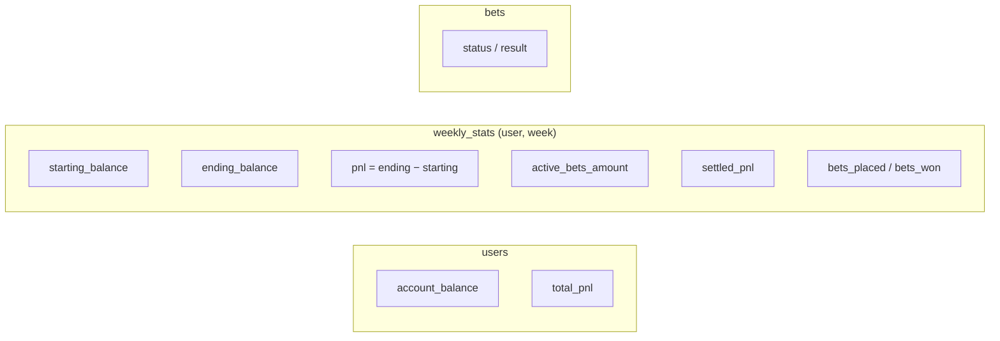

# 06 – Betting Lifecycle

All money is fake. Every user starts with **1,000**. Code: `app/routes/betting.py`, `app/routes/admin.py`, `app/routes/helpers.py`.

## Betting period (one per week)

- `lock_time` is entered in the admin form as a naive datetime and **stored as UTC**.
- The lock is lazy: `check_betting_period_lock(week)` flips `is_locked` when it sees `now ≥ lock_time`. It is only called from `place_bet` and `remove_bet`; the betting page itself doesn't check it.
- **Current week** = highest-numbered unsettled period. Settling week *N* moves the site to the next unsettled period; if there is none, it falls back to week 10. Creating the week *N+1* period before settling *N* moves the site forward immediately.
- `settle_week` **only sets `is_settled`**. It doesn't touch bets; pending bets stay pending.

## Bet

The app has no knowledge of real results. The admin looks at each pending bet (`/admin`, filtered by week) and clicks won or lost.

### Bet types

| `bet_type` | Offered on site | Selection sent by client | Odds taken from |
|---|---|---|---|
| `moneyline` | yes | `matchup_idx` + `team1`/`team2` | Server: row *idx* of `betting_odds_matchup_ml` for the week, ordered by `matchup` |
| `team_ou` | yes | `team_idx` + `over`/`under` | Server: row *idx* of `betting_odds_team_ou` ordered by `owner`; always `EVEN` |
| `highest_scorer` | yes | `owner`, `odds` | **Client** |
| `lowest_scorer` | yes | `owner`, `odds` | **Client** |
| `first_seed` | no UI | `owner`, `odds` | **Client** |
| `ammad_playoff` | no UI | `owner`, `odds` | **Client** |

Moneyline and O/U selections are **positional**: the client and server must agree on row order, and a re-publish that adds rows (e.g. a duplicate run) shifts the indexes. The four owner/odds bet types store whatever odds string the browser sends without checking it against the odds tables.

`description` is a human-readable string (e.g. `"Samer vs Ammad: Samer -150"`); nothing structured records which team or side was picked.

### Payout math

| Odds | `potential_win` (profit) |
|---|---|
| `+X` | amount × X / 100 |
| `−X` | amount × 100 / X |
| `EVEN` | amount |

On a win the user receives `amount + potential_win` (stake back plus profit). On a loss nothing is returned; the stake was already deducted when the bet was placed.

## Accounting

Three places hold money state and are updated together in each request:

| Event | `users` | `weekly_stats` | `bets` |
|---|---|---|---|
| First bet of the week | | row created, `starting_balance` = current balance | |
| **Place** | balance −= amount | placed +1, active += amount, ending = balance | insert `pending` |
| **Remove** | balance += amount | placed −1, active −= amount, ending = balance | delete row |
| **Settle won** | balance += amount + win; total_pnl += win | active −= amount, settled_pnl += win, won +1, ending = balance | `won`, result = +win |
| **Settle lost** | total_pnl −= amount | active −= amount, settled_pnl −= amount, ending = balance | `lost`, result = −amount |

`weekly_stats.pnl` includes the cost of still-open bets (balance-based), while `settled_pnl` only counts resolved bets. The leaderboard uses `users.total_pnl` for all-time and `weekly_stats.settled_pnl` for weekly rankings.

There is no ledger table: balances are mutated in place, so history can only be reconstructed from `bets`. Balance updates are read-modify-write on the ORM object without row locks.
