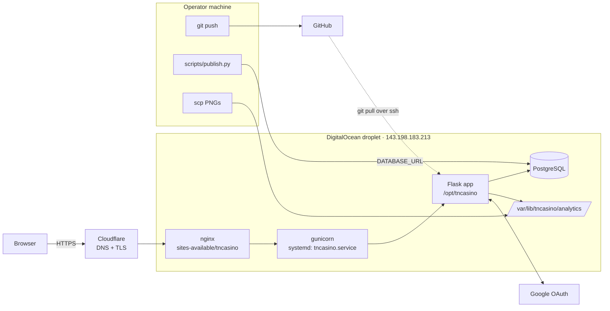

# 07 – Deployment & Ops

> **Verification note.** Server-side details (systemd unit, nginx site, gunicorn flags, prod `.env` contents) are taken from `CLAUDE.md` and were **not** read from the server when this page was written. Items marked *(unverified)* should be confirmed before a refactor depends on them.

## Topology



| Piece | Detail |
|---|---|
| Domain | `tncasino.win`, DNS and TLS via Cloudflare |
| Host | Single DigitalOcean droplet running everything |
| App server | gunicorn importing `app:app`, managed by `/etc/systemd/system/tncasino.service` *(worker count/bind unverified)* |
| Reverse proxy | nginx, `/etc/nginx/sites-available/tncasino` *(unverified)*; `ProxyFix` trusts one proxy hop |
| Database | Self-hosted PostgreSQL on the same droplet *(version, backups unverified)* |
| Code | Git checkout at `/opt/tncasino` |
| Charts | `/var/lib/tncasino/analytics/`, outside the checkout so `git pull` doesn't touch it |

`gunicorn` is not in `requirements.txt`; it is installed on the server separately *(unverified)*. No dependency versions are pinned.

## Three independent release paths

There is no single "release". Code, data, and images each ship separately, and nothing checks that they're compatible.

| What | Command | Effect |
|---|---|---|
| **Code** | `git push origin main && ssh root@143.198.183.213 "cd /opt/tncasino && git pull && sudo systemctl restart tncasino"` | New code; on restart `create_all()` + `run_schema_migrations()` update app tables |
| **Data** | `python -m scripts.publish` (use `--dry-run` first) | Replaces all 13 analytics tables atomically (see [04](04-data-model.md#publishing-map)) |
| **Charts** | `scp backend/data/images/*.png root@143.198.183.213:/var/lib/tncasino/analytics/` | Updates PNGs; `/analytics` uses them to pick the week to display |

Publishing needs the operator's local `DATABASE_URL` to point at production Postgres. The deploy has no CI gate: it pulls whatever is on `main`, even while CI is still running. There is no rollback script; rolling back code means `git checkout` on the server, and rolling back data means re-publishing older SQLite files.

## Environment variables

| Variable | Used by | Required | Notes |
|---|---|---|---|
| `SECRET_KEY` | app | yes (except tests) | Session signing |
| `DATABASE_URL` | app, `publish.py` | yes | Postgres URL; publish points it at prod |
| `GOOGLE_OAUTH_CLIENT_ID` / `_SECRET` | app | yes | Google Cloud OAuth client |
| `ADMIN_EMAILS` | app | for admin | Comma-separated; checked at each login |
| `FLASK_ENV` | app | prod | `production` → secure cookies |
| `ANALYTICS_IMAGES_DIR` | app | prod | Defaults to `backend/data/images` |
| `FLASK_DEBUG` | `python -m app` | no | `true` enables debug locally |
| `OAUTHLIB_INSECURE_TRANSPORT`, `OAUTHLIB_RELAX_TOKEN_SCOPE` | flask-dance | local only | Allow OAuth over http://localhost |
| `SLEEPER_USERNAME`, `LEAGUE_ID` | notebook 01 | pipeline | |

Local and prod use separate `.env` files; the prod one is `/opt/tncasino/.env`. There is no `.env.example` in the repo.

## Local development

```bash
python -m app
```

Runs Flask on `0.0.0.0:5000` against whatever `DATABASE_URL` is set. The local `.env` must include the two `OAUTHLIB_*` variables for Google sign-in over http.

## CI

`.github/workflows/ci.yml` runs on every push and PR to `main`, Python 3.13:

| Job | Steps |
|---|---|
| `lint` | `ruff check .`, `ruff format --check .` |
| `test` | `pip install -r requirements.txt`, `python -m pytest --tb=short` |

`ruff.toml` excludes `backend/` entirely (line length 120), so scrapers and notebooks are never linted. Nothing deploys automatically.

## Tests

88 tests in `tests/`, running in about a second against in-memory SQLite (`StaticPool`).

| File | Covers |
|---|---|
| `conftest.py` | App fixture, logged-in/admin clients (faked via `sess["_user_id"]`), `analytics_tables` (hand-written DDL for 13 analytics tables), `seeded_analytics` (week 10 data) |
| `test_models.py` (5) | ORM defaults and constraints |
| `test_helpers.py` (6) | Current week, lazy lock logic |
| `test_betting.py` (11) | Place/remove bets, balance and weekly-stat accounting, lock enforcement |
| `test_settlement.py` (7) | Won/lost settlement, weekly stats, double-settle guard |
| `test_admin.py` (5) | Admin access control, set period, unlock |
| `test_leaderboard.py` (9) | Leaderboard rankings and highlights |
| `test_odds.py` (25) | `query_analytics`, team mapping, odds and analytics endpoints against seeded tables |
| `test_scrape.py` (9) | Week normalization and `validate_scraping` pass/fail rules |
| `test_scrapers.py` (11) | Scraper imports and pure parsing helpers (no network) |

**Not covered:** the real OAuth round trip, `/account` and CSRF, `pages.py` routes, `publish.py`, scrapers, notebooks, JavaScript, and anything Postgres-specific (the tests run on SQLite, prod runs on Postgres). The analytics DDL in `conftest.py` is maintained by hand and can drift from what the notebooks actually produce.

## Observability

- Logging is `print()` to stdout, which ends up in the systemd journal *(unverified)*.
- No error tracking, metrics, uptime checks, or alerting.
- No health-check endpoint (`/api/session-check` is the closest).
