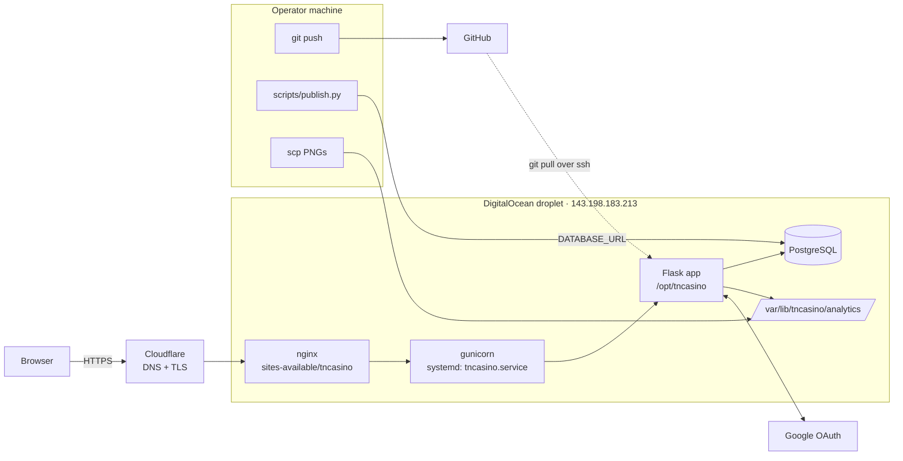

# 07 – Deployment & Ops

> **Verification note.** Server-side details (systemd unit, nginx site, gunicorn flags, prod `.env` contents) are taken from `CLAUDE.md` and were **not** read from the server when this page was written. Items marked *(unverified)* should be confirmed before a refactor depends on them.

## Topology



| Piece | Detail |
|---|---|
| Domain | `tncasino.win`, DNS and TLS via Cloudflare |
| Host | Single DigitalOcean droplet running everything |
| App server | gunicorn importing `app:app`, managed by `/etc/systemd/system/tncasino.service` *(worker count/bind unverified)* |
| Reverse proxy | nginx, `/etc/nginx/sites-available/tncasino` *(unverified)*; `ProxyFix` trusts one proxy hop |
| Database | Self-hosted PostgreSQL on the same droplet *(version, backups unverified)* |
| Code | Git checkout at `/opt/tncasino` |
| Charts | `/var/lib/tncasino/analytics/`, outside the checkout so `git pull` doesn't touch it |

`gunicorn` is not in `requirements.txt`; the server's venv (Python 3.12.3, checked 2026-09-29) holds it and 30 other hand-installed packages, and no `numpy`, which the app has needed since B7 ([08](08-constraints-and-debt.md#ops)). Every line of `requirements.txt` is pinned exactly to the version a fresh install resolved on 2026-09-29; the CI jobs, a fresh Linux venv and a fresh Windows venv all install the same set.

## Three independent release paths

There is no single "release". Code, data, and images each ship separately, and nothing checks that they're compatible.

| What | Command | Effect |
|---|---|---|
| **Code** | `git push origin main && ssh root@143.198.183.213 "cd /opt/tncasino && git pull && sudo systemctl restart tncasino"` | New code; on restart `create_all()` + `run_schema_migrations()` update app tables |
| **Data** | `python -m scripts.publish` (use `--dry-run` first) | Replaces all 13 analytics tables atomically (see [04](04-data-model.md#publishing-map)) |
| **Charts** | `scp backend/data/images/*.png root@143.198.183.213:/var/lib/tncasino/analytics/` | Updates PNGs; `/analytics` uses them to pick the week to display |

Publishing needs the operator's local `DATABASE_URL` to point at production Postgres. The deploy has no CI gate: it pulls whatever is on `main`, even while CI is still running. There is no rollback script; rolling back code means `git checkout` on the server, and rolling back data means re-publishing older SQLite files.

## Environment variables

| Variable | Used by | Required | Notes |
|---|---|---|---|
| `SECRET_KEY` | app | yes (except tests) | Session signing |
| `DATABASE_URL` | app, `publish.py` | yes | Postgres URL; publish points it at prod |
| `GOOGLE_OAUTH_CLIENT_ID` / `_SECRET` | app | yes | Google Cloud OAuth client |
| `ADMIN_EMAILS` | app | for admin | Comma-separated; checked at each login |
| `FLASK_ENV` | app | prod | `production` → secure cookies |
| `ANALYTICS_IMAGES_DIR` | app | prod | Defaults to `backend/data/images` |
| `FLASK_DEBUG` | `python -m app` | no | `true` enables debug locally |
| `OAUTHLIB_INSECURE_TRANSPORT`, `OAUTHLIB_RELAX_TOKEN_SCOPE` | flask-dance | local only | Allow OAuth over http://localhost |
| `SLEEPER_USERNAME`, `LEAGUE_ID` | notebook 01 | pipeline | |

Local and prod use separate `.env` files; the prod one is `/opt/tncasino/.env`. There is no `.env.example` in the repo.

## Local development

```bash
python -m app
```

Runs Flask on `0.0.0.0:5000` against whatever `DATABASE_URL` is set. The local `.env` must include the two `OAUTHLIB_*` variables for Google sign-in over http.

## CI

`.github/workflows/ci.yml` runs on every push and PR to `main`, Python 3.13:

| Job | Steps |
|---|---|
| `lint` | `ruff check .`, `ruff format --check .` |
| `test` | `pip install -r requirements.txt`, `python -m pytest --tb=short` |

`ruff.toml` excludes `backend/` entirely (line length 120), so scrapers and notebooks are never linted. The lint job installs the ruff version pinned in `requirements.txt`, because a newer ruff formats the code fences in Markdown and fails on the design docs; `requirements.txt` also keeps pandas below 3 and SQLAlchemy below 2.1, the versions the pipeline is tested on. Nothing deploys automatically.

## Tests

1181 tests in `tests/` (one skipped), running in about 50 seconds. The app tests use in-memory SQLite (`StaticPool`); `test_balance_race.py` builds a file-backed SQLite app (`file_backed_app` in `conftest.py`) so twenty threads really race. The pipeline tests under `tests/pipeline/` run on scratch SQLite files and recorded fixtures, never the network or the real databases.

| Area | Files | Covers |
|---|---|---|
| Fixtures | `conftest.py` | App fixture, logged-in/admin clients (faked via `sess["_user_id"]`), `analytics_tables` (hand-written DDL for the analytics tables, with `season` and `run_id`), `seeded_analytics` (2026 week 10, with the run that published it, its window and a 20-sim score matrix in `simulation_totals`), `window_clock` (pins `windows.utc_now` an hour after that run so the window is open in every test), `fresh_matrix_cache` (clears the per-worker matrix cache between tests), `file_backed_app` |
| Markets and money (531) | `test_markets.py`, `test_betting.py`, `test_windows.py`, `test_cashout.py`, `test_parlays.py`, `test_matrices.py`, `test_settlement.py`, `test_settlement_outcomes.py`, `test_ledger.py`, `test_balance_race.py` | Market keys and quotes, the betting window (open, paused, closed, the lock), placing, removing and settling by key, cash-out offers from the score matrix and the futures quotes with every refusal, parlay quotes and placement with every refusal rule and the refusal log, the cached matrix and the joint chance, parlays settled leg by leg with pushed legs re-priced, outcomes from the published scores, push and void, the admin preview, the refusals, accounting, lock enforcement, guarded balance changes, the twenty-thread race |
| Odds and pages (96) | `test_odds.py`, `test_leaderboard.py`, `test_admin.py`, `test_admin_pipeline.py`, `test_helpers.py`, `test_models.py` | `query_analytics`, team mapping, odds and analytics endpoints against seeded tables, leaderboard rankings, admin access and periods, the pipeline dashboard, current week and lazy lock, ORM defaults and migrations |
| Legacy scrapers (20) | `test_scrape.py`, `test_scrapers.py` | Week normalization, `validate_scraping` pass/fail rules, pure parsing helpers (no network) |
| Pipeline (535) | `tests/pipeline/` (29 files) | One file per step or shared module: settings, runner, the CLI, sources, teams, names, scrape, verify, clean, match, stats, validate, league, lineups, waivers, params, sampling, simulate, the win rules, odds, playoffs, standings, accuracy, fit, evaluate, calibrate, publish, legacy migration |

**Not covered:** the real OAuth round trip, `/account/update-profile` and CSRF, `pages.py` routes, the legacy `scripts/publish.py`, the legacy scrapers' network paths, notebooks, JavaScript, and anything Postgres-specific (the tests run on SQLite, prod runs on Postgres). The analytics DDL in `conftest.py` is maintained by hand and can drift from what the pipeline actually produces.

## Observability

- Logging is `print()` to stdout, which ends up in the systemd journal *(unverified)*.
- No error tracking, metrics, uptime checks, or alerting.
- No health-check endpoint (`/api/session-check` is the closest).
