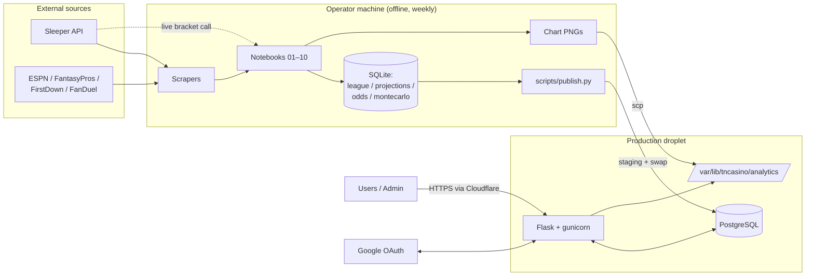

# TNCasino Architecture

How the system works **today**. These docs describe current behavior, including the rough edges, so they can serve as the baseline for scoping refactors. When a refactor lands, update the relevant page in the same PR.

## The system in one paragraph

Each week, an operator runs a local pipeline (CLI scripts + ten Jupyter notebooks) that scrapes player projections from five sources, matches them to Sleeper player IDs, turns them into per-player mean/σ estimates, builds each fantasy team's best lineup, and runs a 50,000-iteration lognormal Monte Carlo simulation. The simulation output becomes betting odds and chart-ready curves, stored in local SQLite files. `scripts/publish.py` copies the tables the website needs into production PostgreSQL. The Flask app at [tncasino.win](https://tncasino.win) reads those tables to show odds and analytics, and lets users sign in with Google and place fake-money bets, which an admin settles manually.

## Pages

| Doc | Read it when you need to know… |
|---|---|
| [01 – Overview](01-overview.md) | The components, what runs where, and the weekly operating cycle |
| [02 – Data pipeline](02-data-pipeline.md) | What each scraper and notebook reads, does, and writes |
| [03 – Modeling & odds](03-modeling-and-odds.md) | How projections become distributions, simulations, and prices |
| [04 – Data model](04-data-model.md) | Every database, table, key, and how publishing maps them |
| [05 – Web app](05-web-app.md) | Flask structure, auth, routes, and which page calls which API |
| [06 – Betting lifecycle](06-betting-lifecycle.md) | How bets, balances, betting periods, and settlement work |
| [07 – Deployment & ops](07-deployment-and-ops.md) | Infrastructure, deploys, publishing, env vars, CI, tests |
| [08 – Constraints & debt](08-constraints-and-debt.md) | What a refactor has to work around, by area |

## Glossary

| Term | Meaning |
|---|---|
| **Week** | NFL week. Stored as an **integer** in league/odds tables, but as the **string `"Week N"`** in `projections` and `projections_with_sleeper`. |
| **Current week** | The highest-numbered `BettingPeriod` that is not settled (`get_current_week()`); falls back to `10` if none exists. Notebooks ignore this and use their own hardcoded `CURRENT_WEEK`. |
| **roster_id / team_id** | Sleeper's per-league team number (1–12). `team_id` in odds tables is the same value. |
| **owner** | A team's Sleeper `display_name` (e.g. `sfaizi24`). Curve tables and several joins key on it. The website maps it to a first name via `OWNER_DISPLAY_NAMES` in `app/routes/helpers.py`. |
| **team_name** | Sleeper team name, or `"Team {roster_id}"` if unset. Primary key component in `team_lineups`. |
| **μ (mu), σ (sigma)** | Per-player projected mean and standard deviation, in fantasy points (PPR). |
| **Replacement player** | A waiver-level benchmark player substituted into a lineup slot when the rostered starter projects worse. See [03](03-modeling-and-odds.md#2-lineups-and-replacement-players). |
| **run_id** | Identifier for one simulation run: `seed_{SEED}_{timestamp}` (notebook 07) or `standings_{week}_{timestamp}` (notebook 09). |
| **Analytics tables** | Tables produced by the pipeline and published to Postgres (odds, curves, lineups, Sleeper league data). Read-only from the app's point of view. |
| **App tables** | Tables owned by the Flask ORM: `users`, `bets`, `weekly_stats`, `betting_periods`. Never touched by publishing. |
