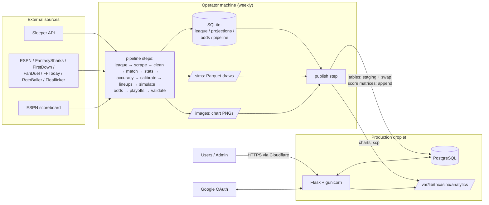

# TNCasino Architecture

How the system works **today**. These docs describe current behavior, including the rough edges, so they can serve as the baseline for scoping refactors. When a refactor lands, update the relevant page in the same PR.

## The system in one paragraph

Each week, an operator runs the `pipeline` package on their own machine (`python -m pipeline run --week N`). It mirrors the Sleeper league, scrapes player projections from eight sources, verifies each source against Sleeper and drops any that fails, matches the rest to Sleeper player IDs, and turns them into one scoring distribution per player under a versioned, fitted model. It builds each fantasy team's lineup, runs a 50,000-iteration correlated lognormal Monte Carlo simulation, and prices the week's markets and the season's futures from the draws, all into local SQLite files, with the draws in Parquet and the charts as PNGs. The publish step (`--steps publish`) uploads the charts to the droplet, appends each run's score matrix to `simulation_totals`, and stages and swaps the tables the website needs into production PostgreSQL. The Flask app at [tncasino.win](https://tncasino.win) reads those tables to show odds and analytics, opens betting until the published run's `window_closes_at`, lets users sign in with Google and place fake-money bets, and settles them from the published scores through the admin's settlement preview.

## Pages

| Doc | Read it when you need to know… |
|---|---|
| [01 – Overview](01-overview.md) | The components, what runs where, and the weekly operating cycle |
| [02 – Data pipeline](02-data-pipeline.md) | What each step and source reads, does, and writes |
| [03 – Modeling & odds](03-modeling-and-odds.md) | How projections become distributions, simulations, and prices |
| [04 – Data model](04-data-model.md) | Every database, table, key, and how publishing maps them |
| [05 – Web app](05-web-app.md) | Flask structure, auth, routes, and which page calls which API |
| [06 – Betting lifecycle](06-betting-lifecycle.md) | How bets, balances, betting periods, and settlement work |
| [07 – Deployment & ops](07-deployment-and-ops.md) | Infrastructure, deploys, publishing, env vars, CI, tests |
| [08 – Constraints & debt](08-constraints-and-debt.md) | What a refactor has to work around, by area |

## Glossary

| Term | Meaning |
|---|---|
| **Week** | NFL week, stored as an **integer** in every table. The 2025 databases, which kept `"Week N"` strings in `projections` and `projections_with_sleeper`, were converted by the one-off `python -m pipeline migrate-legacy`. |
| **Current week** | The highest-numbered `BettingPeriod` that is not settled (`get_current_week()`); falls back to `10` if none exists. |
| **roster_id / team_id** | Sleeper's per-league team number (1–12). `team_id` in odds tables is the same value. |
| **owner** | A team's Sleeper `display_name` (e.g. `sfaizi24`). Curve tables and several joins key on it. The website maps it to a first name via `OWNER_DISPLAY_NAMES` in `app/routes/helpers.py`. |
| **team_name** | Sleeper team name, or `"Team {roster_id}"` if unset. Primary key component in `team_lineups`. |
| **μ (mu), σ (sigma)** | Per-player projected mean and standard deviation, in fantasy points (PPR). |
| **Replacement player** | A free agent the `lineups` step puts into a slot a roster cannot fill (starter out, on bye or unprojected), taken from the waiver wire in FAAB order with its μ capped at the league's median starter at that position. See [03](03-modeling-and-odds.md#2-lineups-and-replacement-players). |
| **run_id** | Identifier for one pipeline run, `{season}w{week:02d}-{YYYYMMDDTHHMMSS}` from the run's UTC start (`make_run_id` in `pipeline/runner.py`), e.g. `2026w05-20261007T201500`. The simulate step names its draws, its `simulation_runs` row and the published score matrix by it, and the odds and futures rows priced from those draws carry it. |
| **Analytics tables** | Tables produced by the pipeline and published to Postgres (odds, curves, lineups, Sleeper league data). Read-only from the app's point of view. |
| **App tables** | Tables owned by the Flask ORM: `users`, `bets`, `bet_legs`, `parlay_refusals`, `weekly_stats`, `betting_periods`. Never touched by publishing. |
